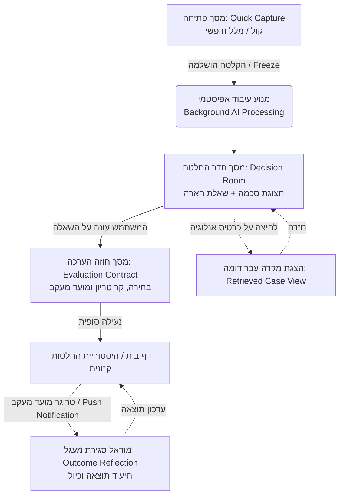
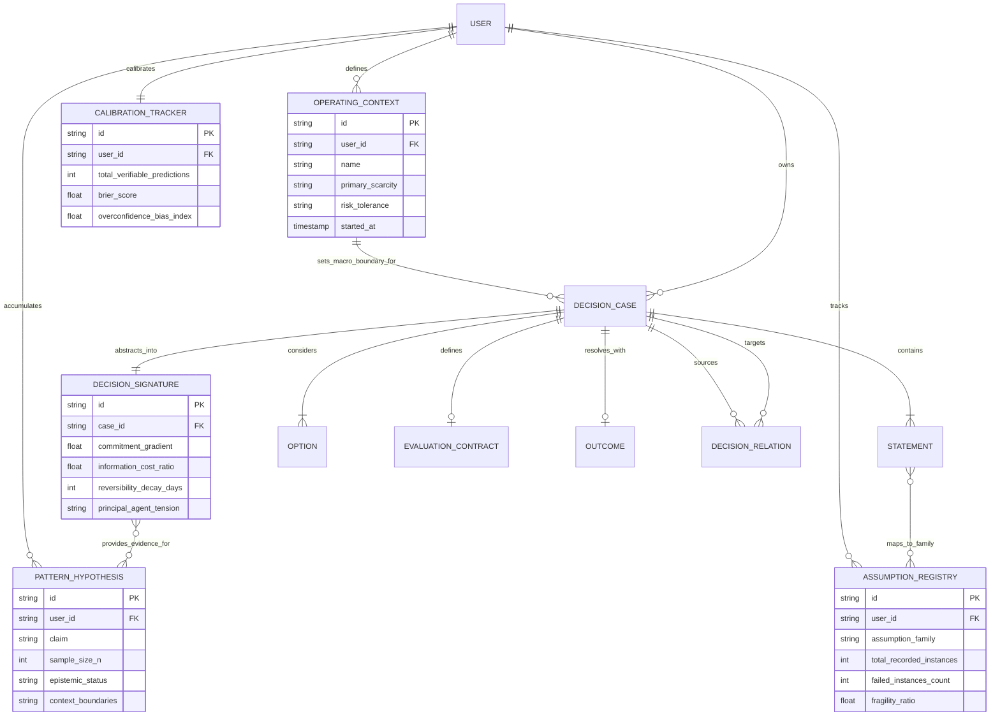
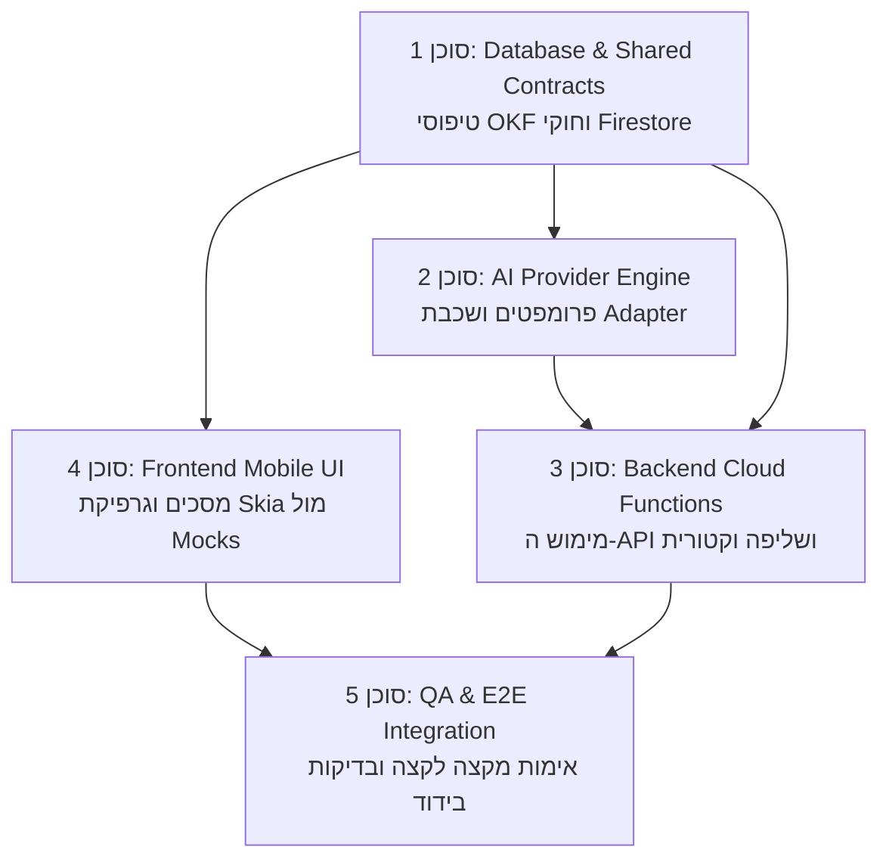

# מסמך אפיון ודרישות מוצר (PRD) — הד | Echo
**תשתית לזיכרון הלומד של שיקול הדעת האנושי**
גרסה: 1.0.0 | תאריך: ספטמבר 2026 | סטטוס: מוכן לפיתוח מבוזר (Multi-Agent)

---

## 1. מבט על וחזון המוצר (Overview & Product Vision)

### 1.1 תקציר המוצר
**הד (Echo)** היא תשתית לזיכרון הלומד של שיקול הדעת האנושי: מערכת Mobile-First המלווה את האדם ברגע קבלת החלטה משמעותית תחת אי-ודאות. המערכת מקפיאה את מצב החשיבה המקורי לפני שנודעת התוצאה, מפרקת את המלל הגולמי לסכמה אפיסטמית מובנית (עובדות, הנחות, פערי מידע וחלופות), מציבה שאלת הארה אחת שחושפת נקודות עיוורון, ומחזירה לאורך זמן את הניסיון המצטבר של המשתמש דרך שליפת אנלוגיות מבניות מהחלטות עבר.

### 1.2 מהות ורוח הרעיון
שיקול דעת אנושי נשען על ניסיון, ערכים, אינטואיציה ואחריות — אלמנטים שמודלים כלליים אינם יכולים להחליף. עם זאת, החשיבה האנושית מוגבלת עקב זיכרון חלקי, הטיות עיגון, עלויות שקועות ונטייה לשכתב בדיעבד את תהליך החשיבה לאחר שנודעת התוצאה (Hindsight Bias).
עקרון היסוד של "הד":
- **האדם נשאר בעל ההחלטה הבלעדי:** ה-AI אינו פוסק, אינו מייעץ "מה לעשות" ואינו מהווה סמכות שיפוטית.
- **הד היא מראה והארה:** המערכת פועלת ככלי רפלקטיבי המציף הנחות סמויות ומפריד בין עובדות מוצקות להשערות.
- **זיכרון קנוני קפוא:** שמירה הרמטית של מה שהיה ידוע ונשקל *לפני* ההחלטה, כך שידע עתידי לא יזהם את תיעוד העבר.

### 1.3 הבעיה שהמוצר פותר
מנהלים, יזמים ומשקיעים צוברים עשרות שנות ניסיון, אך מתחילים כמעט כל החלטה מחדש. כשהתוצאה מגיעה (הצלחה או כישלון), האדם זוכר בעיקר את השורה התחתונה ומעוות את הזיכרון של מה שהוא באמת ידע, הניח וצפה בזמן אמת. מה שחסר אינו עוד מידע או מודל שפה חכם יותר, אלא **נכס מצטבר של היסטוריית שיקול הדעת האישית**.

### 1.4 קהל היעד
- **יזמים ומנכ"לים:** קבלת החלטות אסטרטגיות (גיוסי הון, הקצאת משאבים, כניסה לשווקים חדשים, גיוסי בכירים).
- **משקיעים (VC / Angels):** תיעוד התזות שלפני ביצוע השקעה, מעקב אחר התממשות תנאים וכיול שיקול דעת.
- **מנהלים בכירים ויועצים:** החלטות מורכבות הכוללות מתח בין התחייבות גבוהה לאי-ודאות ואי-הפיכות.

---

## 2. המלצת טכנולוגיות (Tech Stack)

הארכיטקטורה תוכננה למקסם את מהירות הפיתוח ע"י סוכני AI מקביליים (Parallel AI Agents), שמירה על קוד Typed אחיד, ואפשרות להחלפה עתידית של מודלים.

| שכבה | טכנולוגיה | רציונל והתאמה לפיתוח בסוכנים |
| :--- | :--- | :--- |
| **מבנה הפרויקט** | **Monorepo (Turborepo / npm workspaces)** | שיתוף קפדני של חוזי טיפוסים (`packages/shared`) בין ה-Client ל-Backend למניעת אי-התאמות. |
| **Frontend Mobile** | **React Native (Expo SDK 51+) עם TypeScript** | פיתוח Mobile-First מואץ, תמיכה מלאה ב-iOS ו-Android מקוד יחיד, קומפוננטות עצמאיות. |
| **מנוע גרפי ואנימציה** | **Shopify React Native Skia + Reanimated 3** | קוד פתוח חינמי (רישיון MIT). ביצועי 120 FPS בחומרה, רינדור גלי "הד" (Aura/Ripples), מעברים אורגניים ויוקרתיים. |
| **עיצוב וממשק** | **NativeWind (Tailwind) + Expo Blur** | Dark Mode יוקרתי (גווני Graphite/Obsidian), טיפוגרפיה אלגנטית (Editorial Sans/Serif) ואפקטי Glassmorphism עדינים. |
| **Backend & Cloud** | **Firebase (Cloud Functions v2 ב-TypeScript)** | ארכיטקטורת Serverless ללא צורך בניהול שרתים, התממשקות טבעית לפיתוח מודולרי מהיר. |
| **מסד נתונים** | **Firebase Firestore (NoSQL Document Store)** | תמיכה מובנית ב-Offline, סנכרון Realtime למובייל, ומבנה היררכי מושלם ל-Multi-Tenancy מבודד. |
| **חיפוש וקטורי** | **Firestore Vector Search (Vertex AI Vector Search)** | שליפת אנלוגיות ומקרים דומים ברמת ה-Embedding ללא צורך ב-DB וקטורי צד שלישי נפרד. |
| **אימות ואבטחה** | **Firebase Authentication** | ניהול משתמשים מאובטח (Email/Password, Apple Sign-In, Google) עם תמיכה מלאה ב-JWT ו-RLS. |
| **אחסון מדיה** | **Firebase Cloud Storage** | אחסון קבצי הקלטה קולית מקוריים המקושרים הרמטית ל-`userId`. |
| **שכבת AI אגנוסטית** | **AI Provider Adapter (Strategy Pattern)** | חוזה אחיד (`IAiProvider`) המאפשר שימוש ב-Gemini 1.5 Pro/Flash, OpenAI GPT-4o, Anthropic Claude 3.5, או מודל מקומי (Ollama/Llama.cpp). |

---

## 3. משתמשים והרשאות (User Roles & Permissions)

המערכת תוכננה מיומה הראשון כ-**Multi-Tenant עם הפרדה פיזית ולוגית מוחלטת (Zero-Trust Data Isolation)**. שיקול דעת אישי דורש פרטיות מקסימלית:

### 3.1 תפקידי משתמשים
1. **Decision Maker (משתמש קצה):**
   - גישה בלעדית לכל מקרי ההחלטה, האמירות, ההקלטות והשערות הדפוס שלו.
   - אינו רשאי לצפות, לחפש או לקבל אנלוגיות מאף משתמש אחר במערכת.
2. **System / Worker (סוכן פנימי):**
   - Cloud Functions מאובטחות הרצות תחת Service Account ייעודי.
   - גישה לעיבוד מקרה ספציפי אך ורק על פי אירוע מורשה (Trigger) עבור אותו משתמש.

### 3.2 מנגנון בידוד נתונים והרשאות (Firestore Security Rules)
- כל המסמכים שמורים תחת הנתיב הפרטי של המשתמש:
  `/users/{userId}/decision_cases/{caseId}/...`
- כללי אבטחה מחמירים ב-Firestore:
  ```javascript
  rules_version = '2';
  service cloud.firestore {
    match /databases/{database}/documents {
      match /users/{userId}/{document=**} {
        allow read, write: if request.auth != null && request.auth.uid == userId;
      }
    }
  }
  ```
- חיפוש וקטורי מוגבל תמיד ב-Pre-filter קשיח: `userId == request.auth.uid`. שום וקטור של משתמש א' לעולם לא ישמש שכנים קרובים (KNN) של משתמש ב'.
- קבצי קול ב-Cloud Storage מוגנים תחת `/recordings/{userId}/{caseId}/*`.

---

## 4. ארכיטקטורת ממשק (UI/UX & Wireframe Architecture)

הממשק עוצב בגישת **Luxury Atmospheric Minimalism**: רקע כהה ועמוק (`#0D0E12`), טיפוגרפיה מוקפדת בצבעי פנינה ואפור חם (`#F4F4F5`, `#A1A1AA`), וגרפיקה וקטורית דינמית (Skia) של הילת "הד" (Pulsing Echo Aura) המתעוררת לחיים בזמן דיבור או עיבוד.

### 4.1 פירוט המסכים המרכזיים

#### מסך 1: לכידה מהירה (Quick Capture Screen)
- **Visuals:** מסך נקי מהסחות דעת. במרכזו אלמנט Skia עגול ונושם של גלי קול (Echo Orb).
- **Controls:**
  - כפתור מיקרופון מרכזי להקלטה חופשית בלחיצה או החזקה.
  - תיבת קלט טקסט מינימליסטית ("מה ההחלטה שעומדת בפניך כרגע?").
  - חיווי זיהוי קולי בזמן אמת.
- **Transition:** לחיצה על "הקפא והאר" (Freeze & Echo) מעבירה את המצב למסך 2 באנימציית מעבר חלקה של התכנסות גלי ההד לתוך מבנה סכמטי.

#### מסך 2: חדר ההחלטה ומראת החשיבה (Decision Room & Epistemic Mirror)
- **מצב קריאה בלבד ללא עריכה** — מניעת חיכוך ועייפות קוגניטיבית.
- **רכיב 1 (Top): מצב חשיבה גולמי מקורי (Frozen Before AI):**
  - כרטיס סגור עם תגית נעילה עדינה (`🔒 Frozen @ 10:14:02`).
  - אפשרות לפתיחה (Accordion) לצפייה במלל המקורי המדויק או האזנה להקלטה.
- **רכיב 2 (Center): פירוק סכמת חשיבה אפקטיבית (Epistemic Schema Cards):**
  - **מטרה (Goal):** כרטיס אלגנטי המגדיר מה האדם רוצה להשיג או לשמר.
  - **עובדות מוצקות (Observations/Facts):** רשימת תבליטים עם תגית `[עובדה]`.
  - **הנחות סמויות (Assumptions):** רשימת פריטים מודגשת בגוון ענבר חם עם תגית `[הנחה טעונת אימות]`.
  - **אי-ודאות וחיכוך (Unknowns):** פערי המידע הקריטיים שזוהו.
  - **חלופות (Options):** האפשרויות שעלו בשיחה.
- **רכיב 3 (Hero): שאלת ההארה האחת (The Single Illumination Question):**
  - תיבה מובלטת בטיפוגרפיה גדולה ומרווחת עם מסגרת זוהרת עדינה (Subtle Glow).
  - שאלה רפלקטיבית יחידה שנועדה לחשוף נקודת עיוורון (למשל: "האם דרושים 3 חודשים, או שקיים ניסוי זול יותר לבדיקת נכונות לשלם בתוך שבועיים?").
  - שדה מענה קצר וממוקד עבור המשתמש.
- **רכיב 4 (Bottom Carousel): הדי עבר (Analogous Cases Carousel):**
  - מופיע רק אם נמצאה אנלוגיה מבנית אמיתית.
  - כרטיס המציג מקרה עבר דומה, ציון הדמיון המבני ("התחייבות גבוהה + אימות ראשוני חלש"), ומה היה הניסוי שנבחר אז.
  - מלווה בדיסקליימר אפיסטמי: "אנלוגיה למחשבה — לא המלצה".

#### מסך 3: חוזה הערכה ונעילה (Evaluation Contract Screen)
- סיכום הבחירה שנבחרה (כולל "פעולת בירור / ניסוי קטן" אם נוסח).
- הגדרת קריטריון הצלחה מדויק מראש (למשל: "לקוח משלם אחד תוך 6 שבועות").
- קביעת אות מעקב (Monitoring Trigger) ותאריך תזכורת.
- כפתור נעילה: "שמור לזיכרון שיקול הדעת".

#### מסך 4: מעקב וסגירת מעגל (Outcome & Reflection Modal)
- נפתח בעקבות לחיצה על התראה בתאריך היעד או ביוזמת המשתמש.
- מציג את מה שנועם/המשתמש הניח וציפה אז, ומבקש 2 שורות בלבד: "מה נצפה בפועל?".
- בחינת הקריטריון: האם הקריטריון שהגדרנו בזמנו היה אכן מדד טוב?

### 4.2 תרשים זרימת מסכים (UI Navigation Flow)



---

## 5. מודל נתונים (Data Model / DB Schema) — עקרונות Google OKF

מודל הנתונים נבנה על פי עקרונות **Google Open Knowledge Format (OKF)**: ייצוג אונטולוגי מפורש, הפרדת מהויות (Concept-per-Entity), מטא-דאטה מבוקר, קשרים גלויים, ודפוסי גישה ברורים עם RLS.

### 5.1 הגדרת הישויות (OKF Concepts)

```yaml
Entity: User
Concept ID: concept:user
Metadata:
  type: actor
  title: Decision Maker Account
  description: מייצג את בעל שיקול הדעת האישי במערכת
  resource: /users/{user_id}
  tags: [auth, tenant, identity]
Schema Fields:
  - id: String (Primary Key, Firebase Auth UID)
  - email: String (Required, Unique)
  - created_at: Timestamp (Required)
  - last_login: Timestamp (Optional)
Relationships:
  - has_many: concept:decision_case (via user_id)
Access Patterns & RLS Policies:
  - Fetch by Auth UID
  - RLS: רק המשתמש המאומת רשאי לקרוא/לכתוב את הפרופיל של עצמו

---

Entity: DecisionCase
Concept ID: concept:decision_case
Metadata:
  type: knowledge_record
  title: מקרה החלטה (Decision Case)
  description: האובייקט הקנוני המאגד מקרה שיקול דעת בודד על כל רבדיו
  resource: /users/{user_id}/decision_cases/{case_id}
  tags: [core, canonical_record, deliberation]
Schema Fields:
  - id: String (Primary Key, UUID v4)
  - user_id: String (Required, Foreign Key to User)
  - title: String (Required, תקציר ההחלטה)
  - status: Enum [deliberating, decided, monitoring, resolved, archived]
  - family: String (תחום ההחלטה: hire_or_wait, continue_or_stop, capital_allocation וכו')
  - context_stakes: Enum [low, medium, high, very_high]
  - context_reversibility: Enum [reversible, partially_reversible, irreversible]
  - context_time_pressure: Enum [low, medium, high]
  - raw_capture_text: String (Required, מלל מקורי מדויק)
  - raw_audio_path: String (Optional, נתיב להקלטה ב-Storage)
  - frozen_at: Timestamp (Required, חותמת זמן של הקפאת המצב לפני AI)
  - resolved_at: Timestamp (Optional)
  - vector_embedding: Array<Float> (וקטור דמיון מבני ב-Vertex AI)
  - created_at: Timestamp (Required)
  - updated_at: Timestamp (Required)
Relationships:
  - belongs_to: concept:user (via user_id)
  - has_many: concept:statement (via case_id)
  - has_many: concept:option (via case_id)
  - has_one: concept:evaluation_contract (via case_id)
  - has_one: concept:outcome (via case_id)
  - has_many: concept:decision_relation (via case_id)
Access Patterns & RLS Policies:
  - Query: שליפת כל המקרים של משתמש ממוינים לפי created_at DESC
  - Vector Query: חיפוש KNN המוגבל ל-user_id הנוכחי בלבד
  - RLS: read/write מותר אך ורק אם request.auth.uid == user_id

---

Entity: Statement
Concept ID: concept:statement
Metadata:
  type: atomic_claim
  title: אמירה אפיסטמית
  description: יחידת טענה אטומית שחולצה מהלכידה הגולמית ומסווגת לתפקיד קוגניטיבי
  resource: /users/{user_id}/decision_cases/{case_id}/statements/{statement_id}
  tags: [epistemic, extraction, claim]
Schema Fields:
  - id: String (Primary Key, UUID v4)
  - case_id: String (Required, Foreign Key to DecisionCase)
  - user_id: String (Required)
  - text: String (Required, ניסוח האמירה)
  - role: Enum [goal, observation, evaluation, assumption, prediction, unknown]
  - provenance_source: Enum [user_verbatim, inferred_by_ai]
  - confidence_score: Float (ציון ודאות החילוץ של המודל, 0.0-1.0)
  - created_at: Timestamp (Required)
Relationships:
  - belongs_to: concept:decision_case (via case_id)
Access Patterns & RLS Policies:
  - Query: שליפת כל האמירות של מקרה מסוים
  - RLS: רק המשתמש המאומת רשאי לקרוא/לכתוב

---

Entity: Option
Concept ID: concept:option
Metadata:
  type: decision_alternative
  title: חלופת החלטה
  description: אפשרות ממשית שנשקלה במהלך ההחלטה
  resource: /users/{user_id}/decision_cases/{case_id}/options/{option_id}
  tags: [alternative, choice]
Schema Fields:
  - id: String (Primary Key, UUID v4)
  - case_id: String (Required)
  - user_id: String (Required)
  - title: String (Required)
  - origin: Enum [proposed_by_user, suggested_by_ai]
  - was_selected: Boolean (Default: false)
  - created_at: Timestamp (Required)
Relationships:
  - belongs_to: concept:decision_case (via case_id)

---

Entity: EvaluationContract
Concept ID: concept:evaluation_contract
Metadata:
  type: agreement
  title: חוזה הערכה ומעקב
  description: הגדרה מראש של קריטריוני הצלחה, אותות כשל ומועד לבדיקה
  resource: /users/{user_id}/decision_cases/{case_id}/contract
  tags: [contract, validation, trigger]
Schema Fields:
  - id: String (Primary Key, UUID v4)
  - case_id: String (Required, 1:1)
  - user_id: String (Required)
  - target_criteria: String (Required, קריטריון ההצלחה שהוגדר מראש)
  - failure_signals: String (סימני אזהרה שהוגדרו מראש)
  - review_date: Timestamp (Required, תאריך תזכורת למעקב)
  - trigger_type: Enum [scheduled_date, event_based, threshold_reached]
  - is_triggered: Boolean (Default: false)
  - created_at: Timestamp (Required)
Relationships:
  - belongs_to: concept:decision_case (via case_id)

---

Entity: Outcome
Concept ID: concept:outcome
Metadata:
  type: empirical_result
  title: תוצאת החלטה ובחינת קריטריון
  description: התיעוד של מה שנצפה בפועל בעולם לאחר המעשה ובחינת תקיפות הקריטריון
  resource: /users/{user_id}/decision_cases/{case_id}/outcome
  tags: [outcome, hindsight_barrier, learning]
Schema Fields:
  - id: String (Primary Key, UUID v4)
  - case_id: String (Required, 1:1)
  - user_id: String (Required)
  - observed_facts: String (Required, מה קרה בפועל ללא פרשנות)
  - criteria_evaluation: Enum [succeeded, failed, partially_succeeded, unmeasurable]
  - reflection_notes: String (בחינת הקריטריון המקורי — האם בדיעבד הוא היה מדד נכון?)
  - recorded_at: Timestamp (Required)
Relationships:
  - belongs_to: concept:decision_case (via case_id)

---

Entity: DecisionRelation
Concept ID: concept:decision_relation
Metadata:
  type: graph_edge
  title: יחס בין החלטות (אנלוגיה מבנית)
  description: מקשר בין מקרי החלטה שונים על בסיס דמיון מבני, אנלוגיה או בדיקת השערה
  resource: /users/{user_id}/relations/{relation_id}
  tags: [graph, analogy, similarity]
Schema Fields:
  - id: String (Primary Key, UUID v4)
  - user_id: String (Required)
  - source_case_id: String (Required)
  - target_case_id: String (Required)
  - relation_type: Enum [SIMILAR_TO, TESTS_HYPOTHESIS, CONTRADICTS, EXTENDS]
  - similarity_reason: String (הסבר ההשוואה המבנית האנושי)
  - analogy_strength: Enum [weak, partial, strong]
  - created_at: Timestamp (Required)
Relationships:
  - belongs_to: concept:decision_case (source)
  - belongs_to: concept:decision_case (target)

---

Entity: OperatingContext
Concept ID: concept:operating_context
Metadata:
  type: temporal_era
  title: תקופת הפעלה ושלב חיים (Operating Context / Era)
  description: מעגן את המצב המאקרו-ארגוני/אישי שבו ההחלטה התקבלה כדי למנוע השוואות שווא בין תקופות חיים שונות
  resource: /users/{user_id}/eras/{era_id}
  tags: [temporal, era, macro_context]
Schema Fields:
  - id: String (Primary Key, UUID v4)
  - user_id: String (Required)
  - name: String (Required, לדוגמה: "Early Stage / Survival", "Scale-Up / 50 Employees", "M&A Transition")
  - started_at: Timestamp (Required)
  - ended_at: Timestamp (Optional, Null משמעו התקופה הנוכחית)
  - primary_scarcity: Enum [runway_capital, executive_attention, engineering_capacity, market_credibility]
  - risk_tolerance: Enum [existential_risk_only, calculated_risk, highly_conservative]
Relationships:
  - has_many: concept:decision_case (via era_id)
Access Patterns & RLS Policies:
  - Fetch Active Era for user
  - RLS: רק המשתמש המאומת רשאי לקרוא/לכתוב

---

Entity: DecisionSignature
Concept ID: concept:decision_signature
Metadata:
  type: structural_abstraction
  title: חתימה מבנית מופשטת של החלטה
  description: הפשטה מנותקת-תוכן של הדינמיקה הניהולית המאפשרת שליפת אנלוגיות מתחומים שונים לחלוטין
  resource: /users/{user_id}/decision_cases/{case_id}/signature
  tags: [structural, signature, deep_analogy]
Schema Fields:
  - id: String (Primary Key, UUID v4)
  - case_id: String (Required, 1:1)
  - user_id: String (Required)
  - commitment_gradient: Float (0.0=הפיך לחלוטין ומתון, 1.0=התחייבות בינארית כבדה)
  - information_cost_ratio: Float (0.0=מידע יקר/בלתי אפשרי לפני מעשה, 1.0=בדיקה זולה ומהירה זמינה)
  - reversibility_decay_days: Integer (כמה ימים עד שחלון החזרה נסגר)
  - principal_agent_tension: Enum [sole_actor, team_alignment, external_dependency]
  - decision_tempo: Enum [emergency_hours, tactical_weeks, strategic_months]
Relationships:
  - belongs_to: concept:decision_case (via case_id)

---

Entity: PatternHypothesis
Concept ID: concept:pattern_hypothesis
Metadata:
  type: empirical_hypothesis
  title: השערת דפוס שיקול דעת אישית
  description: השערה זהירה מבוססת מדגם מקרים (N) המנוסחת בענווה אפיסטמית עם ראיות תומכות וסותרות
  resource: /users/{user_id}/patterns/{pattern_id}
  tags: [pattern, calibration, longitudinal_asset]
Schema Fields:
  - id: String (Primary Key, UUID v4)
  - user_id: String (Required)
  - claim: String (Required, לדוגמה: "מקרים עתירי התחייבות הפיקו תועלת מפעולת בירור מקדימה")
  - sample_size_n: Integer (Required, כמות המקרים המתועדים בבסיס ההשערה)
  - supporting_case_ids: Array<String> (Required)
  - contradicting_case_ids: Array<String> (Required, מקרים שבהם הדפוס נכשל)
  - context_boundaries: String (תנאי הסף שבהם הדפוס תקף)
  - epistemic_status: Enum [emerging, supported, challenged, obsolete]
  - updated_at: Timestamp (Required)
Relationships:
  - has_many: concept:decision_case (via supporting/contradicting IDs)

---

Entity: AssumptionRegistry
Concept ID: concept:assumption_registry
Metadata:
  type: cognitive_bias_tracker
  title: מרשם רגישות הנחות אישי
  description: מעקב ארוך-טווח אחר משפחות של הנחות עבודה שנוטות להישבר אצל המשתמש בתוצאה בפועל
  resource: /users/{user_id}/assumption_registry/{category_id}
  tags: [assumptions, blindspot, fragility]
Schema Fields:
  - id: String (Primary Key, UUID v4)
  - user_id: String (Required)
  - assumption_family: String (Required, לדוגמה: "enterprise_procurement_speed", "customer_paid_conversion")
  - total_recorded_instances: Integer (כמה פעמים הנחה זו הונחה)
  - failed_instances_count: Integer (כמה פעמים ההנחה נשברה בדיעבד ב-Outcome)
  - fragility_ratio: Float (failed / total)
  - typical_underestimation_factor: Float (לדוגמה: זמני רכש ארכו פי 2.8 מהצפוי)
  - last_alerted_at: Timestamp (Optional)
Relationships:
  - has_many: concept:statement (references statements classified under this family)

---

Entity: CalibrationTracker
Concept ID: concept:calibration_tracker
Metadata:
  type: statistical_calibration
  title: מעקב כיול תחזיות והסתברויות
  description: מעקב אמפירי אחר הקשר בין רמת הביטחון המוצהרת של המשתמש לבין אחוז ההתממשות בפועל
  resource: /users/{user_id}/calibration
  tags: [calibration, brier_score, predictions]
Schema Fields:
  - id: String (Primary Key, UUID v4)
  - user_id: String (Required, 1:1)
  - total_verifiable_predictions: Integer (Default: 0)
  - brier_score: Float (Default: 0.0, מדד סטטיסטי לכיול הסתברותי)
  - confidence_bucket_scores: Map<String, Float> (התפלגות: כאשר אמר 80%, כמה פעמים התממש?)
  - overconfidence_bias_index: Float (סטיית ביטחון יתר מנורמלת)
  - updated_at: Timestamp (Required)
```

### 5.2 דיאגרמת ישויות וקשרים (Mermaid ERD — Multi-Layered Architecture)



---

## 6. פיצ'רים מרכזיים וזרימת משתמש (Core Features & User Flows)

### 6.1 תהליך ליבה: לכידה, הקפאה וחילוץ אפיסטמי
1. **שלב 1 — לכידה גולמית (Raw Capture):** המשתמש מקליט או מקליד תיאור חופשי של הדילמה (לדוגמה: תיאור מקרה "פרויקט אטלס" או "סמנכ"ל מכירות").
2. **שלב 2 — הקפאה הרמטית (Freeze Before AI):** השרת מקבל את המלל/האודיו, מייצר `DecisionCase` חדש, שומר את המלל המדויק עם חותמת זמן ומקבע את הדגל `frozen=true`. המלל המקורי לעולם לא ישוכתב.
3. **שלב 3 — חילוץ סכמה אפיסטמית (Epistemic Extraction):** מנוע ה-AI מעבד את המלל ומחלץ:
   - מטרה עליונה (`goal`).
   - עובדות מוצקות (`observation`) — דברים שכבר ידועים או נמדדו.
   - הנחות ציר (`assumption`) — הנחות שחייבות להתקיים כדי שההחלטה תהיה הגיונית.
   - אי-ודאות ופערי מידע (`unknown`).
   - חלופות קיימות (`options`).
   - שיוך אוטומטי ל-`OperatingContext` הפעיל של המשתמש.
   - חילוץ `DecisionSignature` מופשטת (הפיכות, יחס עלות בירור, שיפוע התחייבות).

### 6.2 תהליך ליבה: שאלת הארה אחת (Single Illumination Question)
1. מנוע ה-AI מזהה את **נקודת החיכוך הקוגניטיבית המרכזית** במקרה הנוכחי:
   - אם זו בעיית מסגור בינארי + התחייבות גבוהה מול בדיקה זולה אפשרית ← שאלת "בירור זול" (Information Action).
   - אם זו החלטה בעלת אי-הפיכות גבוהה מאוד וערכים קריטיים ← שאלת Premortem או עמידות (Robustness).
   - אם זוהתה הנחת ציר שמופיעה ב-`AssumptionRegistry` כבעלת שבירות גבוהה (High Fragility) בעברו של המשתמש ← שאלת הארה על תקפות ההנחה (למשל: "זמני רכש בעברך ארכו פי 2.8 — כיצד המבנה ישרוד עיכוב דומה?").
2. הכלל החמור: **שאלה אחת בלבד**. אין שיחה ארוכה ואין פינג-פונג מייגע.
3. המשתמש משיב לשאלה בממשק המינימליסטי, והתשובה מקושרת למקרה כ-`InformationAction` או עדכון חלופה.

### 6.3 תהליך ליבה: אלגוריתם שליפה משולשת בסקייל (Tri-Factor Retrieval Engine)
כדי למנוע שליפת מקרים לא רלוונטיים במאגר של מאות החלטות, המערכת אינה מסתמכת על דמיון מילות מפתח בלבד, אלא מריצה מודל שקלול תלת-ממדי:

$$\text{Relevance Score} = 0.45 \cdot \text{Structural Match} + 0.35 \cdot \text{Contextual Match} + 0.20 \cdot \text{Semantic Match}$$

1. **Structural Match (45%):** השוואת מרחק וקטורי של ה-`DecisionSignature` (התאמת הפיכות, שיפוע התחייבות, ויחס עלות מידע).
2. **Contextual Match (35%):** בדיקת תאימות של ה-`OperatingContext` (האם שתי ההחלטות התקבלו באותו שלב חברה, או אזהרה מפורשת שההקשר שונה).
3. **Semantic Match (20%):** דמיון וקטורי של מלל ההחלטה (Vertex AI Embeddings).
4. אם הציון המשוקלל עולה על הסף (0.78), נשלף המקרה האנלוגי בליווי הסבר מבני אנושי: "במקרה X מ-2025 עלתה דילמה דומה לגבי התחייבות מול בדיקה; נבחר אז ניסוי של 6 שבועות שהניב מידע קריטי".

### 6.4 תהליך ליבה: חוזה מעקב וסגירת מעגל (Evaluation & Follow-up)
1. המשתמש נועל את ההחלטה (Option נבחרת), קובע קריטריון ברור להצלחה (EvaluationContract) ומועד מעקב.
2. Cloud Functions מתוזמנות (Scheduled Triggers) רצות מדי יום ובודקות האם הגיע תאריך הבדיקה.
3. כשתאריך המעקב מגיע, נשלחת התראת Push למכשיר המזמינה את המשתמש לתעד בקצרה: "מה קרה בפועל?".
4. המערכת שומרת את ה-`Outcome` בנפרד, ומאפשרת בחינה של הקריטריון המקורי.

### 6.5 תהליך איחוד וזיכוך זיכרון ברקע (Epistemic Consolidation Background Worker)
בכל הוספת תוצאה חדשה (`Outcome`), מופעל תהליך עבודה אסינכרוני שמעדכן את נכסי העל של המשתמש:
1. **עדכון מרשם ההנחות (`AssumptionRegistry`):** סיווג האם הנחות המקרה החזיקו במציאות או נשברו, וחישוב מחדש של יחס השבירות.
2. **עדכון כיול התחזיות (`CalibrationTracker`):** עדכון מדד Brier Score עבור תחזיות שהוכרעו.
3. **עדכון וגיבוש השערות דפוס (`PatternHypothesis`):** הוספת המקרה לרשימת המקרים התומכים או הסותרים, עדכון גודל המדגם $N$, ועדכון סטטוס ההשערה (מ-`emerging` ל-`supported` או `challenged`).
4. **עקרון הענווה האפיסטמית:** שום דפוס אינו הופך ל"אמת מוחלטת על האדם", אלא מוצג תמיד כהשערה זהירה בעלת הקשר ותנאי גבול מוגדרים.

---

## 7. ממשקים ואינטגרציות (APIs & External Integrations)

ה-Backend ממומש ב-Firebase Cloud Functions v2 (TypeScript) וחושף פונקציות Callable מאובטחות (Callable Functions עם Firebase Auth Context):

### 7.1 רשימת Endpoints / Cloud Functions

#### `createDecisionCase` (Callable)
- **תיאור:** מקבל טקסט או קישור להקלטה קולית ב-Storage, מקפיא את המלל הגולמי ומחלץ סכמה אפיסטמית.
- **Request:**
  ```typescript
  {
    rawText: string;
    audioStoragePath?: string;
  }
  ```
- **Response:**
  ```typescript
  {
    caseId: string;
    frozenAt: string;
    schema: {
      goal: string;
      statements: Array<{ id: string; text: string; role: string; provenance: string }>;
      options: Array<{ id: string; title: string }>;
      context: { stakes: string; reversibility: string; timePressure: string };
    };
    illuminationQuestion: string;
    similarCases: Array<{ caseId: string; title: string; similarityReason: string }>;
  }
  ```

#### `submitDeliberationAnswer` (Callable)
- **תיאור:** מקבל את המענה של המשתמש לשאלת ההארה ומעדכן את המקרה.
- **Request:**
  ```typescript
  {
    caseId: string;
    userAnswer: string;
    selectedOptionId?: string;
  }
  ```
- **Response:** `{ success: boolean; updatedCaseId: string }`

#### `finalizeEvaluationContract` (Callable)
- **תיאור:** נועל את ההחלטה, קובע קריטריוני הערכה ותאריך תזכורת.
- **Request:**
  ```typescript
  {
    caseId: string;
    selectedOptionId: string;
    targetCriteria: string;
    reviewDate: string; // ISO 8601
  }
  ```
- **Response:** `{ contractId: string; status: "monitoring" }`

#### `recordOutcome` (Callable)
- **תיאור:** מתעד את התוצאה שנצפתה בפועל ומבצע בחינת קריטריון. מפעיל אוטומטית ברקע את תהליך הגיבוש (`runConsolidationJob`).
- **Request:**
  ```typescript
  {
    caseId: string;
    observedFacts: string;
    criteriaEvaluation: "succeeded" | "failed" | "partially_succeeded" | "unmeasurable";
    reflectionNotes?: string;
  }
  ```
- **Response:** `{ outcomeId: string; status: "resolved"; consolidationTriggered: boolean }`

#### `runConsolidationJob` (Background Cloud Task / Trigger)
- **תיאור:** תהליך גיבוש אפיסטמי ברקע — מעדכן את `AssumptionRegistry`, כיול תחזיות `CalibrationTracker` והשערות דפוס `PatternHypothesis`.
- **Request:** `{ userId: string; recentCaseId: string }`
- **Response:** `{ success: boolean; patternsUpdated: number; fragilityAlertsCount: number }`

### 7.2 ממשק שכבת ה-AI המודל-אגנוסטית (`IAiProvider`)
השרת משתמש בחוזה הבא, המאפשר החלפת ספק ענן או מודל מקומי:

```typescript
export interface EpistemicExtractionResult {
  title: string;
  family: string;
  goal: string;
  statements: Array<{ text: string; role: "observation" | "evaluation" | "assumption" | "unknown" }>;
  options: string[];
  context: {
    stakes: "low" | "medium" | "high" | "very_high";
    reversibility: "reversible" | "partially_reversible" | "irreversible";
    timePressure: "low" | "medium" | "high";
  };
  signature: {
    commitmentGradient: number; // 0.0 - 1.0
    informationCostRatio: number; // 0.0 - 1.0
    reversibilityDecayDays: number;
    principalAgentTension: "sole_actor" | "team_alignment" | "external_dependency";
  };
  illuminationQuestion: string;
}

export interface IAiProvider {
  extractEpistemicSchema(rawText: string, activeEraContext?: Record<string, any>): Promise<EpistemicExtractionResult>;
  generateStructuralEmbedding(signature: Record<string, any>, context: Record<string, any>): Promise<number[]>;
  transcribeAudio?(audioBuffer: Buffer): Promise<string>;
}
```

---

## 8. מקרי קצה וטיפול בשגיאות (Edge Cases & Error Handling)

| תרחיש כשל / מקרה קצה | התנהגות לוגית של המערכת | תגובת UI/UX במובייל |
| :--- | :--- | :--- |
| **הקלטה קולית חלשה או לא ברורה** | מודל התמלול נכשל או מחזיר ציון ביטחון נמוך (<0.5). ההקלטה נשמרת כקובץ מקורי ללא שינוי. | מוצגת הודעה עדינה: "ההקלטה אינה ברורה מספיק. באפשרותך להקליט שוב או להקליד ישירות את עיקרי הדברים". שום מידע אינו אובד. |
| **חוסר זמינות זמני של שירות ה-AI** | המערכת מקפיאה ושומרת את המלל הגולמי ב-Firestore עם סטטוס `pending_extraction`. תור עיבוד (Cloud Tasks) מנסה שוב. | המשתמש רואה שהמלל נשמר והוקפא בהצלחה (`🔒 מצב חשיבה הוקפא`), ומופיע חיווי עדין: "סכמת החשיבה מתעדכנת ברקע". |
| **אין החלטות עבר דומות (מקרה ראשון/שני)** | שאילתת ה-Vector Search מחזירה תוצאות עם ציון דמיון נמוך מהסף הנדרש (Cosine Similarity < 0.75). | קרוסלת האנלוגיות מוסתרת לחלוטין. המערכת אינה "ממציאה" מקרים או כופה דמיון שאינו קיים. המיקוד נשאר בשאלת ההארה בלבד. |
| **המשתמש מתעלם מהתראת התוצאה (Outcome)** | ההחלטה נשארת בסטטוס `monitoring` ללא הגבלת זמן. שום מידע אינו נסגר או משוערך אוטומטית. | הכרטיס מסומן בתגית שקטה "ממתין לעדכון תוצאה" ברשימת ההחלטות, ללא התראות ספאם חוזרות. |
| **משתמש מנסה לקרוא נתונים של משתמש אחר** | Firestore Security Rules חוסמים את הבקשה ומחזירים `PERMISSION_DENIED` (שגיאה 403). | האפליקציה מחזירה שגיאת אבטחה ומתנתקת במידת הצורך; שום פרט על קיומו של מידע אחר אינו נחשף. |

---

## 9. תוכנית ביצוע לריבוי סוכנים (Multi-Agent Execution & Orchestration Plan)

כדי לאפשר פיתוח מקבילי מהיר ע"י מספר סוכני בינה מלאכותית (כגון סוכני Cursor, Devin או Sub-Agents ייעודיים) ללא התנגשויות קוד ודריסות הדדיות, המערכת מחולקת לפי חוזי עבודה נוקשים:

### 9.1 תפקיד סוכן העל — Orchestrator Agent
- **אחריות:** הקמת מבנה ה-Monorepo, ניהול הגדרות ה-CI/CD, ביצוע Code Review על PRs של תתי-הסוכנים, ווידוא עמידה ב-Definition of Done.
- **כלל ברזל:** אף תת-סוכן אינו עורך קבצים מחוץ לנתיב המורשה שלו (Owned Paths).

### 9.2 חוזי עבודה מוגדרים לתתי-הסוכנים (Sub-Agent Work Contracts)

#### סוכן 1: Database & Shared Contracts Sub-Agent
- **Owned Paths:**
  - `packages/shared/src/types/*`
  - `firebase/firestore.rules`
  - `firebase/firestore.indexes.json`
- **Provides:**
  - ממשקי TypeScript מלאים של כל ישויות ה-OKF (`DecisionCase`, `Statement`, `Option`, `Outcome` וכו').
  - חוקי אבטחה הרמטיים של Firestore עבור Multi-Tenancy.
- **Consumes:** אין (סוכן השורש).
- **Definition of Done:**
  - חבילת `packages/shared` מתקמפלת ללא שגיאות ב-`tsc`.
  - כל בדיקות ה-Unit של חוקי האבטחה (`@firebase/rules-unit-testing`) עוברות בהצלחה של 100%.
- **Sequencing:** שלב ראשון (Phase 1). כל שאר הסוכנים תלויים בו.

#### סוכן 2: AI Provider & Epistemic Engine Sub-Agent
- **Owned Paths:**
  - `packages/backend/src/ai/*`
  - `packages/backend/src/prompts/*`
  - `packages/backend/tests/ai/*`
- **Provides:**
  - מימוש מלא של `IAiProvider` עם Strategy Pattern (תמיכה ב-Gemini ו-OpenAI).
  - פרומפטים מובנים בפורמט JSON Schema לחילוץ אפיסטמי ושאלת הארה אחת.
- **Consumes:**
  - טיפוסים מתוך `packages/shared/src/types`.
- **Definition of Done:**
  - מודל חילוץ אפיסטמי מייצר פלט JSON תקף מול 10 טקסטים של החלטות לדוגמה (כולל מקרי הסימולציה במסמך החזון).
- **Sequencing:** Phase 2 (לאחר סוכן 1).

#### סוכן 3: Backend & Cloud Functions Sub-Agent
- **Owned Paths:**
  - `packages/backend/src/functions/*`
  - `packages/backend/src/services/*`
  - `firebase/storage.rules`
- **Provides:**
  - פונקציות ה-Callable API: `createDecisionCase`, `submitDeliberationAnswer`, `finalizeEvaluationContract`, `recordOutcome`.
  - אינטגרציה עם Firestore Vector Search.
- **Consumes:**
  - טיפוסים מ-`packages/shared`.
  - מנוע ה-AI מ-`packages/backend/src/ai`.
- **Definition of Done:**
  - כל ה-Endpoints נבדקו מקומית ב-Firebase Emulator Suite ומוחזרים קודים תקינים (200 OK) עם בידוד Auth.
- **Sequencing:** Phase 3 (לאחר סוכנים 1 ו-2).

#### סוכן 4: Frontend UI & Graphics Sub-Agent (Mobile)
- **Owned Paths:**
  - `apps/mobile/src/screens/*`
  - `apps/mobile/src/components/*`
  - `apps/mobile/src/graphics/*` (Skia Shaders & Echo Orb)
  - `apps/mobile/src/navigation/*`
- **Provides:**
  - מסכי האפליקציה המלאים (Quick Capture, Decision Room, Evaluation Contract, Outcome Modal).
  - אנימציות Skia בביצועי 120 FPS וערכת נושא Dark Mode יוקרתית.
- **Consumes:**
  - טיפוסים מ-`packages/shared`.
  - קריאות ל-Cloud Functions (ניתן לעבוד מול Mock תחילה).
- **Definition of Done:**
  - המסכים נטענים ב-Expo Go / סימולטור ללא שגיאות עיצוב, מגיבים למחוות ומציגים את סכמת החשיבה באופן קריא ואלגנטי.
- **Sequencing:** Phase 2 במקביל לסוכן 2 (מול Mocks), וחיבור סופי ב-Phase 4.

#### סוכן 5: QA & Integration Testing Sub-Agent
- **Owned Paths:**
  - `packages/e2e-tests/*`
- **Provides:**
  - בדיקות אינטגרציה מקצה לקצה המדמות תרחיש משתמש מלא (לכידה ← הקפאה ← מראה ← מעקב תוצאה).
  - אימות ששום משתמש אינו יכול לראות נתוני משתמש אחר.
- **Consumes:** כלל תוצרי המערכת.
- **Definition of Done:** תרחיש E2E מלא רץ ועובר בהצלחה ב-CI.
- **Sequencing:** Phase 4.

### 9.3 גרף תלויות בין הסוכנים (Mermaid Dependency Graph)



---
*מסמך זה מהווה מפרט דרישות סופי ומאושר עבור פיתוח מערכת "הד" (Echo) בתצורת Multi-Agent.*
