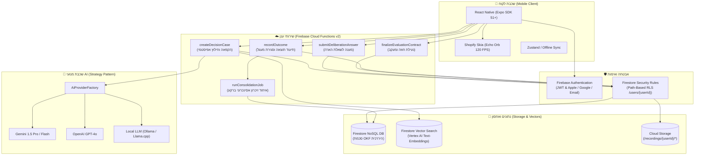
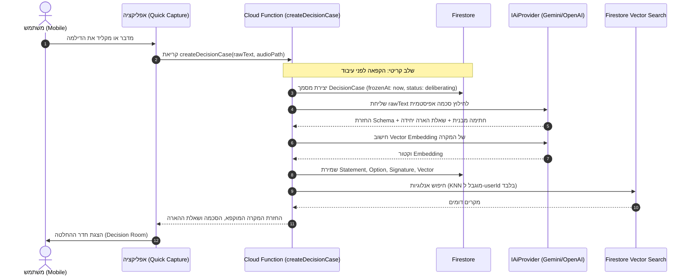
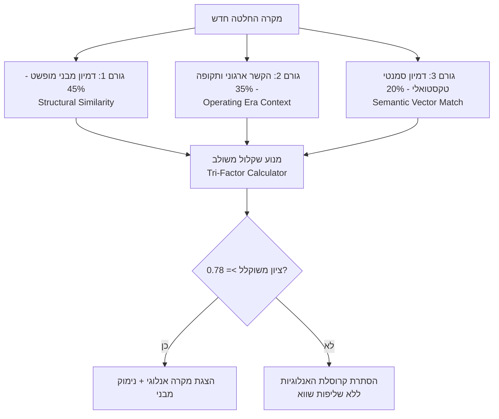
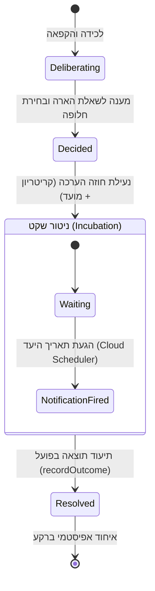

# מסמך ארכיטקטורה בסיסית — הד | Echo
**מפרט הנדסי של המערכת, צינורות נתונים ותשתיות ענן**
גרסה: 1.0.0 | תאריך: ספטמבר 2026 | סיווג: ארכיטקטורת תוכנה

---

## 1. מבט-על על המערכת (System Overview & Component Topology)

ארכיטקטורת "הד" (Echo) תוכננה על פי עקרונות של **מודולריות מחמירה (Strict Separation of Concerns)**, **בידוד נתונים מוחלט (Zero-Trust Multi-Tenancy)**, ו**התאמה מלאה לפיתוח מקבילי ע"י ריבוי סוכני AI (Multi-Agent Development)**.



---

## 2. חלוקת מודולים ומבנה ה-Monorepo

המערכת בנויה כ-Monorepo מודולרי המנוהל תחת `npm workspaces` ו-Turborepo:

```
ECHO/
├── apps/
│   └── mobile/                # אפליקציית Mobile ב-React Native (Expo)
│       ├── src/
│       │   ├── screens/       # מסכי המשתמש (QuickCapture, DecisionRoom וכו')
│       │   ├── graphics/      # רכיבי Skia Shaders ו-Echo Orb
│       │   ├── theme/         # ערכת נושא Luxury Dark Mode
│       │   └── navigation/    # ניווט ואבטחת מסכים
│       └── package.json
├── packages/
│   ├── shared/                # חוזי טיפוסים משותפים (Single Source of Truth)
│   │   ├── src/
│   │   │   ├── types/         # הגדרות ממשקי OKF (decision, statement, era וכו')
│   │   │   └── index.ts
│   │   └── package.json
│   └── backend/               # שירותי שרת ומנוע AI
│       ├── src/
│       │   ├── ai/            # Strategy Pattern עבור ספקי ה-AI
│       │   ├── prompts/       # פרומפטים מובנים לחילוץ אפיסטמי
│       │   ├── services/      # לוגיקה עסקית (שליפה משולשת, איחוד)
│       │   └── functions/     # Callable Cloud Functions
│       └── package.json
├── firebase/                  # קבצי תצורה של Firebase
│   ├── firestore.rules        # חוקי אבטחה הרמטיים (Path-based isolation)
│   ├── storage.rules          # חוקי אבטחת מדיה והקלטות
│   └── firestore.indexes.json # אינדקסים משולבים ואינדקסים וקטוריים
└── docs/                      # מסמכי ארכיטקטורה ויסוד
```

---

## 3. פירוט שכבות הטכנולוגיה (Tech Stack Detail)

### 3.1 שכבת הלקוח (Frontend Mobile)
- **Framework:** React Native מבוסס **Expo SDK 51+** עם TypeScript קפדני (`strict: true`).
- **Styling:** **NativeWind (Tailwind CSS v3)** מותאם למובייל לתמיכה מלאה בערכת נושא מותאמת אישית.
- **Graphic Engine:** **Shopify React Native Skia** ברינדור מואץ חומרה ב-GPU (120 FPS). משמש ליצירת כדור ההד (Echo Orb), פעימות הילה (Aura Glow), ואפקטי גלים בריאקטיביות קולית.
- **Animations:** **React Native Reanimated 3** לביצוע מעברי מסכים ואנימציות Accordion מבוססות חומרה ב-UI Thread בלבד.

### 3.2 שכבת השרת (Serverless Cloud Functions)
- **Runtime:** **Firebase Cloud Functions v2** (Node.js 20+ / TypeScript).
- **Communication Protocol:** **Callable Functions (HTTPS with Auth Context)**. כל קריאה מאומתת ברמת ה-Framework ומזריקה את ה-`context.auth.uid` האותנטי ללא אפשרות זיוף.
- **Background Processing:** **Cloud Tasks** וטריגרים מתוזמנים (**Cloud Scheduler**) לביצוע עבודות תחזוקה אסינכרוניות.

### 3.3 שכבת ה-AI המודל-אגנוסטית (Strategy Pattern)
כדי למנוע תלות נוקשה בספק ענן יחיד (Vendor Lock-in), פותחה שכבת Adapter סביב הממשק `IAiProvider`:

```typescript
export interface IAiProvider {
  extractEpistemicSchema(rawText: string, activeEraContext?: Record<string, any>): Promise<EpistemicExtractionResult>;
  generateStructuralEmbedding(signature: Record<string, any>, context: Record<string, any>): Promise<number[]>;
  transcribeAudio?(audioBuffer: Buffer): Promise<string>;
}
```

- **GeminiProvider:** ספק ברירת מחדל מבוסס **Google Gemini 1.5 Pro / Flash** (מהירות, חלון קונטקסט ענק ודיוק בסכמות JSON מורכבות).
- **OpenAiProvider:** תמיכה מלאה ב-**OpenAI GPT-4o** דרך Structured Outputs.
- **LocalProvider:** תמיכה במודלים מקומיים בקוד פתוח (דרך Ollama / Llama.cpp) לטובת משתמשים עם דרישות פרטיות קיצוניות (Air-gapped / Local-only).
- **AiProviderFactory:** טוען ומזריק את הספק הרצוי בהתאם להגדרת משתנה סביבה יחיד (`AI_PROVIDER`).

---

## 4. צינורות נתונים ותהליכי ליבה (Core Data Pipelines)

### 4.1 צינור 1: לכידה מהירה והקפאה הרמטית (Raw Capture & Freeze)



### 4.2 צינור 2: מנוע השליפה המשולשת בסקייל (Tri-Factor Retrieval Engine)

כדי לשלוף אנלוגיות אמיתיות המלמדות על הדינמיקה הניהולית ולא רק התאמות טקסטואליות שטחיות, המערכת מפעילה אלגוריתם שקלול תלת-גורמי:

$$\text{Relevance Score} = 0.45 \cdot S_{\text{structural}} + 0.35 \cdot S_{\text{contextual}} + 0.20 \cdot S_{\text{semantic}}$$



1. **Structural Match ($0.45$):** מרחק וקטורי מנורמל בין פרמטרי ה-`DecisionSignature`:
   - שיפוע התחייבות (Commitment Gradient: מ-0 עד 1).
   - יחס עלות מידע (Information Cost Ratio).
   - ימי דעיכת הפיכות (Reversibility Decay Days).
   - מתח מנהל-סוכן (Principal-Agent Tension).
2. **Contextual Match ($0.35$):** תאימות של ה-`OperatingContext` (שלב החברה, משאב בחסר וסבילות סיכון). אם ההחלטה התקבלה בשלב חיים שונה, מופקת אזהרה למשתמש על השוני בהקשר.
3. **Semantic Match ($0.20$):** דמיון קוסינוס וקטורי של תיאור ההחלטה ב-Vertex AI.

### 4.3 צינור 3: חוזה מעקב וסגירת מעגל (Evaluation & Outcome Loop)



### 4.4 צינור 4: עובד איחוד הזיכרון ברקע (Epistemic Consolidation Worker)

בעת קריאת `recordOutcome`, מופעל ברקע תהליך `runConsolidationJob` המעדכן אסינכרונית את נכסי העל של המשתמש:
1. **עדכון מרשם שבירות ההנחות (`AssumptionRegistry`):**
   - בחינת ההנחות שנכללו במקרה המקורי מול העובדות שנצפו ב-Outcome.
   - עדכון מונה השבירות (`failed_instances_count`) וחישוב מחדש של יחס השבירות (`fragility_ratio`).
2. **עדכון כיול תחזיות (`CalibrationTracker`):**
   - חישוב Brier Score על בסיס התחזיות שהוכרעו.
   - עדכון התפלגות הביטחון (Confidence Buckets).
3. **גיבוש השערות דפוס (`PatternHypothesis`):**
   - שיוך המקרה כמקרה תומך או סותר להשערה קיימת, עדכון גודל המדגם $N$, ועדכון הסטטוס האפיסטמי של ההשערה.

---

## 5. אבטחה, פרטיות ובידוד מוחלט (Zero-Trust Multi-Tenancy)

שיקול דעת אישי ודילמות עסקיות הם המידע הרגיש ביותר של כל מנהל. המערכת מיישמת ארכיטקטורת אבטחה קשיחה:

### 5.1 חוקי Firestore (Path-Based RLS)
כל ישויות המידע נשמרות בהיררכיה פרטית תחת ה-Path של ה-`userId`:

```javascript
rules_version = '2';
service cloud.firestore {
  match /databases/{database}/documents {
    // חסימת כל גישה כללית
    match /{document=**} {
      allow read, write: if false;
    }
    
    // בידוד הרמטי של נתיב המשתמש
    match /users/{userId}/{allPaths=**} {
      allow read, write: if request.auth != null && request.auth.uid == userId;
    }
  }
}
```

### 5.2 בידוד וקטורי מובנה
שום שאילתת דמיון וקטורי אינה מבוצעת על כלל המאגר. כל שאילתת KNN כוללת Pre-filter מובנה המחייב `userId == request.auth.uid`. אין אפשרות תיאורטית להדלפת וקטורים או אנלוגיות בין משתמשים שונים.

### 5.3 אבטחת קבצי אודיו והקלטות
קבצי הקלטת קול נשמרים ב-Cloud Storage בנתיב המבודד `/recordings/{userId}/{caseId}/*` ומוגנים בחוקי Storage המאפשרים קריאה והורדה אך ורק לבעל ה-UID המאומת.

---

## 6. אסטרטגיית איכות ובדיקות (Testing Strategy)

| שכבת בדיקה | כלי עבודה | היקף ומטרת הבדיקה |
| :--- | :--- | :--- |
| **חוזי טיפוסים** | TypeScript Compiler (`tsc`) | קימפול מלא של חבילת `packages/shared` ללא שגיאות. |
| **חוקי אבטחה (RLS)** | `@firebase/rules-unit-testing` | הדמיית ניסיונות פריצה ואימות שמשתמש א' לעולם אינו נגיש למידע של משתמש ב'. |
| **חילוץ אפיסטמי** | Jest + Mock AI Provider | אימות שפרומפטים מחלצים JSON תקף מול כל 4 מקרי הסימולציה מהחזון. |
| **מנוע שליפה ואיחוד** | Unit Tests (`packages/backend`) | בדיקת נוסחת השליפה המשולשת, עדכון Brier Score ושבירות הנחות. |
| **קומפוננטות UI** | Jest + React Native Testing Library | אימות רינדור כרטיסי הסכמה, מצבי ה-Echo Orb ומחוות משתמש. |
