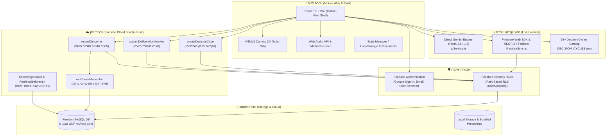
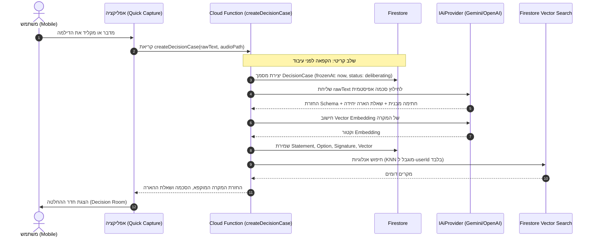
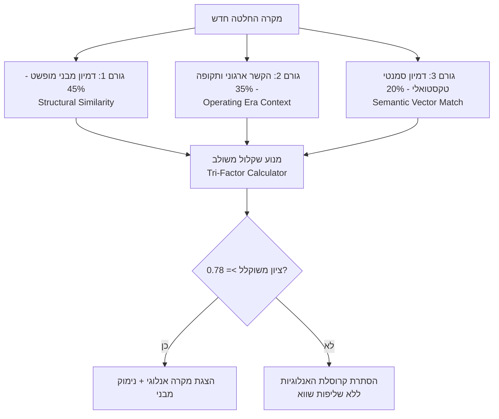
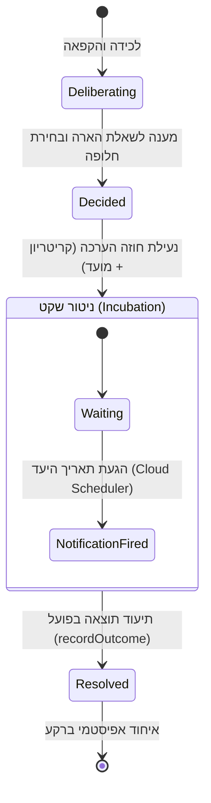

# מסמך ארכיטקטורה בסיסית — הד | Echo
**מפרט הנדסי של המערכת, צינורות נתונים ותשתיות ענן**
גרסה: 1.0.0 | תאריך: ספטמבר 2026 | סיווג: ארכיטקטורת תוכנה

---

## 1. מבט-על על המערכת (System Overview & Component Topology)

ארכיטקטורת "הד" (Echo) תוכננה על פי עקרונות של **מודולריות מחמירה (Strict Separation of Concerns)**, **בידוד נתונים מוחלט (Zero-Trust Multi-Tenancy)**, ו**התאמה מלאה לפיתוח מקבילי ע"י ריבוי סוכני AI (Multi-Agent Development)**.



---

## 2. חלוקת מודולים ומבנה ה-Monorepo

המערכת בנויה כ-Monorepo מודולרי המנוהל תחת `npm workspaces` ו-Turborepo:

```
ECHO/
├── apps/
│   └── mobile/                # אפליקציית Mobile-First ב-React 18 + Vite (PWA)
│       ├── src/
│       │   ├── screens/       # מסכי המשתמש (QuickCapture, DecisionRoom, Journal, Profile וכו')
│       │   ├── graphics/      # מנוע Canvas 2D של כדור ההד (EchoOrb.tsx) וזרימת שלבים
│       │   ├── theme/         # ערכת נושא Luxury Dark Mode מבוססת DESIGN_SYSTEM.md
│       │   ├── components/    # כרטיס הד מהעבר (EchoPastCard), TopDrawer, מודאלים
│       │   └── services/      # מנוע AI ישיר (aiService.ts), סנכרון Firestore (firestoreSync.ts), אודיו
│       └── package.json
├── packages/
│   ├── shared/                # חוזי טיפוסים משותפים (Single Source of Truth)
│   │   ├── src/
│   │   │   ├── types/         # הגדרות ממשקי OKF (decision, cognitive, outcome, era וכו')
│   │   │   └── index.ts
│   │   └── package.json
│   └── backend/               # שירותי שרת ומנוע AI מתקדם
│       ├── src/
│       │   ├── ai/            # Strategy Pattern עבור ספקי ה-AI
│       │   ├── prompts/       # פרומפטים מובנים לחילוץ אפיסטמי ודלתא
│       │   ├── services/      # לוגיקה עסקית (DecisionService, RetrievalBeforeAsk, KnowledgeGraph)
│       │   └── functions/     # Callable Cloud Functions v2
│       └── package.json
├── firebase/                  # קבצי תצורה של Firebase
│   ├── firestore.rules        # חוקי אבטחה הרמטיים (Path-based isolation)
│   ├── storage.rules          # חוקי אבטחת מדיה והקלטות
│   └── firestore.indexes.json # אינדקסים משולבים
├── DECISION_CYCLES.json       # מאגר 38 מחזורי הכרעה היסטוריים מאומתים
└── docs/                      # מסמכי ארכיטקטורה, חזון ואפיון
```

---

## 3. פירוט שכבות הטכנולוגיה (Tech Stack Detail)

### 3.1 שכבת הלקוח (Frontend Mobile Web / PWA)
- **Framework:** **React 18** מבוסס **Vite** עם TypeScript קפדני (`strict: true`). מעטפת מובייל רספונסיבית מלאה (המותאמת לפריסה מלאה בסמארטפון ולמוקאפ ממוסגר יוקרתי במסכי דסקטופ).
- **Styling:** **Tailwind CSS** בשילוב אובייקט `LuxuryTheme` המיישם 100% מכללי **[DESIGN_SYSTEM.md](../DESIGN_SYSTEM.md)** (פלטת 3 צבעים בלבד: Void `#07080B`, Typography `#E6E8EE`, Sacred Gold `#D4AF37`, פונטים: Frank Ruhl Libre & Assistant, כיווניות ימין-לשמאל `dir="rtl"`).
- **Graphic Engine:** **HTML5 Canvas 2D Engine** מתמטי מובנה (`EchoOrb.tsx`) הפועל ב-60 FPS ללא ספריות כבדות. מחשב 32 פרוסות רוחב כדוריות, 140 נקודות לטבעת, זווית הטיה פרספקטיבית של 22 מעלות וסיבוב ציר Yaw מתמיד, המגיב בזמן אמת לעוצמת הקול.
- **Audio Engine:** **Web Audio API** סטנדרטי בדפדפן (`MediaRecorder`, `AudioContext`, `AnalyserNode`) המבטיח תאימות מוחלטת בכל דפדפן נייד ללא צורך בספריות נייטיב חיצוניות.

### 3.2 שכבת השרת והענן (Serverless Cloud Functions v2)
- **Runtime:** **Firebase Cloud Functions v2** (Node.js 20+ / TypeScript).
- **Communication Protocol:** **Callable Functions (HTTPS with Auth Context)**.
- **שירותי ליבה מתקדמים:** `DecisionService`, `KnowledgeGraphService`, `RetrievalBeforeAskService`, `DynamicEntityExtractorService` ו-`TriFactorRetrievalService`.

### 3.3 ארכיטקטורת AI היברידית וחוסן רב-שכבתי
כדי להבטיח זמני תגובה מיידיים (Zero Friction) וחוסן במצבי אי-חיבור, המערכת מיישמת גישה היברידית:
1. **פנייה ישירה מהקליינט ל-Google Gemini (`aiService.ts`):** מפעילה את מודלי `gemini-2.5-flash` / `gemini-1.5-flash` בחילוץ אפיסטמי ממוקד (טמפרטורה 0.2, פלט JSON מובנה) תוך שניות בודדות.
2. **סנכרון רב-מסלולי (Multi-Tier Firestore Sync):** ניסיון ראשוני ב-Firestore SDK, מעבר שקוף ל-Firestore REST API (עמיד לחסימות רשת), וגיבוי מקומי מלא לקובץ `DECISION_CYCLES.json`.
3. **שכבת Strategy Pattern ב-Backend (`IAiProvider`):** מאפשרת מעבר קל בין Gemini, OpenAI GPT-4o ומודלים מקומיים בענן.

---

## 4. צינורות נתונים ותהליכי ליבה (Core Data Pipelines)

### 4.1 צינור 1: לכידה מהירה והקפאה הרמטית (Raw Capture & Freeze)



### 4.2 צינור 2: מנוע השליפה המשולשת בסקייל (Tri-Factor Retrieval Engine)

כדי לשלוף אנלוגיות אמיתיות המלמדות על הדינמיקה הניהולית ולא רק התאמות טקסטואליות שטחיות, המערכת מפעילה אלגוריתם שקלול תלת-גורמי:

$$\text{Relevance Score} = 0.45 \cdot S_{\text{structural}} + 0.35 \cdot S_{\text{contextual}} + 0.20 \cdot S_{\text{semantic}}$$



1. **Structural Match ($0.45$):** מרחק וקטורי מנורמל בין פרמטרי ה-`DecisionSignature`:
   - שיפוע התחייבות (Commitment Gradient: מ-0 עד 1).
   - יחס עלות מידע (Information Cost Ratio).
   - ימי דעיכת הפיכות (Reversibility Decay Days).
   - מתח מנהל-סוכן (Principal-Agent Tension).
2. **Contextual Match ($0.35$):** תאימות של ה-`OperatingContext` (שלב החברה, משאב בחסר וסבילות סיכון). אם ההחלטה התקבלה בשלב חיים שונה, מופקת אזהרה למשתמש על השוני בהקשר.
3. **Semantic Match ($0.20$):** דמיון קוסינוס וקטורי של תיאור ההחלטה מול תקדימי העבר.

#### שירות שליפה מקדים והדים מהעבר (`RetrievalBeforeAskService` & `EchoPastCard`)
היישום המעשי של השליפה מתבצע מול מאגר 38 מחזורי ההחלטה המאומתים (`DECISION_CYCLES.json`):
- **רף סינון מחמיר:** כרטיס הד מהעבר (`EchoPastCard`) מוצג בממשק רק כאשר הציון המשוקלל חוצה **85%** ($\text{Score} \ge 0.85$). מתחת לרף זה, המערכת שומרת על שקט קוגניטיבי מוחלט (Smart Silence) ונמנעת משליפות שווא.
- **שאלה היסטורית מותנית:** המערכת אינה מסתפקת בהצגת המקרה, אלא שולפת את הלקח ההיסטורי ומנסחת שאלת חידוד מונעת ("במקרה דומה בעבר התברר ש... האם נכון לבדוק זאת גם כאן?").

### 4.3 צינור 3: חוזה מעקב וסגירת מעגל (Evaluation & Outcome Loop)



### 4.4 צינור 4: עובד איחוד הזיכרון ברקע (Epistemic Consolidation Worker)

בעת קריאת `recordOutcome`, מופעל ברקע תהליך `runConsolidationJob` המעדכן אסינכרונית את נכסי העל של המשתמש:
1. **עדכון מרשם שבירות ההנחות (`AssumptionRegistry`):**
   - בחינת ההנחות שנכללו במקרה המקורי מול העובדות שנצפו ב-Outcome.
   - עדכון מונה השבירות (`failed_instances_count`) וחישוב מחדש של יחס השבירות (`fragility_ratio`).
2. **עדכון כיול תחזיות (`CalibrationTracker`):**
   - חישוב Brier Score על בסיס התחזיות שהוכרעו.
   - עדכון התפלגות הביטחון (Confidence Buckets).
3. **גיבוש השערות דפוס (`PatternHypothesis`):**
   - שיוך המקרה כמקרה תומך או סותר להשערה קיימת, עדכון גודל המדגם $N$, ועדכון הסטטוס האפיסטמי של ההשערה.

---

## 5. אבטחה, פרטיות ובידוד מוחלט (Zero-Trust Multi-Tenancy)

שיקול דעת אישי ודילמות עסקיות הם המידע הרגיש ביותר של כל מנהל. המערכת מיישמת ארכיטקטורת אבטחה קשיחה:

### 5.1 חוקי Firestore (Path-Based RLS)
כל ישויות המידע נשמרות בהיררכיה פרטית תחת ה-Path של ה-`userId`:

```javascript
rules_version = '2';
service cloud.firestore {
  match /databases/{database}/documents {
    // חסימת כל גישה כללית
    match /{document=**} {
      allow read, write: if false;
    }
    
    // בידוד הרמטי של נתיב המשתמש
    match /users/{userId}/{allPaths=**} {
      allow read, write: if request.auth != null && request.auth.uid == userId;
    }
  }
}
```

### 5.2 בידוד וקטורי מובנה
שום שאילתת דמיון וקטורי אינה מבוצעת על כלל המאגר. כל שאילתת KNN כוללת Pre-filter מובנה המחייב `userId == request.auth.uid`. אין אפשרות תיאורטית להדלפת וקטורים או אנלוגיות בין משתמשים שונים.

### 5.3 אבטחת קבצי אודיו והקלטות
קבצי הקלטת קול נשמרים ב-Cloud Storage בנתיב המבודד `/recordings/{userId}/{caseId}/*` ומוגנים בחוקי Storage המאפשרים קריאה והורדה אך ורק לבעל ה-UID המאומת.

---

## 6. אסטרטגיית איכות ובדיקות (Testing Strategy)

| שכבת בדיקה | כלי עבודה | היקף ומטרת הבדיקה |
| :--- | :--- | :--- |
| **חוזי טיפוסים** | TypeScript Compiler (`tsc`) | קימפול מלא של חבילת `packages/shared` ללא שגיאות. |
| **חוקי אבטחה (RLS)** | `@firebase/rules-unit-testing` | הדמיית ניסיונות פריצה ואימות שמשתמש א' לעולם אינו נגיש למידע של משתמש ב'. |
| **חילוץ אפיסטמי** | Jest + Mock AI Provider | אימות שפרומפטים מחלצים JSON תקף מול כל 4 מקרי הסימולציה מהחזון. |
| **מנוע שליפה ואיחוד** | Unit Tests (`packages/backend`) | בדיקת נוסחת השליפה המשולשת, עדכון Brier Score ושבירות הנחות. |
| **קומפוננטות UI** | Jest + React Native Testing Library | אימות רינדור כרטיסי הסכמה, מצבי ה-Echo Orb ומחוות משתמש. |
