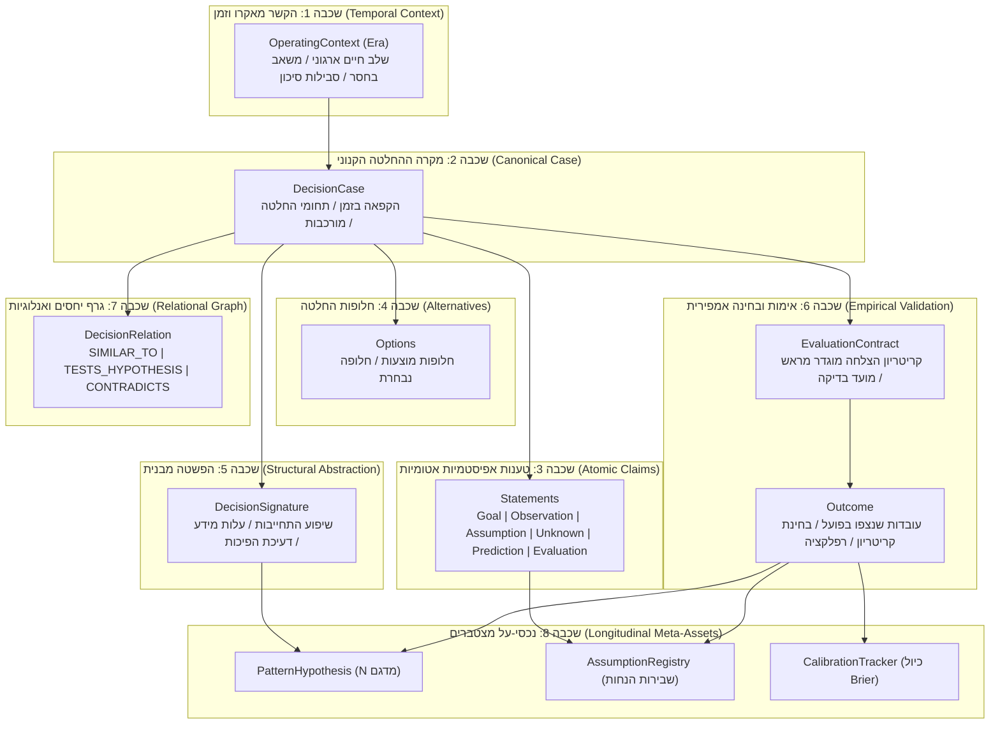
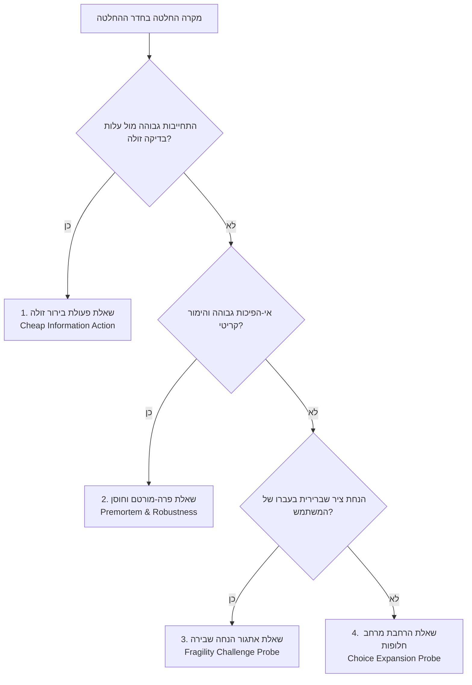
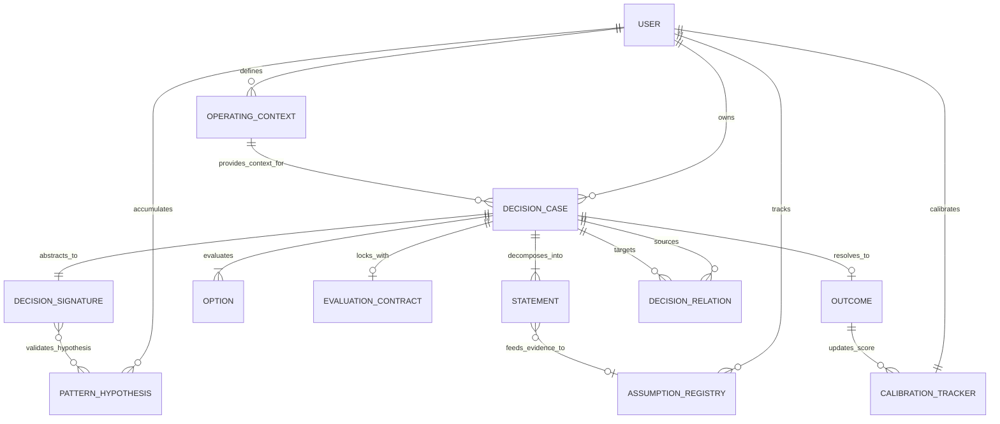

# מסמך ארכיטקטורה אונטולוגית — הד | Echo
**מידול ידע שיקול דעת, סכמת Google OKF וגרף קשרים אפיסטמי**
גרסה: 1.0.0 | תאריך: ספטמבר 2026 | סיווג: מודל ידע ואונטולוגיה

---

## 1. מבוא ועקרונות Google OKF בייצוג שיקול דעת

ייצוג של תהליכי חשיבה אנושיים מחייב דיוק מושגי עליון. שיקול דעת אינו ניתן לייצוג כטקסט בלתי מובנה, ואינו יכול להישען על מודל מסד נתונים שטוח. 

מערכת "הד" מיישמת את עקרונות **Google Open Knowledge Format (OKF)** למידול ידע:
1. **Concept-per-Entity (מושג עצמאי לכל מהות):** הפרדה מוחלטת בין המקרה הקנוני, טענותיו האטומיות, החלופות, המבנה המופשט והתוצאות בפועל.
2. **Atomic Epistemic Claims (אטומיות הטענה):** פירוק המלל הגולמי ליחידות טענה בסיסיות שאינן ניתנות לחלוקה נוספת, כאשר לכל יחידה משויך תפקיד קוגניטיבי ברור.
3. **Content-Agnostic Abstraction (הפשטה מנותקת-תוכן):** הפרדה בין התוכן הספציפי (שמות לקוחות, טכנולוגיות) לבין המבנה המתמטי של ההחלטה (הפיכות, שיפוע התחייבות, יחס עלות מידע).
4. **Explicit Provenance & Confidence (מקוריות וביטחון):** כל טענה נושאת חותמת מקור ברורה — האם נאמרה מפורשות ע"י המשתמש (`user_verbatim`) או הוסקה ע"י ה-AI (`inferred_by_ai`), יחד עם ציון ודאות אלגוריתמי.

---

## 2. אונטולוגיית 8 השכבות האפיסטמיות (The 8-Layer Epistemic Ontology)

---

## 3. מפרט הישויות המלא (OKF Concepts Specification)

### 3.1 `OperatingContext` (תקופת הפעלה ושלב חיים)
- **Concept ID:** `concept:operating_context`
- **ייעוד:** מעגן את המצב המאקרו-ארגוני או האישי שבו ההחלטה התקבלה. מונע השוואות שווא בין החלטות מתקופת "הישרדות מוקדמת" (Seed/Survival) להחלטות מתקופת "צמיחה מואצת" (Scale-Up).
- **שדות מפתח:**
  - `name`: שם התקופה (למשל: "Bootstrap Survival", "Post Series-A Growth").
  - `primary_scarcity`: המשאב הנמצא בחסר החריף ביותר (`runway_capital`, `executive_attention`, `engineering_capacity`, `market_credibility`).
  - `risk_tolerance`: רמת הסיכון המותרת (`existential_risk_only`, `calculated_risk`, `highly_conservative`).
  - `started_at` / `ended_at`: חלון הזמן האמפירי.

### 3.2 `DecisionCase` (מקרה ההחלטה הקנוני)
- **Concept ID:** `concept:decision_case`
- **ייעוד:** האובייקט הקנוני המאגד מקרה שיקול דעת בודד.
- **שדות מפתח:**
  - `title`: תקציר הדילמה.
  - `status`: מחזור חיי המקרה (`deliberating` $\rightarrow$ `decided` $\rightarrow$ `monitoring` $\rightarrow$ `resolved` $\rightarrow$ `archived`).
  - `family`: משפחת ההחלטה (למשל: `hire_or_wait`, `continue_or_stop`, `capital_allocation`, `market_entry`).
  - `context_stakes`: רמת ההימור (`low`, `medium`, `high`, `very_high`).
  - `context_reversibility`: מידת ההפיכות (`reversible`, `partially_reversible`, `irreversible`).
  - `context_time_pressure`: לחץ זמן (`low`, `medium`, `high`).
  - `frozen_at`: חותמת זמן מדויקת (epoch ms) שבה ננעל מצב החשיבה המקורי לפני עיבוד ה-AI.
  - `raw_capture_text`: המלל המקורי המדויק ללא שום מניפולציה.

### 3.3 `Statement` (טענה אפיסטמית אטומית)
- **Concept ID:** `concept:statement`
- **ייעוד:** יחידת טענה בסיסית שחולצה מהלכידה הגולמית, מסווגת לפי תפקידה הקוגניטיבי.
- **טקסונומיית התפקידים האפיסטמיים (`role`):**
  - `goal`: המטרה המבוקשת או התוצאה הרצויה שאותה מנסים להשיג או לשמר.
  - `observation`: עובדה מוצקה, מדד אמפירי או מידע מאומת שכבר קיים בעולם.
  - `assumption`: הנחה סמויה או גלויה, השערת עבודה שטרם נבדקה ויכולה להתברר כשגויה.
  - `unknown`: פער מידע קריטי, אי-ודאות מוכרזת שטרם התבררה.
  - `prediction`: תחזית הסתברותית או ציפייה מוגדרת לגבי התנהגות העתיד.
  - `evaluation`: שיפוט ערכי סובייקטיבי (למשל: "הצוות מרגיש עמוס מדי").
- **שדות מפתח:**
  - `provenance_source`: מקור הטענה (`user_verbatim` או `inferred_by_ai`).
  - `confidence_score`: מידת הוודאות של מודל החילוץ (0.0 עד 1.0).

### 3.4 `DecisionSignature` (חתימה מבנית מופשטת)
- **Concept ID:** `concept:decision_signature`
- **ייעוד:** הפשטה מתמטית מנותקת-תוכן של הדינמיקה הניהולית. מאפשרת שליפת אנלוגיות בין תחומים שונים לחלוטין (למשל: החלטת גיוס הנהלה המשולה להחלטת כניסה לשוק חדש).
- **ממדי החתימה:**
  - `commitment_gradient` ($0.0 \dots 1.0$): עד כמה ההחלטה מחייבת הקצאת משאבים בינארית כבדה שאינה ניתנת לחלוקה לשלבים קטנים.
  - `information_cost_ratio` ($0.0 \dots 1.0$): עד כמה זול או קל לבצע ניסוי מקדים לרכישת מידע מאמת לפני ההתחייבות.
  - `reversibility_decay_days` (ימים): משך הזמן שעד לחלוף חלון ההזדמנות לנסיגה מההחלטה ללא נזק בלתי הפיך.
  - `principal_agent_tension`: מידת התלות בגורמים חיצוניים או יישור קו בצוות (`sole_actor`, `team_alignment`, `external_dependency`).
  - `decision_tempo`: קצב קבלת ההחלטה (`emergency_hours`, `tactical_weeks`, `strategic_months`).

### 3.5 `EvaluationContract` (חוזה הערכה ומעקב מראש)
- **Concept ID:** `concept:evaluation_contract`
- **ייעוד:** סגירת חוזה בדיקה אובייקטיבי המונע את שכתוב הזיכרון בדיעבד.
- **שדות מפתח:**
  - `target_criteria`: קריטריון ההצלחה שהוגדר מראש בחדות בלתי מתפשרת (למשל: "לקוח משלם אחד תוך 6 שבועות").
  - `failure_signals`: אותות כשל וסימני אזהרה שהוגדרו מראש.
  - `review_date`: תאריך יעד קשיח לבדיקה (Epoch timestamp).

### 3.6 `Outcome` (תוצאה אמפירית ובחינת קריטריון)
- **Concept ID:** `concept:outcome`
- **ייעוד:** תיעוד המציאות בפועל ובחינה רפלקטיבית של תקפות הקריטריון המקורי.
- **שדות מפתח:**
  - `observed_facts`: עובדות שנצפו בעולם בפועל (ללא פרשנות).
  - `criteria_evaluation`: תוצאת הבדיקה ביחס לקריטריון המקורי (`succeeded`, `failed`, `partially_succeeded`, `unmeasurable`).
  - `reflection_notes`: בחינה רפלקטיבית בדיעבד — האם הקריטריון שהגדרנו בזמנו היה אכן מדד נכון?

### 3.7 נכסי-העל המצטברים (Longitudinal Meta-Assets)

#### `AssumptionRegistry` (מרשם שבירות הנחות אישי)
- עוקב אחר משפחות הנחה ספציפיות של המשתמש (למשל: `client_procurement_speed`, `engineering_delivery_buffer`).
- מחשב `fragility_ratio` = (הנחות שנשברו בפועל) / (סה"כ פעמים שהונחו).
- מזהה פקטורי תת-הערכה אופייניים (`typical_underestimation_factor`), למשל: זמני רכש בפועל ארכו פי 2.8 מהערכת המשתמש.

#### `CalibrationTracker` (מעקב כיול הסתברותי אישי)
- מודד סטטיסטית את מדד ה-Brier Score של המשתמש לאורך מאות מקרים:
  $$\text{Brier Score} = \frac{1}{N} \sum_{t=1}^N (f_t - o_t)^2$$
- מייצר עקומת כיול (Confidence Buckets): כאשר המשתמש טען שהוא בטוח ב-80%, האם האירוע התממש ב-80% מהפעמים?

#### `PatternHypothesis` (השערת דפוס שיקול דעת)
- מנסח השערה זהירה מבוססת ראיות (למשל: *"בהחלטות עתירות התחייבות, ביצוע בדיקה זולה בשבועיים הראשונים שיפר את סיכויי ההצלחה ב-60%"*).
- מכיל גודל מדגם $N$, רשימת מקרים תומכים וסותרים, ותנאי סף תקיפים (`context_boundaries`).

---

## 4. טקסונומיית שאלות ההארה (The Single Illumination Taxonomy)

המערכת אינה מייצרת שאלות פתוחות כלליות, אלא מסווגת את המקרה לאחת מארבע תבניות הארה אפיסטמיות מוגדרות:

1. **שאלת פעולת בירור זולה (Cheap Information Action):**
   - *טריגר:* `commitment_gradient > 0.7` וגם `information_cost_ratio > 0.6`.
   - *דוגמה:* "האם דרושים 3 חודשי פיתוח מלאים, או שקיים ניסוי של שבועיים לבדיקת נכונות לשלם ב-2% מהעלות?"
2. **שאלת פרה-מורטם וחוסן (Premortem & Robustness Probe):**
   - *טריגר:* `context_reversibility == 'irreversible'` וגם `context_stakes == 'very_high'`.
   - *דוגמה:* "נניח שבעוד שנה המהלך נכשל לחלוטין — מהו מנגנון הכשל הסביר ביותר שלא הוזכר כעת בדיון?"
3. **שאלת אתגור הנחה שבירה (Fragility Challenge Probe):**
   - *טריגר:* זוהתה הנחה השייכת למשפחה ב-`AssumptionRegistry` בעלת `fragility_ratio > 0.5`.
   - *דוגמה:* "זמני רכש באנטרפרייז בעברך ארכו פי 2.8 מהצפוי. כיצד התוכנית תחזיק מעמד אם הסגירה תתארך ב-6 חודשים?"
4. **שאלת הרחבת מרחב חלופות (Choice Expansion Probe):**
   - *טריגר:* המשתמש הגדיר בחירה בינארית צרה ("לעשות או לא לעשות").
   - *דוגמה:* "אם שתי האפשרויות שהוצגו היו נפסלות לחלוטין ע"י גורם חיצוני — מה הייתה דרך הפעולה השלישית?"

---

## 5. דיאגרמת ישויות וקשרים מלאה (Complete Mermaid ERD)

---

## 6. חוקי שלמות אפיסטמית (Epistemic Integrity Rules)

כדי להבטיח את טוהר הזיכרון, המערכת אוכפת חוקי שלמות מחמירים:
1. **Rule of Non-Retroactivity:** ברגע שנקבעה חותמת זמן `frozen_at`, המלל המקורי, האודיו והסכמה הראשונית הופכים ל-Read-Only. שום מודל שפה או עדכון ממשק אינו רשאי לדרוס אותם.
2. **Rule of Provenance Independence:** כל עדכון של חלופה בעקבות שאלת הארה נשמר כאובייקט נפרד (`origin: 'suggested_by_ai'`), כדי שלעולם לא יטושטש ההבדל בין מה שהאדם חשב בעצמו לבין מה שהמערכת האירה.
3. **Rule of Outcome Blindness:** בעת הצגת מקרים אנלוגיים בחדר ההחלטה (Decision Room), תוצאת המקרה נשארת מוסתרת כברירת מחדל עד לחיצה מפורשת — כדי לא לייצר "הטיית תוצאה" אצל המשתמש בזמן קבלת ההחלטה הנוכחית.
