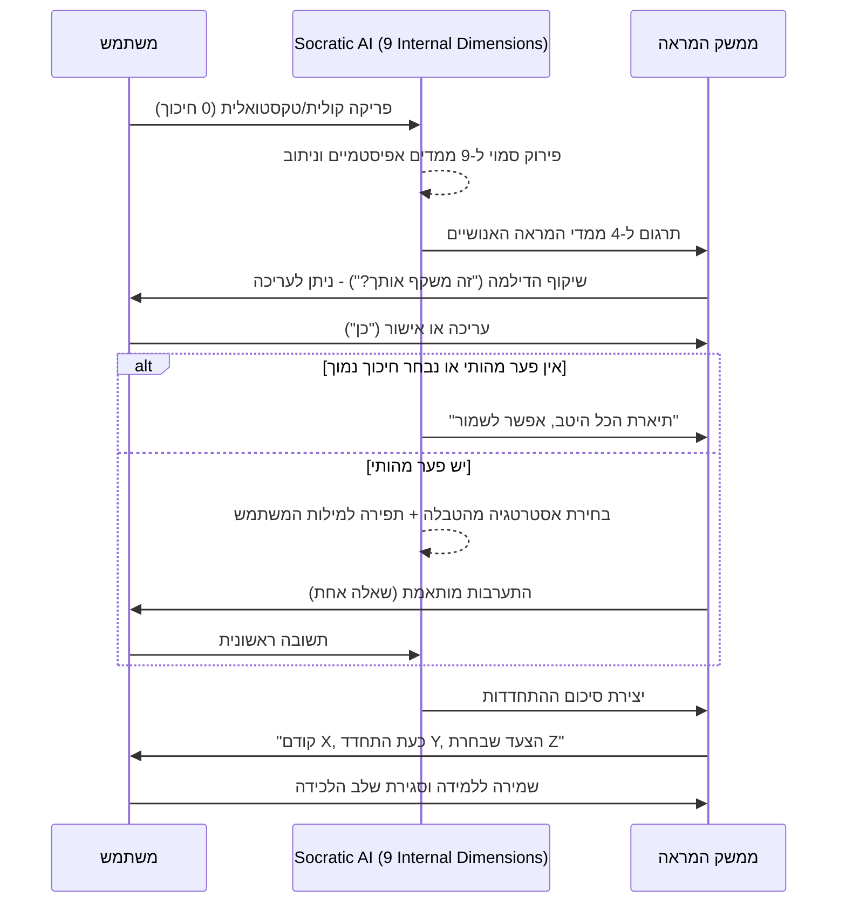

# מנוע קוגניטיבי: ממידע גולמי לחידוד מינימליסטי
**אונטולוגיית עיבוד, זיקוק מידע וחוויית משתמש (Cognitive Engine & UX)**
גרסה: 2.0.0 | תאריך: ספטמבר 2026

---

## 1. פילוסופיית העיצוב: חיכוך דינמי והאדם במרכז

המטרה של מערכת "הד" (Echo) אינה לקבל החלטות עבור המשתמש, לא להציף אותו בדשבורדים מורכבים, ובוודאי שלא לשמש כיועץ חיצוני. המערכת שומרת על המשתמש במרכז הבלעדי ומשמשת כ**מראה מתפתחת**. 
הגישה: **המשתמש שופך מלל גולמי (0 חיכוך) -> המכונה מקטלגת מאחורי הקלעים -> המשתמש מקבל שיקוף קצר לעריכה -> המערכת בוחרת התערבות אחת (או אפס) -> מוצגת התחדדות מיידית.**

---

## 2. האונטולוגיה הכפולה (The Dual Ontology)

כדי לייצר ערך מיידי מבלי להתיש את המשתמש, קיימת הפרדה בין **המנוע הפנימי** לבין **המראה החיצונית**.

### א. המנוע הפנימי של ה-AI (Background Processing)
מאחורי הקלעים, ה-AI מנתח 9 ממדים אפיסטמיים לטובת ניתוב נכון של ההתערבות:
1. **עובדות ($F$)** / 2. **הנחות ($A$)** / 3. **פערי מידע ($U$)** / 4. **חותמת רגשית ($E$)** / 5. **סיכון ($R$)** / 6. **הפיכות ($Rev$)** / 7. **דיסוננס ($C$)** / 8. **מיקוד שליטה ($Loc$)** / 9. **רמת ביטחון ($Conv$)**.

### ב. המראה החיצונית למשתמש (The 4 Human Dimensions)
במקום להציף את כל ה-9 ממדים, המערכת משקפת לאדם רק 4 שאלות אנושיות הניתנות לעריכה ישירה:
| הממד החיצוני | מה המערכת משקפת מתוך דברי המשתמש |
| :--- | :--- |
| **מה חשוב לי?** | מטרות, ערכים, אילוצים ומחירים שהאדם לא רוצה לשלם. |
| **על מה אני נשען?** | מידע שנמסר, ניסיון קודם, הערכות והנחות שאותרו. |
| **מה נשאר פתוח?** | מידע חסר, חלופות שלא נבחנו ומתחים בין מטרות מתחרות. |
| **איך אבחן את דרכי?** | מה עשוי לשנות את הבחירה, צעדי בירור מוקדמים ומתי כדאי לחזור לבחון. |

*הערה: הניסוח תמיד ישתמש ב-"הבנתי שחשוב לך..." (שיקוף) במקום "המטרה שלך היא..." (קביעה).*

---

## 3. אלגוריתם הניצוח: התערבות מותאמת (Adaptive Intervention)

המערכת דוגלת בעקרון **"שאלה אחת מועילה - ולפעמים גם אפס"**. 
אם הדיאגנוזה של המנוע הפנימי לא מצביעה על פער מהותי, או אם המשתמש בחר במסלול מהיר, המערכת תגיד: *"תיארת את השיקולים ואת אי-הוודאות המרכזית. אפשר לשמור כך ולהמשיך."*

כאשר קיים פער, ה-AI יבחר באחת מההתערבויות הבאות בהתבסס על ניתוח המלל:

| מה עולה מהמנוע הפנימי | התערבות ה-AI האפשרית (Tailored Elicitation) |
| :--- | :--- |
| **שתי מטרות מתחרות / דיסוננס** | "אם אי אפשר לקבל את שתיהן במלואן, על מה פחות תרצה לוותר?" |
| **הנחה משמעותית ללא בסיס מפורש** | "מה גורם לך לחשוב שזה יקרה?" |
| **פרט חסר (ידע סמוי/פערי מידע)** | "אם יתברר שהפרט הזה שונה, האם תשקול אחרת?" |
| **שתי אפשרויות שמוצגות כיחידות** | "האם יש דרך ביניים שתרצה לבחון?" |
| **התחייבות שקשה לבטל (אל-חזור)** | "מה חשוב לך לברר לפני הצעד שקשה לחזור ממנו?" |
| **המשך איסוף מידע ללא סוף** | "איזו תשובה נוספת באמת תשנה את הבחירה שלך?" |
| **בחירה שנראית כבר מגובשת** | "מה, אם בכלל, יגרום לך לפתוח אותה מחדש?" |

---

## 4. הצגת השינוי בחשיבה (Before & After Insight)

מיד לאחר תשובת המשתמש להתערבות (או לאחר שערך את המראה), המערכת **לא** מחליפה בשקט את המסך. היא מציגה סיכום התחדדות מפורש. זהו הערך המיידי החזק ביותר של המוצר.

> **קודם:** (ציטוט של החשש או הדילמה המקוריים).
> **כעת התחדד:** (סיכום השורה התחתונה שעליה המשתמש והמערכת הסכימו).
> **הצעד שבחרת:** (פעולת בירור, או החלטה, או שמירת המצב להמשך ניטור).

---

## 5. סיכום חוויית הזרימה (Flow Summary)

