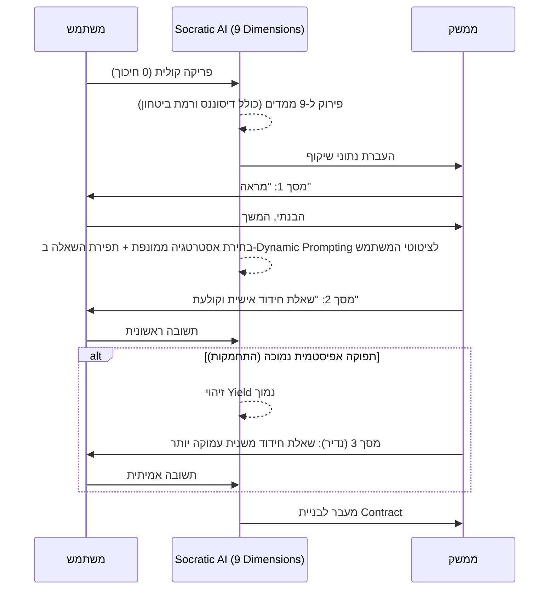

# מנוע קוגניטיבי: ממידע גולמי לחידוד מינימליסטי
**אונטולוגיית עיבוד, זיקוק מידע וחוויית משתמש (Cognitive Engine & UX)**
גרסה: 1.3.0 | תאריך: ספטמבר 2026

---

## 1. פילוסופיית העיצוב: חיכוך אפסי והאדם במרכז

המטרה של מערכת "הד" (Echo) אינה לקבל החלטות עבור המשתמש, לא להציף אותו בדשבורדים מורכבים, ובוודאי שלא לשמש כיועץ חיצוני. המערכת שומרת על המשתמש במרכז הבלעדי ומשמשת כ**מראה סוקרטית אלגנטית**. 
הגישה: **המשתמש שופך מלל גולמי (0 חיכוך) -> המכונה מקטלגת מאחורי הקלעים -> המשתמש מקבל תצוגה נקייה ושאלת חידוד אחת, תפורה אישית למילותיו, השואבת ממנו את האמת.**

---

## 2. האונטולוגיה המורחבת של המלל הגולמי (Raw Material Orchestration)

כדי לייצר שאלה ש"קולעת בול" לכוונת המשתמש, המנוע מפרק את המלל הגולמי ל-9 ממדים אפיסטמיים (`EpistemicState`). הוספנו למבנה ממדים מתקדמים כדי לזהות חולשות עדינות בחשיבה:

1. **עובדות ($F$):** נתונים שניתנים להוכחה ברגע זה.
2. **הנחות ($A$):** השערות על העתיד.
3. **פערי מידע וידע סמוי ($U$):** זיהוי רגעים שבהם המשתמש מתעלם ממידע הכרחי, שסביר להניח שהוא יודע אך נמנע מלהתייחס אליו בדיבור.
4. **חותמת רגשית ($E$):** זיהוי מצב סומטי (פחד, לחץ, התלהבות, FOMO).
5. **סיווג סיכון ($R$):** האם אנחנו ב"מדיוקריסטן" (טעות שגרתית) או ב"אקסטרמיסטן" (Ruin Risk / ברבור שחור).
6. **הפיכות ($Rev$):** האם אפשר לחזור לאחור בקלות (Two-way door).
7. **[חדש] דיסוננס קוגניטיבי ($C$ - Contradictions):** זיהוי סתירות פנימיות בתוך אותו משפט. *(למשל: "אנחנו חייבים להוציא את זה מחר" לעומת "אסור לנו לעשות פאשלות מול הלקוח הזה").*
8. **[חדש] מיקוד שליטה ($Loc$ - Locus of Control):** האם המשתמש מדבר כקורבן של השוק (חיצוני) או כיוזם (פנימי)? 
9. **[חדש] רמת ביטחון ($Conv$ - Conviction):** האם השפה מוחלטת ("תמיד", "בטוח") או מהססת ("אולי", "אני מקווה")?

---

## 3. ממשק המשתמש (UI): שיקוף ולאחריו חידוד

### מסך 1: שיקוף המראה (The Epistemic Mirror)
המסך מתחלק חזותית:
- **צד א' (עובדות):** רשימה נקייה של העובדות שחולצו.
- **צד ב' (הנחות ורגש):** רשימה של ההנחות והסתירות ($C$), בתוספת תגית זוהרת עדינה אם זוהה רגש דומיננטי ($E$).
*המטרה:* ניפוץ ביטחון היתר על ידי מראה קרה של היחס בין עובדות להנחות.

### מסך 2: שאלת החידוד הדינמית (The Bespoke Illumination)
המסך מוחשך, ובמרכז מופיעה באותיות גדולות **רק שאלה אחת**.
*הערה קריטית:* המערכת **לא משתמשת בתבניות טקסט קבועות**. השאלות בטבלה למטה הן רק *אסטרטגיות* (Routing). ה-AI ייקח את הציטוטים המדויקים של המשתמש וייצר שאלה אישית, חד-פעמית, שמרגישה שהיא נכתבה ספציפית עבור המלל שלו.

---

## 4. אלגוריתם הניצוח: תעדוף וחילוץ סוקרטי

| עדיפות | טריגר אונטולוגי במלל | הוגה | דוגמה להרכבת שאלת חידוד דינמית מתוך המלל (Tailored Elicitation) |
| :--- | :--- | :--- | :--- |
| **1. קריטי** | סכנת הישרדות או Ruin Risk | טאלב | *"אמרת ש-'נשים את כל התקציב של Q3 על הקמפיין'. אם ה-ROAS קורס לאפס, מה המנגנון שמונע מהחברה להיסגר ב-Q4?"* |
| **2. סתירה ($C$)** | זיהוי דיסוננס (Contradiction) | פסטינגר | *"מצד אחד ציינת ש-'אין לנו כסף לטעויות', אך מצד שני אמרת ש-'נקפוץ למים בלי QA'. איך שני המשפטים האלו מתקיימים יחד?"* |
| **3. רגשי ($E$)** | פחד, לחץ, או מיקוד שליטה חיצוני | דמסיו | *"השתמשת במילה 'חייבים' 4 פעמים בגלל השקת המתחרה. אלמלא המתחרה קיים, מה היית בוחר לעשות הבוקר?"* |
| **4. ידע סמוי** | יעד ללא פירוט סיכונים נדרש | כהנמן | *"הצבת יעד השקה ל-'אחרי החגים', אבל לא הזכרת במילה את צוואר הבקבוק של ה-DevOps שעיכב אותנו פעם קודמת. מה אתה יודע על המוכנות שלהם שלא נאמר כאן?"* |
| **5. אל-חזור** | החלטה בלתי הפיכה (One-way door) | קליין | *"ביטלנו את החוזה עם הספק הישן (החלטה אל-חזור). אנחנו בעוד שנה והכל קרס. מה בחוזה החדש גרם לזה?"* |

### מנגנון "ההארה הכפולה" (The Secondary Deep-Dive)
הפילוסופיה היא **שאלה אחת בלבד**. עם זאת, המערכת כוללת מנגנון התאוששות. 
לאחר שהמשתמש עונה על שאלת החידוד, מנוע ה-AI בוחן את "התפוקה האפיסטמית" (Epistemic Yield) של התשובה. 
- **אם התשובה מתחמקת או דלילה:** (למשל: "יהיה בסדר", "אני סומך עליהם").
- **הפעולה:** המערכת רשאית (במקרים חריגים בלבד) להציג **שאלת חידוד שנייה**, שמפרקת את ההתחמקות. 
  - *דוגמה לשאלה שנייה:* "ענית שאתה סומך עליהם, אבל רמת הביטחון שלך קודם הייתה נמוכה. איזה מטריקה קשיחה תוכיח לך בעוד שבועיים שהאמון הזה מוצדק?"

---

## 5. סיכום חוויית הזרימה (Flow Summary)

