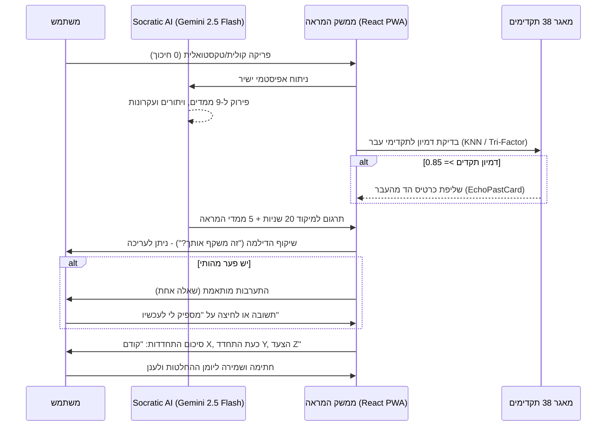

# מנוע קוגניטיבי: ממידע גולמי לחידוד מינימליסטי
**אונטולוגיית עיבוד, זיקוק מידע וחוויית משתמש (Cognitive Engine & UX)**
גרסה: 2.0.0 | תאריך: ספטמבר 2026

---

## 1. פילוסופיית העיצוב: חיכוך דינמי והאדם במרכז

המטרה של מערכת "הד" (Echo) אינה לקבל החלטות עבור המשתמש, לא להציף אותו בדשבורדים מורכבים, ובוודאי שלא לשמש כיועץ חיצוני. המערכת שומרת על המשתמש במרכז הבלעדי ומשמשת כ**מראה מתפתחת**. 
הגישה: **המשתמש שופך מלל גולמי (0 חיכוך) -> המכונה מקטלגת מאחורי הקלעים -> המשתמש מקבל שיקוף קצר לעריכה -> המערכת בוחרת התערבות אחת (או אפס) -> מוצגת התחדדות מיידית.**

---

## 2. האונטולוגיה הכפולה (The Dual Ontology)

כדי לייצר ערך מיידי מבלי להתיש את המשתמש, קיימת הפרדה בין **המנוע הפנימי** לבין **המראה החיצונית**.

### א. המנוע הפנימי של ה-AI (Background Processing)
מאחורי הקלעים, ה-AI מנתח 9 ממדים אפיסטמיים לטובת ניתוב נכון של ההתערבות:
1. **עובדות ($F$)** / 2. **הנחות ($A$)** / 3. **פערי מידע ($U$)** / 4. **חותמת רגשית ($E$)** / 5. **סיכון ($R$)** / 6. **הפיכות ($Rev$)** / 7. **דיסוננס ($C$)** / 8. **מיקוד שליטה ($Loc$)** / 9. **רמת ביטחון ($Conv$)**.

### ב. המראה החיצונית למשתמש (The 5 Human Dimensions & First 20 Seconds Focus)
במקום להציף את כל ה-9 ממדים, המערכת משקפת לאדם תמונת חשיבה צלולה הניתנת לעריכה ישירה:

1. **מיקוד 20 השניות הראשונות (The First 20 Seconds Header):**
   - **המתח המרכזי (`centralTension`):** מה עומד מול מה ברמת הערכים, הצרכים והמחירים הספציפיים לדילמה זו (למשל: "פשטות ורציפות מול תלות בספק יחיד").
   - **ציר ההכרעה (`keyHinge`):** "נראה שההכרעה תלויה בעיקר ב..." — זיהוי הנתון הבודד שיכריע את הכף.

2. **המראה האנושית לעריכה (The Editable Mirror):**
| הממד החיצוני | מה המערכת משקפת מתוך דברי המשתמש |
| :--- | :--- |
| **אתה שוקל** | ניסוח הדילמה המרכזית העומדת על הפרק בגוף שני. |
| **מה חשוב לי?** | מטרות, ערכים, אילוצים ומחירים שהאדם לא רוצה לשלם. |
| **העובדות הקשיחות** | נתונים, אירועים שקרו בפועל, ומידע ודאי שלא ניתן לערעור. |
| **ההנחות שלי** | פרשנות, הערכות עתידיות, וציפיות (1-3 הנחות קריטיות). |
| **המידע החסר להחלטה** | פערי מידע, שאלות פתוחות וגורמים שמונעים כרגע קבלת החלטה ברורה. |

*הערה: הניסוח תמיד ישתמש בשפה עדינה ואמפתית ("הבנתי שחשוב לך...", "ההנחה המרכזית שלך היא...") במקום קביעות פסקניות.*

---

## 3. אלגוריתם הניצוח: התערבות מותאמת ושליפת הדים מהעבר

### 3.1 שאלת הארה אחת — ולפעמים אפס (Adaptive Single Intervention)
המערכת דוגלת בעקרון **"שאלה אחת מועילה - ולפעמים גם אפס"**. 
אם הדיאגנוזה של המנוע הפנימי לא מצביעה על פער מהותי, או אם המשתמש בחר במסלול מהיר, המערכת תגיד: *"תיארת את השיקולים ואת אי-הוודאות המרכזית. אפשר לשמור כך ולהמשיך."*

כאשר קיים פער, ה-AI יבחר באחת מההתערבויות הבאות בהתבסס על ניתוח המלל:

| מה עולה מהמנוע הפנימי | התערבות ה-AI האפשרית (Tailored Elicitation) |
| :--- | :--- |
| **שתי מטרות מתחרות / דיסוננס** | "אם אי אפשר לקבל את שתיהן במלואן, על מה פחות תרצה לוותר?" |
| **הנחה משמעותית ללא בסיס מפורש** | "מה גורם לך לחשוב שזה יקרה?" |
| **פרט חסר (ידע סמוי/פערי מידע)** | "אם יתברר שהפרט הזה שונה, האם תשקול אחרת?" |
| **שתי אפשרויות שמוצגות כיחידות** | "האם יש דרך ביניים שתרצה לבחון?" |
| **התחייבות שקשה לבטל (אל-חזור)** | "מה חשוב לך לברר לפני הצעד שקשה לחזור ממנו?" |
| **המשך איסוף מידע ללא סוף** | "איזו תשובה נוספת באמת תשנה את הבחירה שלך?" |
| **בחירה שנראית כבר מגובשת** | "מה, אם בכלל, יגרום לך לפתוח אותה מחדש?" |

### 3.2 כרטיס הד מהעבר (`EchoPastCard` & Historical Precedent)
מעל שאלת החידוד, מופעל שירות השליפה המקדים (`RetrievalBeforeAskService`) מול מאגר 38 מקרי ההכרעה ההיסטוריים (`DECISION_CYCLES.json`):
- **סף צימוד:** מופק רק עבור ציון דמיון משוקלל $\ge 0.85$.
- **מבנה הכרטיס:** הצגת המקרה ההיסטורי, הלקח שנלמד אז, ושאלה היסטורית מונעת המותאמת לדילמה הנוכחית.

---

## 4. הצגת השינוי בחשיבה (Before & After Insight)

מיד לאחר תשובת המשתמש להתערבות (או לאחר שערך את המראה), המערכת **לא** מחליפה בשקט את המסך. היא מציגה סיכום התחדדות מפורש:

> **קודם:** (ציטוט של החשש או הדילמה המקוריים).
> **כעת התחדד:** (סיכום השורה התחתונה שעליה המשתמש והמערכת הסכימו).
> **הצעד שבחרת:** (פעולת בירור מוקדמת, מתוך 1-2 צעדים מוצעים או בחירה אישית).

---

## 5. מנגנוני שיקול דעת עמוקים (OKF Horizon 2 Deep Mechanisms)

ברקע הניתוח, המערכת מחלצת ומאחסנת את חתימת שיקול הדעת המופשטת:
- **ויתורים מודעים (`Tradeoffs`):** הגדרת הערך המוגן (`protectedValue`) מול הערך המוקרב (`sacrificedValue`).
- **סייגים ותנאי סף (`Boundary Conditions`):** התנאים שבהם ההנחות המרכזיות נותרות בתוקף.
- **עקרונות פעולה (`Operating Principles`):** כללי אצבע ניהוליים המופעלים בדילמה זו (למשל: "בירור מוקדם זול לפני התחייבות כבדה").

---

## 6. סיכום חוויית הזרימה (Flow Summary)

