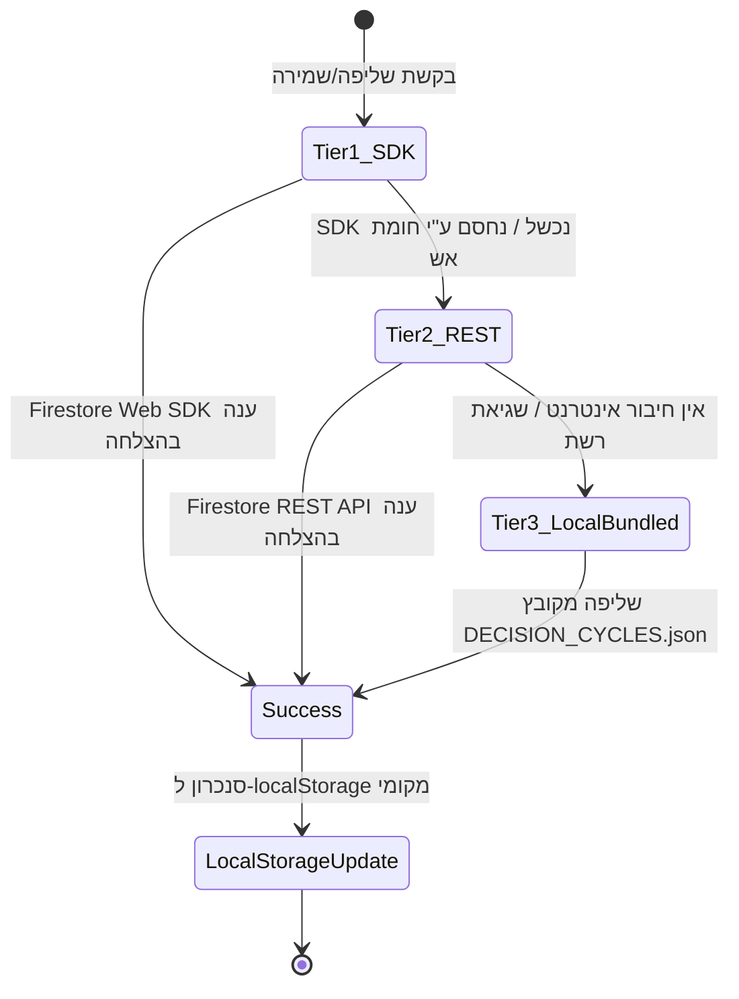

# מדריך זרימת נתונים, סנכרון ואינטגרציה (Data Flow & Integration) — הד | Echo
**גרסה:** 1.0.0 | **תאריך:** ספטמבר 2026 | **סיווג:** ארכיטקטורת נתונים ואינטגרציה

---

## 1. מבוא ועקרונות זרימת המידע (Data Flow Architecture)

מערכת **"הד" (Echo)** מיישמת ארכיטקטורת נתונים היברידית ייחודית שנועדה לענות על שלושה צרכים מתחרים:
1. **אפס חיכוך וזמן תגובה מיידי (Low Latency & Zero Friction):** חילוץ אפיסטמי מהיר ללא המתנה ל-Cold Starts.
2. **חוסן מוחלט ופעולה במצב לא מקוון (Offline Resilience):** המשך עבודה רציף גם כשיש תקלות רשת או חסימת שירותים.
3. **בידוד נתונים קפדני (Zero-Trust Multi-Tenancy):** מניעת ערבוב בין דילמות של משתמשים שונים.

```mermaid
flowchart TD
    subgraph Client ["📱 אפליקציית מובייל (React 18 / Vite)"]
        Audio["קלט קולי (Web Audio API)\nMediaRecorder + AnalyserNode"]
        Text["הקלדה חופשית (Textarea)"]
        Orb["כדור ההד (HTML5 Canvas 2D)\nתגובתיות תדרים בזמן אמת"]
        
        CaptureFlow["לכידת דילמה\nhandleCaptureSubmit()"]
        AiClientService["מנוע ניתוח ישיר\naiService.ts"]
        SyncService["מנוע סנכרון רב-שכבתי\nfirestoreSync.ts"]
        LocalCache[("זיכרון מקומי\nlocalStorage")]
    end

    subgraph AICloud ["🧠 שירותי AI של Google"]
        GeminiFlash["Google Gemini 2.5 / 1.5 Flash\n(REST API, Temp 0.2, JSON Schema)"]
    end

    subgraph StorageCloud ["☁️ שירותי ענן ואחסון Firebase"]
        FirestoreSDK["Tier 1: Firestore Web SDK"]
        FirestoreREST["Tier 2: Firestore REST API"]
        LocalBundled["Tier 3: קובץ מאגר סטטי\nDECISION_CYCLES.json"]
        FirestoreDB[("Firestore Database\n/users/{userId}/decisions/*")]
    end

    Audio --> Orb
    Audio & Text --> CaptureFlow
    CaptureFlow --> AiClientService
    AiClientService -->|Prompt חילוץ מובנה| GeminiFlash
    GeminiFlash -->>|JSON 5 ממדים + 20 שניות| AiClientService
    
    AiClientService -->|שליפת תקדימי עבר (85%+)| SyncService
    SyncService --> LocalCache
    SyncService --> FirestoreSDK
    FirestoreSDK -.->|כשל רשת / חסימה| FirestoreREST
    FirestoreREST -.->|אין חיבור| LocalBundled
    
    FirestoreSDK & FirestoreREST --> FirestoreDB
```

---

## 2. צינור קליטת השמע והרינדור (Audio Capture & Wave Dynamics)

1. **קליטת השמע:**
   * מבוצעת באמצעות `navigator.mediaDevices.getUserMedia({ audio: true })`.
   * מעטפת השירות ב-[voiceService.ts](file:///c:/Users/guyku/costs/ECHO/apps/mobile/src/services/voiceService.ts) מנהלת `AudioContext` ו-`AnalyserNode` (עם גודל FFT של 256).
2. **ריאקטיביות ויזואלית לכדור ההד (`EchoOrb.tsx`):**
   * הקומפוננטה דוגמת את עוצמת השמע הממוצעת בזמן אמת (0.0 עד 1.0) ומבצעת החלקה מתמטית (Smoothing Alpha = 0.12).
   * קנבס ה-2D מחשב 32 פרוסות רוחב כדוריות ו-140 נקודות לטבעת בהטיה של 22 מעלות (`tilt = 0.38 rad`) וסיבוב ציר Yaw מתמיד (`ROT_SPEED = 0.018`).
3. **סיום ההקלטה:**
   * ה-`MediaRecorder` מייצר קובץ אודיו (Blob מסוג `audio/webm` או `audio/mp4`), ומספק אותו למנוע הניתוח או לתמלול.

---

## 3. מנוע החילוץ האפיסטמי (Direct Gemini Extraction Pipeline)

הפנייה ל-AI מתבצעת ישירות מתוך [aiService.ts](file:///c:/Users/guyku/costs/ECHO/apps/mobile/src/services/aiService.ts) ל-Endpoint של Google Gemini:
```
POST https://generativelanguage.googleapis.com/v1beta/models/gemini-2.5-flash:generateContent?key={API_KEY}
```

### מאפייני הפרומפט וכללי האי-הזיה (Strict Grounding):
* **טמפרטורה נמוכה:** `temperature: 0.2` לקבלת פלט דטרמיניסטי ועקבי.
* **פורמט מבוקר:** `responseMimeType: "application/json"`.
* **חילוץ 5 ממדי המראה האנושיים:**
  1. `consideration`: ניסוח בגוף שני ("אתה שוקל...").
  2. `goalsPrices`: "הבנתי שחשוב לך להשיג ולשמור...".
  3. `facts`: רשימת עובדות קשיחות מאומתות שנאמרו מפורשות.
  4. `assumptions`: בין 1 ל-3 הנחות קריטיות לגבי העתיד.
  5. `missingInfo`: פער המידע שבירורו יכריע את הכף.
* **מיקוד 20 השניות הראשונות (The First 20 Seconds):**
  - `centralTension`: המתח המרכזי בין ערכים או מחירים.
  - `keyHinge`: "נראה שההכרעה תלויה בעיקר ב...".
* **מנגנוני שיקול דעת עמוקים (OKF Horizon 2):**
  - `operatingPrinciples`: כללי אצבע ניהוליים.
  - `tradeoffs`: ויתור בין ערך מוגן (`protectedValue`) לערך מוקרב (`sacrificedValue`).
  - `boundaryConditions`: תנאי סף לקיום ההנחות.
* **התערבות וצעדים:**
  - `question`: שאלת הארה חדה אחת בלבד.
  - `proposedSteps`: 1-2 צעדים מעשיים קונקרטיים.

---

## 4. ארכיטקטורת הסנכרון הרב-שכבתי (Multi-Tier Resilience)

שירות הסנכרון [firestoreSync.ts](file:///c:/Users/guyku/costs/ECHO/apps/mobile/src/services/firestoreSync.ts) מבטיח שהמידע נשמר ונשלף בכל תנאי רשת:



### פירוט השכבות:
1. **Tier 1 — Firestore Web SDK:**
   * שימוש במודול `firebase/firestore` הרגיל. מאפשר Realtime Listeners ו-Offline Persistence מובנה של הדפדפן.
2. **Tier 2 — Firestore REST API:**
   * במידה וה-SDK נחסם ע"י AdBlocker, VPN ארגוני או שגיאות WebSocket, השירות פונה ישירות ל-REST API:
     `https://firestore.googleapis.com/v1/projects/{projectId}/databases/(default)/documents/users/{userId}/decisions`
   * השירות כולל מפענח ייעודי (`decodeDoc` / `decodeFirestoreValue`) הממיר את מבנה ה-REST המפותל (`stringValue`, `mapValue`) לאובייקטי JSON נקיים.
3. **Tier 3 — Bundled JSON Fallback:**
   * אם המשתמש במצב Offline מלא ואין עדיין נתונים שמורים, המערכת טוענת את קובץ המאגר הסטטי המצורף לאפליקציה ([DECISION_CYCLES.json](file:///c:/Users/guyku/costs/ECHO/DECISION_CYCLES.json)).
4. **שכבת ה-Storage המקומית (`localStorage`):**
   * כל החלטה נשמרת מידית תחת המפתח `echo_decisions_{userId}`.
   * עבור מייסד המערכת, מתבצע סנכרון אוטומטי למפתחות `echo_decisions_Guy_Kuleski` ו-`echo_decisions_guy_founder`.

---

## 5. מנוע שליפת תקדימים והדים מהעבר (Historical Retrieval Engine)

בעת כניסה לחדר ההחלטה, המערכת מריצה בדיקת התאמה מול מאגר 38 המקרים המאומתים:

1. **אלגוריתם השקלול:**
   $$\text{Score} = 0.45 \cdot S_{\text{structural}} + 0.35 \cdot S_{\text{contextual}} + 0.20 \cdot S_{\text{semantic}}$$
2. **רף הסינון:**
   * אם $\text{Score} \ge 0.85$: מופק כרטיס הד מהעבר (`EchoPastCard`).
   * אם $\text{Score} < 0.85$: המערכת שומרת על שקט מוחלט (Smart Silence) ונמנעת משליפות שווא.
3. **תוכן הכרטיס:**
   * כותרת המקרה ההיסטורי והתאריך שבו התרחש.
   * הלקח שנלמד אז.
   * שאלה היסטורית מונעת המותאמת לדילמה הנוכחית.

---

## 6. סכמת הישויות ומבנה ה-Firestore

כל ישויות המשתמש שמורות תחת הנתיב ההיררכי המבודד:
```
/users/{userId}/decisions/{decisionId}
```

### שדות המסמך המרכזיים ב-Firestore:
```typescript
interface FirestoreDecisionDocument {
  id: string;                    // מזהה ייחודי (dec-{timestamp} או UUID)
  title: string;                 // כותרת הדילמה (עד 60 תווים)
  family: string;                // משפחת ההחלטה (general_deliberation, hire_or_wait וכו')
  status: string;                // "נחתם למעקב", "monitoring", "resolved"
  sealed: boolean;               // האם המקרה ננעל
  createdAt: number;             // epoch ms
  frozenAt: number;              // epoch ms של ההקפאה ההרמטית
  
  // ממדי המראה
  dilemma: string;               // consideration
  centralTension?: string;       // המתח המרכזי
  keyHinge?: string;             // ציר ההכרעה
  goalsPrices: string;           // מטרות ומחירים
  facts: string;                 // עובדות קשיחות
  assumptions: string;           // הנחות ופרשנויות
  missingInfo: string;           // פער המידע
  
  // הארה והכרעה
  question: string;              // שאלת ההארה שנשאלה
  answer?: string;               // תשובת המשתמש לשאלה
  conclusion?: string;           // מסקנה
  nextStep: string;              // הצעד שנבחר
  proposedSteps?: string[];      // הצעדים שהוצעו ע"י ה-AI
  
  // הדים מהעבר
  pastEcho?: {
    title: string;
    reason: string;
    score: number;
    lesson?: string;
  };
  
  // מעגלי המשך ותוצאה
  followUps: Array<{
    date: number;
    whatHappened: string;
    assumptionClarification: string;
    processReflection: string;
    quickStatus?: string;
  }>;
}
```
