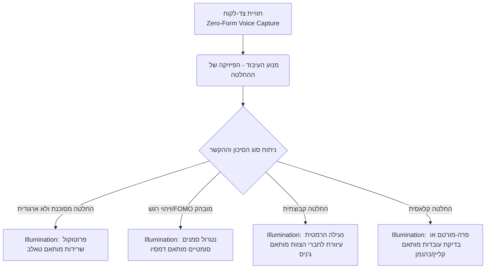

# מסמך ידע: תהליך קבלת החלטות — תשתית אקדמית, הטיות ושיפור בחיכוך נמוך
**מדעי ההחלטה (Decision Science), כלכלה התנהגותית, פסיכולוגיה קוגניטיבית ומתודולוגיות Low-Friction**
גרסה: 3.0.0 | תאריך: ספטמבר 2026 | סיווג: מסמך תשתית מדעית וידע (עומק אקדמי ואתגור מערכתי)

---

## 1. מבוא: מדוע מקבלי החלטות אינטליגנטיים נכשלים?

הנחת היסוד של הכלכלה הקלאסית גרסה כי האדם הוא "הומו אקונומיקוס" — מקבל החלטות רציונלי הממקסם תועלת צפויה. אולם, עשרות שנות מחקר במדעי הקוגניציה הוכיחו כי **החשיבה האנושית פועלת תחת מגבלות רציונליות מובנות (Bounded Rationality)**. 

הפרדוקס המרכזי של עולם הניהול וההשקעות הוא שדווקא מנהלים מוכשרים ובעלי אינטלקט גבוה נופלים קורבן להטיות חריפות. הסיבה אינה חוסר ידע, אלא **היעדר מנגנון חיצוני המגן על החשיבה מפני עצמה**. 

מסמך זה מרכז ניתוח עומק של הספרות האקדמית המובילה, מפרק את החוזקות והחולשות של המוח האנושי, מציג את הפתרונות המובנים במערכת **"הד" (Echo)**, ובפרק 3 **מאתגר את המערכת בעצמה** דרך הוגים המצביעים על עיוורונות אפשריים במודל הנוכחי.

---

## 2. מחקר אקדמי קלאסי: עיצוב הארכיטקטורה של "הד"

פרק זה סוקר את ענקי מדעי ההחלטה שעליהם מבוססת ליבת המערכת.

### 2.1 דניאל כהנמן ועמוס טברסקי (Daniel Kahneman & Amos Tversky)
- **מאמרי יסוד:** *Judgment under Uncertainty: Heuristics and Biases* (1974).
- **צדדים חלשים:** WYSIATI ("מה שאתה רואה זה כל מה שיש"). בניית נרטיב שלם ממידע חלקי תוך התעלמות ממה שאינו ידוע. עיוורון סטטיסטי.
- **התובנה המערכתית ל-"הד":** מנוע ה-AI לוקח פריקה קולית של "מערכת 1" ומפריד באכזריות בין **עובדות** לבין **הנחות**. בכך הוא שובר את אשליית ה-WYSIATI ומציף פערי מידע (`Unknowns`). שילוב פונקציית ה-Outside View באמצעות משיכת מקרי עבר.

### 2.2 גרד גיגרנזר (Gerd Gigerenzer)
- **מאמרי יסוד:** *Fast and Frugal Heuristics: The Adaptive Toolbox* (1999).
- **צדדים חזקים:** האינטואיציה האנושית היא **רציונלית אקולוגית** — מותאמת בצורה מושלמת לאי-ודאות אמיתית (Uncertainty) שבה מודלים מתמטיים קורסים.
- **התובנה המערכתית ל-"הד":** "הד" לא מכריחה למלא טבלאות של 50 פרמטרים. היא מכבדת את האינטואיציה ("Fast and Frugal") ומיישמת קבלת החלטות מבוססת סיבה-יחידה דרך **שאלת ההארה האחת** — נקודת המנוף הקריטית ביותר.

### 2.3 גארי קליין (Gary Klein)
- **מאמרי יסוד:** *Sources of Power: How People Make Decisions* (1998) | *Performing a Project Premortem* (2007).
- **סיכום הגישה:** קבלת החלטות נטורליסטית (NDM). מומחים משתמשים ב-RPD (Recognition-Primed Decision) — זיהוי תבניות.
- **התובנה המערכתית ל-"הד":** יישום אוטומטי של טכניקת ה**פרה-מורטם**. להחלטות בלתי-הפיכות, שאלת ההארה היחידה תהיה להניח כישלון מוחלט ולאתר את הסיבה מראש. בנוסף, יצירת `DecisionSignature` לבניית מאגר זיהוי תבניות עבור המנהל.

### 2.4 ברוך פישהוף (Baruch Fischhoff)
- **מאמרי יסוד:** *Hindsight ≠ Foresight* (1975).
- **סיכום הגישה:** הטיית הבדיעבד (Hindsight Bias). שכתוב הזיכרון כדי לגרום לתוצאה להיראות בלתי נמנעת ("ידעתי את זה כל הזמן"), מה שמונע למידה מטעויות.
- **התובנה המערכתית ל-"הד":** **הקפאה קנונית (Canonical Hermetic Freeze):** יצירת חותמת זמן `frozenAt` שנועלת הרמטית את המחשבה המקורית ל-Read-Only, ומונעת פיזית את הטיית הבדיעבד.

### 2.5 אנני דיוק (Annie Duke) ופיליפ טטלוק (Philip Tetlock)
- **מושגים מרכזיים:** Resulting (הטיית התוצאה), Brier Score, ענווה אפיסטמית.
- **התובנה המערכתית ל-"הד":** הפרדה מוחלטת ב-DB בין `EvaluationContract` (ההחלטה) לבין `Outcome` (התוצאה בפועל), תוך ניהול ציון **CalibrationTracker** פסיבי המכייל את רמת הביטחון של המנהל לאורך שנים.

---

## 3. אתגור המערכת: גבולות המודל הנוכחי ווקטורים לשיפור

כדי שמערכת "הד" תהיה חסינה (Robust) ולא רק מנגנון לתיעוד עצמי, עלינו לבחון את ההנחות הסמויות שלה אל מול הוגים שמאתגרים את רעיון הרציונליות המבודדת. פרק זה מנתח נקודות עיוורון פוטנציאליות במערכת ומגדיר פתרונות ארכיטקטוניים חדשים לשילוב.

### 3.1 נסים ניקולס טאלב (Nassim Nicholas Taleb) — ברבורים שחורים וחוסר ארגודיות
- **מאמרי/ספרי יסוד:** *The Black Swan* (2007) | *Antifragile* (2012).
- **האתגר למערכת "הד":** "הד" משתמשת בתחזיות סטטיסטיות, ציוני כיול (Brier), ומשיכת "מקרים דומים מהעבר" (Reference Class Forecasting). טאלב טוען שבסביבות מורכבות ("Extremistan" - כגון שווקים פיננסיים, מגפות או סטארטאפים), סטטיסטיקה מהעבר אינה מנבאת אירועי קיצון חסרי תקדים (ברבורים שחורים). הסתמכות על "כיול מדויק" בסביבה חסרת ארגודיות (Non-Ergodic) עלולה להעניק למנהל תחושת ביטחון מזויפת שתוביל לאובדן מוחלט (Ruin).
- **וקטור השיפור למערכת (System Upgrade):**
  - **פרוטוקול שרידות (Survival-First Protocol):** על המערכת לזהות (באמצעות ה-AI) האם ההחלטה שייכת ל"מדיוקריסטן" (סיכון מתוחם) או ל"אקסטרמיסטן" (סיכון זנב / חשיפה להתמוטטות). אם מדוהה פוטנציאל לסיכון בלתי-הפיך (Ruin), מנוע ה-AI *יבטל* את חישובי ההסתברות ויחליף את שאלת ההארה לטקטיקת גידור: "אם ההחלטה תשתבש לחלוטין, האם החברה תשרוד כדי לשחק מחר? איך מקצצים את זנב הסיכון השמאלי?"

### 3.2 אנטוניו דמסיו (Antonio Damasio) ופול סלוביק (Paul Slovic) — היוריסטיקת הרגש
- **מאמרי/ספרי יסוד:** *Descartes' Error* (Damasio, 1994) | *The Affect Heuristic* (Slovic, 2002).
- **האתגר למערכת "הד":** "הד" מתייחסת להחלטה כאל פעולה אפיסטמית-קוגניטיבית (מפרידה עובדות מול הנחות). דמסיו הוכיח נוירולוגית (השערת הסמנים הסומטיים) שבני אדם מנותקי רגש *אינם מסוגלים* לקבל החלטות. במקביל, סלוביק מראה שמנהלים משתמשים ברגש (Affect) כהיוריסטיקה — פחד או התלהבות מכתיבים את תפיסת הסיכון והסיכוי, לעיתים באופן תת-מודע. הניסיון "לייבש" את ההחלטה לעובדות בלבד עלול ליצור נתק מהאינטואיציה ההישרדותית.
- **וקטור השיפור למערכת (System Upgrade):**
  - **מיפוי רגשי מפורש (Affect Capture):** הוספת שכבת מטא-דאטה בשלב ה-Capture. לאחר הפריקה הקולית, המערכת תשאל: "מה התחושה הדומיננטית שלך כרגע לגבי ההחלטה? (התלהבות / לחץ / פחד מהחמצה-FOMO / אדישות)". עצם תיוג הרגש מקטין את השפעתו הסמויה (Affect Labeling), ומאפשר למערכת להתאים את ה-Illumination Question (למשל: אם הרגש הוא FOMO, השאלה תהיה "מה יקרה אם לא נעשה כלום?").

### 3.3 קארל וייק (Karl Weick) — בניית משמעות (Sensemaking) מתוך כאוס
- **מאמרי יסוד:** *Sensemaking in Organizations* (1995).
- **האתגר למערכת "הד":** המערכת מניחה שמנהל מגיע עם "החלטה" ברורה שיש לעבדה (בעיה -> חלופות -> בחירה). וייק חקר משברים (כמו אסון מאן גולץ') והראה שבמצבי כאוס אין "החלטות", אלא ניסיון מתמשך *לייצר משמעות* ממידע סותר (Sensemaking). מנהל עשוי לא לדעת אפילו מהי השאלה שצריך להחליט עליה.
- **וקטור השיפור למערכת (System Upgrade):**
  - **מצב ספיגה (Sensemaking Mode / Journaling):** הוספת מוד פעולה פסיבי שבו "הד" אינה דוחפת ל-`EvaluationContract`. המשתמש יכול לפרוק שברי מידע לאורך שבועות ב-Voice, וה-AI יבנה ברקע "גרף אותות חלשים" ללא דרישה להכרעה, עד שמתגבשת תמונה המצדיקה החלטה אקטיבית.

### 3.4 אירווינג ג'ניס (Irving Janis) וקאס סאנסטיין (Cass Sunstein) — דינמיקה קבוצתית
- **מאמרי/ספרי יסוד:** *Groupthink* (Janis, 1972) | *Nudge* & *Wiser* (Sunstein, 2014).
- **האתגר למערכת "הד":** "הד" נבנתה ככלי Single-Player. במציאות התאגידית, החלטות מתקבלות על ידי צוותים. אם מנהל משתמש ב"הד" כדי להתבצר בעמדתו ואז מציג אותה לצוות, המערכת עלולה להגביר *Groupthink* (חשיבת יחד) והקצנה קבוצתית (Group Polarization), שכן היא מציידת מנהל שגוי בטיעונים מאורגנים.
- **וקטור השיפור למערכת (System Upgrade):**
  - **חיכוך אפיסטמי מרובה-משתתפים (Multi-Player Blind Epistemics):** הרחבת המערכת לתמיכה בהחלטות הנהלה. "הד" תאפשר "מרחב החלטה אנונימי" שבו כל סמנכ"ל מחויב לבצע Zero-Form Capture נפרד, ורק לאחר שכולם הוקפאו הרמטית (`frozenAt`), המערכת מציגה את פערי ההנחות (Assumption Divergence) בין חברי הצוות. מונע אפקט של העוגן (Anchoring) של המנכ"ל על שאר הצוות.

---

## 4. פרדוקס החיכוך והאיזון המוצרי

האתגרים המוצגים בפרק 3 מדגישים את הצורך באיזון. למרות שהמערכת זקוקה ליכולות מורכבות (זיהוי ברבורים שחורים, ניתוח רגש, דינמיקה קבוצתית), על חוויית המשתמש להישאר בחיכוך כמעט אפסי.

"הד" אינה מנסה להפוך את האדם למחשבון מתמטי; היא רותמת את החוזקות האנושיות, מכבדת את גבולות הרציונליות ומשקל הרגש, ופורסת רשת ביטחון טכנולוגית בלתי נראית התופסת את ההטיות במדויק ברגע התהוותן.

---

## 5. רשימת מקורות קריאה (Academic Bibliography)

1. **Damasio, A. R. (1994).** *Descartes' Error: Emotion, Reason, and the Human Brain.* Putnam.
2. **Duke, A. (2018).** *Thinking in Bets: Making Smarter Decisions When You Don't Have All the Facts.* Portfolio.
3. **Fischhoff, B. (1975).** *Hindsight ≠ foresight: The effect of outcome knowledge on judgment under uncertainty.* JEP: HPP, 1(3), 288-299.
4. **Gigerenzer, G., & Todd, P. M. (1999).** *Simple Heuristics That Make Us Smart.* Oxford UP.
5. **Janis, I. L. (1972).** *Victims of Groupthink.* Houghton Mifflin.
6. **Kahneman, D. (2011).** *Thinking, Fast and Slow.* FSG.
7. **Klein, G. (1998).** *Sources of Power: How People Make Decisions.* MIT Press.
8. **Slovic, P., et al. (2002).** *The Affect Heuristic.* In Heuristics and Biases, Cambridge UP.
9. **Sunstein, C. R., & Hastie, R. (2014).** *Wiser: Getting Beyond Groupthink to Make Groups Smarter.* HBR Press.
10. **Taleb, N. N. (2007).** *The Black Swan: The Impact of the Highly Improbable.* Random House.
11. **Tetlock, P. E. (2005).** *Expert Political Judgment.* Princeton UP.
12. **Tversky, A., & Kahneman, D. (1974).** *Judgment under Uncertainty: Heuristics and Biases.* Science.
13. **Weick, K. E. (1995).** *Sensemaking in Organizations.* Sage Publications.
