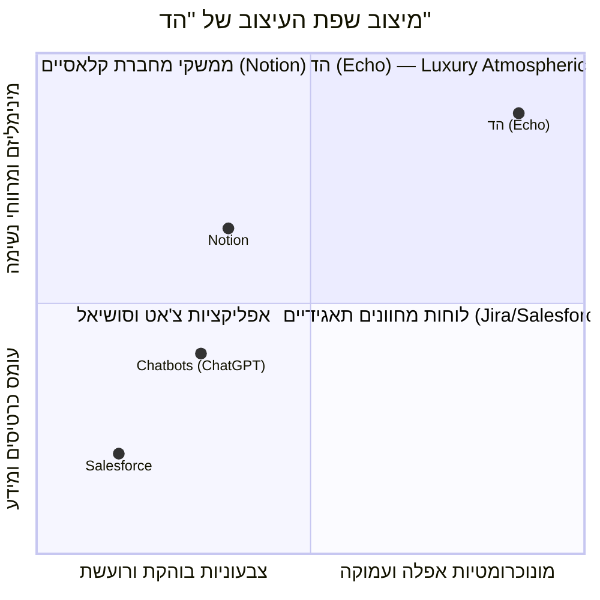
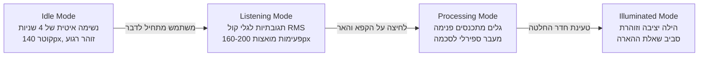

# מסמך עיצוב ומערכת ממשק (Design System & UI/UX) — הד | Echo
**שפת עיצוב, טוקנים גרפיים, מנוע Skia ומפרט מסכים**
גרסה: 1.0.0 | תאריך: ספטמבר 2026 | סיווג: מפרט עיצוב וממשק משתמש

---

## 1. פילוסופיית העיצוב: Luxury Atmospheric Minimalism

מערכת "הד" (Echo) אינה לוח מחוונים עמוס ואינה אפליקציית רישום פתקים. היא סביבה דיגיטלית המיועדת ל**מחשבה עמוקה ורפלקציה שקטה (Contemplative Computing)** עבור מקבלי החלטות בכירים ברגעי מתח ואי-ודאות.



### עקרונות העיצוב המנחים:
1. **Atmos Dark (חושך אטמוספרי ועמוק):** רקעים כהים מרובי שכבות בגווני אובסידיאן וגרפיט (`#0B0C10`), המאפשרים לתוכן ולשאלות לזרוח בעדינות ללא סינוור או עייפות עיניים.
2. **Pearl & Graphite Typography:** היררכיה טיפוגרפית מוקפדת עם פונט אלגנטי, ריווח אותיות נדיב (Letter Spacing) ושילוב בין טקסט פנינה בהיר (`#F4F4F5`) לטקסט משני מאופק (`#A1A1AA`).
3. **Epistemic Color Coding (צבעוניות אפיסטמית פונקציונלית):** הצבע אינו קישוט, אלא כלי קוגניטיבי מובהק להבחנה בין עובדות, הנחות, פערי מידע ומטרות.
4. **Hardware-Accelerated Physics (גרפיקת חומרה חיה):** אלמנטים גרפיים רפלקטיביים (גלי הד, הילה פועמת) המרונדרים ב-GPU ב-120 FPS ומשדרים יוקרה ודינמיות שקטה.

---

## 2. מערכת הטוקנים הגרפיים (Design Tokens)

### 2.1 פלטת הצבעים (Color Palette)

```typescript
export const LuxuryTheme = {
  background: {
    base: '#0B0C10',           // Deep Obsidian (רקע ראשי של האפליקציה)
    surface: '#14161E',        // Card Background (משטח כרטיס רגיל)
    surfaceElevated: '#1D202D',// Elevated Card (משטח מוגבה / Hero)
    border: 'rgba(255, 255, 255, 0.08)', // גבול עדין מזכוכית
    borderActive: 'rgba(99, 102, 241, 0.35)' // גבול זוהר פעיל
  },
  text: {
    primary: '#F4F4F5',        // Soft Pearl White (טקסט ראשי קריא)
    secondary: '#A1A1AA',      // Muted Graphite (טקסט משני והסברים)
    tertiary: '#71717A',       // Dim Zinc (מטא-דאטה וחותמות זמן)
    inverse: '#0B0C10'         // טקסט כהה על רקע בהיר
  },
  accent: {
    auraGlow: '#6366F1',       // Indigo Glow (הילת ההד המרכזית)
    auraSecondary: '#8B5CF6',  // Deep Violet (הילה משנית)
    amberWarning: '#F59E0B',   // Amber (הדגשת הנחות טעונות אימות)
    emeraldSuccess: '#10B981', // Emerald (עובדות מאומתות וקריטריונים שהצליחו)
    cyanInfo: '#06B6D4',       // Cyan (פעולות בירור וניסויים זולים)
    roseAlert: '#F43F5E'       // Rose (אותות כשל והנחות שנשברו)
  },
  epistemicRoles: {
    goal: '#8B5CF6',           // סגול מלכותי למטרה העליונה
    observation: '#10B981',    // ירוק אמרלד לעובדה מוצקה ומאומתת
    evaluation: '#6366F1',     // אינדיגו להערכה סובייקטיבית
    assumption: '#F59E0B',     // ענבר חם להנחה סמויה הדורשת אימות
    unknown: '#EC4899',        // ורוד ניאון עדין לפער מידע קריטי
    prediction: '#3B82F6'      // כחול צלול לתחזית הסתברותית
  }
};
```

### 2.2 טיפוגרפיה (Typography Scales)

| סגנון טיפוגרפי | גודל | משקל (Weight) | Letter Spacing | שימוש במערכת |
| :--- | :--- | :--- | :--- | :--- |
| **Display (Hero)** | 32px | Bold (700) | -0.5px | כותרות לכידה, שאלת ההארה האחת |
| **Heading 1** | 24px | SemiBold (600) | -0.3px | כותרות מסכים (Decision Room, Contract) |
| **Heading 2** | 18px | Medium (500) | 0px | כותרות קטגוריות אפיסטמיות (עובדות, הנחות) |
| **Body Primary** | 16px | Regular (400) | +0.2px | מלל טענות, ניסוח שאלות וחלופות |
| **Body Secondary** | 14px | Regular (400) | +0.1px | הסברים, תיאורי אנלוגיות, ציטוטי עבר |
| **Caption / Meta** | 12px | Medium (500) | +0.5px | תגיות סטטוס, חותמות זמן מוקפאות, תגיות `[עובדה]` |

### 2.3 גריד, רדיוסים ושכבות זכוכית (Elevation & Glassmorphism)
- **Corner Radius:**
  - כרטיסי תוכן: `16px` (`rounded-2xl`).
  - כפתורים ותגיות: `10px` (`rounded-lg`) או Pill מלא (`9999px`).
  - כרטיס שאלת הארה: `20px` (`rounded-3xl`) עם מסגרת זוהרת.
- **Glass Effect (Frosting):**
  - שימוש ב-`Expo Blur` (`intensity: 25`, `tint: 'dark'`) עם מסגרת דקה של `1px` בגוון `rgba(255, 255, 255, 0.08)`.

---

## 3. מנוע הגרפיקה וההד (Shopify React Native Skia)

במרכז החוויה הוויזואלית ניצב רכיב ה-**Echo Orb** — כדור הילה נושם המבוסס על שיידרים ב-Skia, המעניק למשתמש תחושת נוכחות רגועה וחיה.



### ארכיטקטורת המימוש של `EchoOrb.tsx`:
- רינדור ישיר ל-Canvas בחומרה (GPU) דרך `@shopify/react-native-skia`.
- חישוב פעימות רדיוס והילה באמצעות פונקציית סינוס מחזורית ב-Reanimated Worklet:
  $$r(t) = r_{\text{base}} + A \cdot \sin\left(\frac{2\pi t}{T}\right) + k \cdot \text{RMS}_{\text{audio}}$$
- שימוש ב-LinearGradient ו-BlurMask עמוק (Sigma: 35) להפקת הילה רכה ויוקרתית.

---

## 4. מפרט מסכי המשתמש (Screen Architecture & Wireframes)

### מסך 1: לכידה מהירה (Quick Capture Screen)
- **מבנה:** מסך נקי ונטול תפריטים מסיחי דעת.
- **אלמנטים:**
  1. בראש המסך: תאריך ותקופת הפעלה נוכחית (`Era: Scale-Up 2026`).
  2. במרכז המסך: כדור ההד המרכזי (`EchoOrb`) הפועם באיטיות.
  3. מתחת לאורב: כפתור מיקרופון מרכזי בלחיצה רצופה או Toggle.
  4. בחלק התחתון: תיבת קלט טקסט מינימליסטית ("או הקלד כאן את הדילמה...").
  5. כפתור פעולה ראשי: **"הקפא והאר" (Freeze & Echo)**.

```
+------------------------------------------+
|  [●] Era: Scale-Up 2026        10:14 AM  |
|                                          |
|                                          |
|                ( ( ◉ ) )                 |
|             Pulsing Echo Orb             |
|                                          |
|           "מה הדילמה שלפניך?"           |
|                                          |
|  [     הקלטה קולית חיה: 00:42      ]     |
|                                          |
|  [ טקסט: האם להשקיע 500K בפרויקט אטלס... ] |
|                                          |
|  [==========  הקפא והאר (Freeze)  =========] |
+------------------------------------------+
```

---

### מסך 2: חדר ההחלטה ומראת החשיבה (Decision Room & Epistemic Mirror)
- **מבנה:** גלילה אנכית רגועה ומרווחת, ללא מצב עריכה (Read-Only למניעת חיכוך).
- **מרכיבי המסך:**
  1. **כרטיס הקפאה (Top Anchor):** תגית נעילה עדינה `🔒 Frozen @ 10:14:02 — Immutable Record`. לחיצה פותחת את המלל המקורי המדויק.
  2. **כרטיסי סכמה אפיסטמית (Epistemic Schema):**
     - כרטיס מטרה (סגול): `🎯 מטרה: שימור יתרון תחרותי באנטרפרייז`.
     - כרטיס עובדות (ירוק): תבליטי `[עובדה]` (המתחרים טרם השיקו, לקוחות הביעו עניין).
     - כרטיס הנחות (ענבר): תבליטי `[הנחה טעונת אימות]` (נכונות לשלם בפועל, עמידה בזמנים).
  3. **כרטיס הגיבור: שאלת ההארה האחת (Hero Illumination Card):**
     - מסגרת זוהרת באינדיגו, טיפוגרפיה גדולה וקריאה.
     - השאלה היחידה ומענה תמציתי.
  4. **קרוסלת אנלוגיות עבר (Analogous Cases Carousel):**
     - מופיעה בתחתית רק במידה ונמצא מקרה עבר דומה מבנית.

```
+------------------------------------------+
| < חזרה               חדר ההחלטה           |
|------------------------------------------|
| [🔒 מצב חשיבה הוקפא @ 10:14:02 | צפה במקור] |
|                                          |
| 🎯 מטרה: שימור יתרון תחרותי באנטרפרייז   |
|                                          |
| [עובדות מוצקות - Observations]            |
| • לקוחות הביעו עניין מילולי חיובי        |
| • למתחרים אין כרגע פיצ'ר מקביל           |
|                                          |
| [הנחות טעונות אימות - Assumptions]        |
| ⚠️ עניין מילולי יתורגם לנכונות לשלם      |
| ⚠️ הפיתוח יסתיים תוך 3 חודשים בלבד       |
|                                          |
| +--------------------------------------+ |
| | 💡 שאלת ההארה האחת:                  | |
| | "האם נדרשים 3 חודשי פיתוח מלאים,      | |
| |  או שקיים ניסוי של שבועיים לבדיקת     | |
| |  נכונות לשלם ב-2% מהעלות?"           | |
| |                                      | |
| | [ תשובה קצרה: נחתים 2 לקוחות על LOI ]| |
| +--------------------------------------+ |
|                                          |
| [מקרים אנלוגיים מהעבר (ציון 84%)]:       |
| ◀ [מקרה 2024: מודול BI - נבחר ניסוי מקדים] ▶|
|                                          |
| [=========== הגדר חוזה ומעקב =========]   |
+------------------------------------------+
```

---

### מסך 3: חוזה הערכה ונעילה (Evaluation Contract Screen)
- **מבנה:** מסך מיקוד לסגירת חוזה אובייקטיבי.
- **אלמנטים:**
  1. סיכום החלופה שנבחרה (כולל פעולת הבירור הזולה שנוסחה).
  2. הגדרת **קריטריון הצלחה מוגדר מראש וחד-משמעי** ("לפחות לקוח משלם אחד תוך 30 יום").
  3. בחירת תאריך יעד לבדיקה (`Date Picker` מעוצב).
  4. כפתור נעילה סופי: **"שמור לזיכרון שיקול הדעת"**.

---

### מסך 4: מעקב וסגירת מעגל (Outcome & Reflection Modal)
- **מבנה:** מודאל עולה (Bottom Sheet או Full-Screen Modal) בעקבות התראה.
- **אלמנטים:**
  1. הצגת המחשבה המקורית: מה הונח ומה הוגדר כקריטריון ביום ההחלטה.
  2. שדה קלט של שתי שורות בלבד: **"מה נצפה בפועל בעולם?"**
  3. בחירה מתוך 4 סטטוסים: הצליח / נכשל / חלקי / לא ניתן למדידה.
  4. שאלה רפלקטיבית: "האם הקריטריון שהגדרנו בזמנו היה אכן מדד נכון?"
  5. כפתור: **"סגור מעגל ותעד תוצאה"**.

---

### מסך 5 (חדש): מסך זרימת עבודה ומסע החלטה (Decision Workflow & Lifecycle Journey Screen)
- **ייעוד:** תצוגה אינטראקטיבית שקופה המאפשרת למשתמש לראות בדיוק היכן עומדת כל החלטה ברצף הזמן והשלבים, כיצד היא דוגרת, ואילו דפוסי ניסיון הופקו ממנה.
- **אלמנטים מרכזיים:**
  1. **ציר מסע החלטה (Vertical Stepper Timeline):**
     - שלב 1: `Captured & Frozen` (תאריך, שעה וחותמת נעילה).
     - שלב 2: `Epistemic Schema Extracted` (כמות עובדות, הנחות ופערי מידע).
     - שלב 3: `Illumination Resolved` (שאלת ההארה והמענה).
     - שלב 4: `Contract Sealed` (קריטריון הצלחה מוגדר).
     - שלב 5: `Silent Incubation / Monitoring` (חיווי סטטוס חי: מונה ימים שקט עד תאריך הביקורת).
     - שלב 6: `Outcome Closed` (תוצאה אמפירית ורפלקציה).
     - שלב 7: `Pattern Crystallized` (עדכון מרשם הנחות וכיול אישי).
  2. **סטטוס אינדיקטורים חיים:**
     - שלב שהושלם מסומן ב-Emerald Checkmark (`✓`).
     - שלב פעיל נוכחי פועם באינדיגו עדין.
     - שלבים עתידיים מוצגים באפור כהה עמום.
  3. **כרטיס דגירה שקט (Incubation Card):** מוצג עבור מקרים בניטור: "נותרו 18 ימים עד בדיקת קריטריון ההצלחה".

```
+------------------------------------------+
| < חזרה         מסע החלטה: פרויקט אטלס     |
|------------------------------------------|
| [●] סטטוס נוכחי: ניטור שקט (Monitoring)   |
|                                          |
| (✓) 1. לכידה והקפאה                      |
|     12/09/2026, 10:14:02 | נעול 🔒        |
|                                          |
| (✓) 2. מראת חשיבה אפיסטמית               |
|     חולצו: 2 עובדות, 2 הנחות, 1 יעד       |
|                                          |
| (✓) 3. שאלת הארה יחידה                   |
|     נוסח ניסוי LOI מקדים לשבועיים        |
|                                          |
| (✓) 4. חתימת חוזה הערכה                   |
|     קריטריון: חתימת 2 לקוחות אנטרפרייז   |
|                                          |
| (◉) 5. ניטור שקט ודגירה בעולם (פעיל)     |
|     +----------------------------------+ |
|     | ⏳ נותרו 14 ימים למועד הבדיקה     | |
|     | מועד יעד: 26/09/2026             | |
|     +----------------------------------+ |
|                                          |
| ( ) 6. סגירת מעגל: תיעוד תוצאה (ממתין)   |
|                                          |
| ( ) 7. איחוד זיכרון ונכסים מצטברים      |
|                                          |
| [========= צפה בפרטי המקרה המלאים =======] |
+------------------------------------------+
```

---

## 5. משוב הפטי (Haptic Feedback) ונגישות (Accessibility)

- **משוב תחושתי (Haptics):**
  - תחילת הקלטה קולית: `ImpactFeedbackStyle.Light`.
  - לחיצה על "הקפא והאר": `NotificationFeedbackType.Success` כפול המעניק ביטחון פיזי בנעילת המידע.
  - פתיחת שאלת הארה: `ImpactFeedbackStyle.Medium`.
  - סגירת חוזה נעילה: `NotificationFeedbackType.Success`.
- **נגישות וניגודיות (WCAG 2.2 AA Compliance):**
  - יחס ניגודיות מינימלי של 4.5:1 לכל טקסט פנינה (`#F4F4F5`) וטקסט משני (`#A1A1AA`) על פני רקעי Obsidian (`#0B0C10`).
  - גודל מינימלי של Touch Target לכל הכפתורים: $48 \times 48\text{ px}$.
  - תמיכה מלאה בקוראי מסך (Screen Readers) עם תוויות `accessibilityLabel` מפורשות לכל כרטיס אפיסטמי ולכדור ההד.
