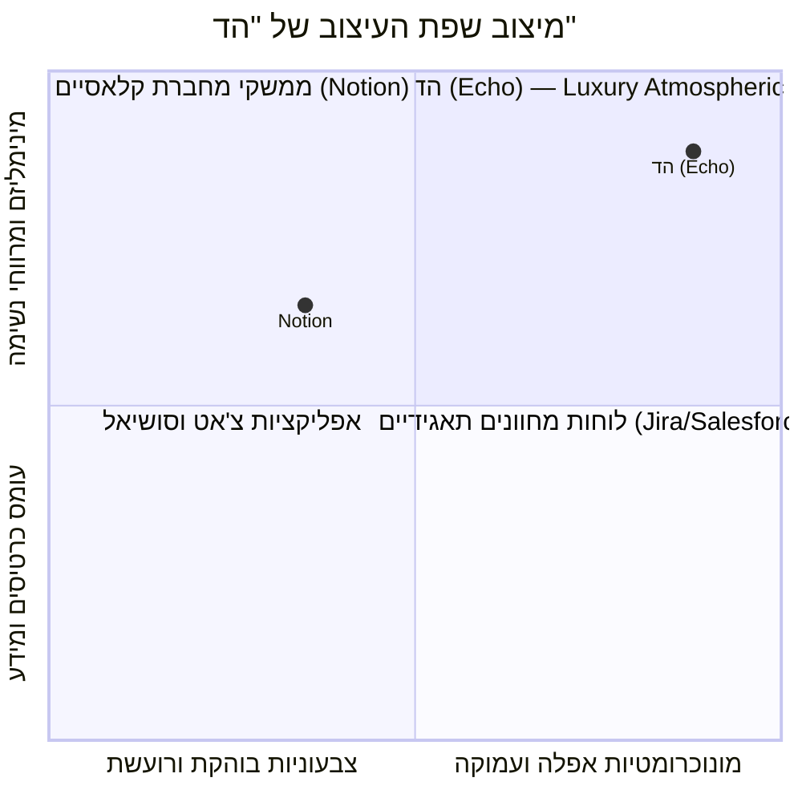

# מסמך עיצוב ומערכת ממשק (Design System & UI/UX) — הד | Echo
**שפת עיצוב, טוקנים גרפיים, מנוע Skia ומפרט מסכים**
גרסה: 2.0.0 | תאריך: ספטמבר 2026 | סיווג: מפרט עיצוב וממשק משתמש

---

## 1. פילוסופיית העיצוב: Luxury Atmospheric Minimalism

מערכת "הד" (Echo) אינה לוח מחוונים עמוס ואינה טופס בירוקרטי. היא סביבה דיגיטלית המיועדת ל**מחשבה עמוקה ורפלקציה שקטה (Contemplative Computing)** עבור מקבלי החלטות.



### עקרונות העיצוב המנחים:
1. **Atmos Dark (חושך אטמוספרי ועמוק):** רקעים כהים מרובי שכבות בגווני אובסידיאן וגרפיט (`#0B0C10`).
2. **Pearl & Graphite Typography:** היררכיה מוקפדת לשמירת שקט ויזואלי.
3. **Editable Mirroring:** התוכן לעולם אינו נעול ומרוחק, אלא נגיש לעריכה קלה במגע יד (Low Friction).
4. **Hardware-Accelerated Physics:** אלמנטים גרפיים רפלקטיביים (גלי הד).

---

## 2. מפרט מסכי המשתמש (Screen Architecture & Wireframes)

### מסך 1: לכידה מהירה (Quick Capture Screen)
- **מבנה:** מסך נקי ונטול תפריטים מסיחי דעת.
- **אלמנטים מרכזיים:**
  1. במרכז: כדור ההד המרכזי (`EchoOrb`) הפועם באיטיות.
  2. מתחת לאורב: כפתור מיקרופון מרכזי בלחיצה רצופה או Toggle.
  3. תיבת קלט טקסט מינימליסטית ("מה הדילמה שלפניך?").
  4. כפתור פעולה ראשי: **"שקף לי"**.

---

### מסך 2: המראה המתפתחת (The Editable Mirror)
- **מבנה:** גלילה אנכית רגועה. התוכן שחולץ מוצג כטיוטה הניתנת לעריכה מיידית, לא כמידע "נעול" של מערכת.
- **מרכיבי המסך:**
  1. **כרטיסי 4 הממדים (The 4 Human Dimensions):**
     - **אתה שוקל:** (הדילמה המרכזית).
     - **אתה רוצה להשיג / לשמור:** (מטרות ומחירים).
     - **אתה נשען על:** (הנחות ומידע).
     - **עדיין לא ברור:** (פערי מידע).
  2. **אימות ולמידה:** כפתור עדין בתחתית הכרטיסים המאפשר שינוי: *"זה משקף אותך?"* (מאפשר לחיצה על כל משפט לתיקון).
  3. **בחירת נתיב חיכוך (Friction Routing):** 
     - המערכת מציעה התערבות ממוקדת אחת (אם זוהה פער).
     - **כפתור יציאה מפורש:** "מספיק לי לעכשיו / שמרתי" (יציאה במסלול המהיר).

```
+------------------------------------------+
| < חזרה               מראה החשיבה          |
|------------------------------------------|
|                                          |
|  [✎] אתה שוקל:                           |
|  מעבר לתפקיד חדש באטלס                   |
|                                          |
|  [✎] הבנתי שחשוב לך להשיג ולשמור:        |
|  • הכנסה גבוהה יותר                      |
|  • נוכחות בבית עם הילדים בערבים          |
|                                          |
|  [✎] אתה נשען על:                        |
|  • השכר שהוצע בחוזה                      |
|                                          |
|  [✎] עדיין לא ברור:                      |
|  • מהן דרישות הזמינות בפועל בערב         |
|                                          |
|     ( זה משקף אותך? הקלק לעריכה )        |
|                                          |
|------------------------------------------|
| 💡 התערבות ה-AI:                       |
| "ציינת שאתה רוצה לשמור זמן בבית, אבל     |
|  חושש. איזה נתון על שעות העבודה יוכל      |
|  להכריע עבורך?"                          |
|                                          |
|  [ מענה: אבדוק גמישות מול המנהל     ]    |
|                                          |
|  [ מספיק לי לעכשיו - שמור והמשך ]        |
+------------------------------------------+
```

---

### מסך 3: חיווי ההתחדדות (The Insight Flash)
- **ייעוד:** מתן ערך מיידי מיד לאחר מענה להתערבות. 
- **אלמנטים:** תצוגה חזותית של הטרנספורמציה שעברה הדילמה.
  - **קודם חשבת:** [החשש המקורי]
  - **כעת התחדד:** [התובנה או חידוד ההנחה]
  - **הצעד שבחרת:** [פעולת הבירור]

---

### מסך 4: סגירת מעגל רכה ולמידה (Continuous Learning Loop)
- מחליף את מנגנון "סיום החוזה" הנוקשה הישן.
- מתופעל מתוך התראה (Push) ששואלת בעדינות: *"רצית לברר לגבי אטלס, יצא לך?"*
- **מרכיבי המסך:** שלוש שאלות פשוטות ולא מוגבלות בינארית (Success/Fail):
  1. **מה קרה בפועל?** (למשל: סירבו לתת יום מהבית).
  2. **מה התברר לגבי ההנחה שלך?** (המשרה תובענית ממה שחשבתי).
  3. **מה היית משנה בדיעבד בתהליך?** (הייתי צריך לברר לפני הראיון).
- **תשובות מקוצרות:** ניתן לענות בקליק: *ביררתי / עדיין לא / כבר לא רלוונטי*.

---

## 3. מנוע הגרפיקה וההד (Shopify React Native Skia)

במרכז החוויה הוויזואלית ניצב רכיב ה-**Echo Orb** — כדור הילה נושם המעניק למשתמש תחושת נוכחות רגועה. 
- חישוב פעימות רדיוס והילה ב-GPU באמצעות `@shopify/react-native-skia`.
- תגובתיות חיה (Audio RMS) המשדרת אמפתיה והקשבה (Low Friction).
