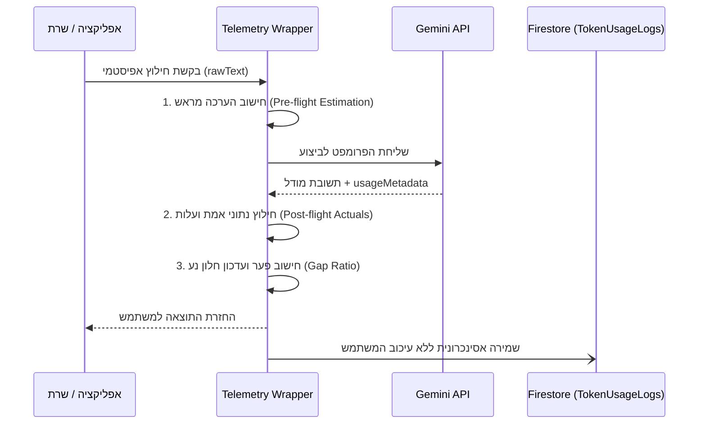

# מפרט ניטור ביצועים, עלויות מודל ובקרת סטיות (Observability & Cost Monitoring) — הד | Echo
**גרסה:** 1.0.0 | **תאריך:** ספטמבר 2026 | **סיווג:** ניטור ביצועים ועלויות (FinOps & Telemetry)

---

## 1. מבוא ומטרות המעקב (FinOps Overview)

מערכת **"הד" (Echo)** נשענת על מודלי שפה גדולים (LLMs) לצורך ביצוע חילוץ אפיסטמי, זיקוק תובנות ושאלות הארה. בסביבת ייצור (Production), קריאות בלתי מבוקרות עלולות לגרום ל"עיוורון עלויות", חריגות תקציב פתאומיות או זמני השהייה (Latency) ארוכים הפוגעים בחוויית המשתמש.

מסמך זה מגדיר את תשתית הניטור והטלמטריה המלאה:
1. **שקיפות פיננסית:** חישוב עלות מדויקת בדולרים (USD) לכל פעולה בודדת ולכל משתמש.
2. **מדידת ביצועים (Latency):** ניטור זמן תגובה מקצה לקצה.
3. **בקרת איכות תחזיות וזיהוי חריגות (Sliding Window Drift Detection):** התרעה מוקדמת בעת סטייה בין העלות המשוערת לעלות בפועל.

---

## 2. מודל המדידה הדו-שלבי (Two-Phase Measurement Model)

עבור כל קריאת AI במערכת, מתבצע תהליך מדידה כפול:



### שלב 1: הערכה מראש (Pre-flight Estimation)
* **קלט (Input):** חישוב מספר טוקנים מדויק של הפרומפט והטקסט הגולמי באמצעות קריאה מקומית ל-`countTokens`.
* **פלט (Output):** הערכה סטטיסטית לפי ממוצע היסטורי של אותה פעולה (למשל: 250 טוקנים ליצירת סכמת 5 הממדים).
* **עלות משוערת:** $\text{Cost}_{\text{est}} = (\text{Tokens}_{\text{in}} \cdot P_{\text{in}}) + (\text{Tokens}_{\text{out,est}} \cdot P_{\text{out}})$.

### שלב 2: מדידה בפועל (Post-flight Actuals)
* **חילוץ נתוני אמת:** קריאת שדות ה-`usageMetadata` מחזרת ה-API:
  - `promptTokenCount`: טוקנים בפועל של הקלט.
  - `candidatesTokenCount`: טוקנים שנוצרו בפועל בתשובה.
  - `totalTokenCount`: סך כל הטוקנים שנצרכו.
* **עלות אמת מדויקת:** חישוב לפי מחירון המודל העדכני.
* **זמן תגובה (Latency):** מדידת הפרש הזמנים המדויק במילישניות ($t_{\text{end}} - t_{\text{start}}$).

---

## 3. סכמת נתוני הטלמטריה (`TokenUsageLog`)

כל קריאה מתועדת בקולקשן ייעודי ב-Firestore בשם `TokenUsageLogs` (באופן אסינכרוני כדי לא לעכב את התגובה למשתמש):

```typescript
export interface TokenUsageLog {
  id: string;                     // Auto-generated UUID
  userId: string;                 // מזהה המשתמש שביצע את הפעולה
  caseId?: string;                // מזהה הדילמה
  actionName: string;             // לדוגמה: "extract_5_dimensions", "generate_illumination", "outcome_loop"
  modelName: string;              // לדוגמה: "gemini-2.5-flash", "gemini-1.5-flash"
  
  // נתוני הערכה מראש
  estimatedInputTokens: number;
  estimatedOutputTokens: number;
  estimatedCostUsd: number;
  
  // נתוני אמת לאחר ריצה
  actualInputTokens: number;
  actualOutputTokens: number;
  actualCostUsd: number;
  latencyMs: number;
  
  // ניתוח סטייה
  gapRatio: number;               // |actual - estimated| / estimated
  
  timestamp: number;              // epoch ms
}
```

---

## 4. מנגנון בקרת סטיות והתרעות (Sliding Window Drift Alerting)

כדי למנוע "עיוורון עלויות" ולשמור על מודל חיזוי מדויק, יוטמע מנגנון בקרת איכות סטטיסטי מבוסס חלון נע:

1. **הגדרת מדד החריגה (Gap Ratio):**
   $$\text{Gap Ratio} = \frac{|\text{actual\_cost} - \text{estimated\_cost}|}{\text{estimated\_cost}}$$

2. **ניהול חלון נע (Sliding Window):**
   המערכת מתחזקת חלון של **10 ההרצות האחרונות** עבור כל סוג פעולה (`actionName`) בנפרד.

3. **תנאי הפעלת התרעה (Alert Trigger):**
   * כאשר ממוצע הסטיות בחלון 10 ההרצות עולה על **50%** ($\overline{\text{Gap Ratio}}_{10} > 0.50$):
     - מופק אירוע אנומליה מסוג `PREDICTION_DRIFT_ALERT`.
     - רישום לוג `WARN/CRITICAL` ב-Google Cloud Logging.
     - סימון מקדמי ההערכה כדורשים כיול מחדש (Auto-Calibration Flag) המעדכן את ממוצע הטוקנים המשוער על בסיס החציון (Median) של ההרצות האחרונות.

---

## 5. אסטרטגיית ניתוב מודלים ואופטימיזציה (Model Routing Strategy)

| סוג פעולה | מודל מומלץ | רציונל וזמן תגובה | עלות ממוצעת לפעולה |
| :--- | :--- | :--- | :--- |
| **לכידה מהירה וחילוץ 5 ממדים (`createDecisionCase`)** | **Gemini 2.5 / 1.5 Flash** | מהירות גבוהה (1-2 שניות), חלון קונטקסט ענק, פלט JSON מובנה וזול מאוד (~$0.075 למיליון טוקנים). | ~$0.00015 |
| **חיווי התחדדות Before/After (`submitIntervention`)** | **Gemini 2.5 / 1.5 Flash** | דורש מעט טוקנים (50-100 טוקנים), חשיבה סוקרטית ממוקדת. | ~$0.00004 |
| **סגירת מעגל למידה ואיחוד (`recordOutcome`)** | **Gemini Flash (Background)** | פעולת רקע שאינה רגישה לזמן תגובה, ניתוב למודל הזול ביותר. | ~$0.00005 |
| **סינתזה רב-תקופתית מורכבת (עתידי / Pro Mode)** | **Gemini 1.5 Pro** | ניתוח השוואתי רוחבי של עשרות מקרי עבר בו-זמנית בעת דרישה מפורשת להעמקה. | ~$0.00250 |

---

## 6. לוח מחוונים ודוחות תקופתיים (DevOps Dashboard)

מנהלי המערכת יכולים לעקוב אחר המדדים באמצעות שאילתות אגרגציה מובנות ב-Firestore:
1. **עלות יומית ממוצעת למשתמש פעיל (Daily Cost per Active User - DAU Cost).**
2. **התפלגות זמני תגובה (p50, p95, p99 Latency).**
3. **גרף סטיות חיזוי (Forecast Drift Graph).**
