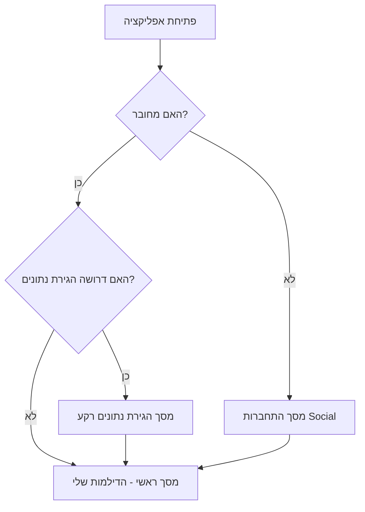
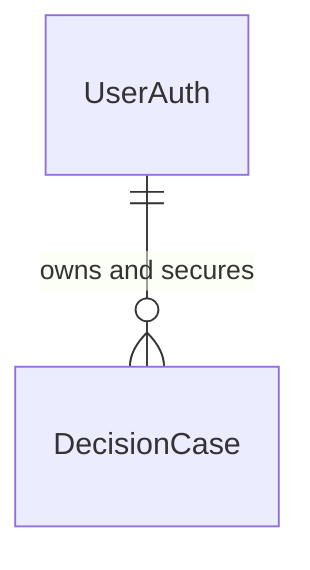
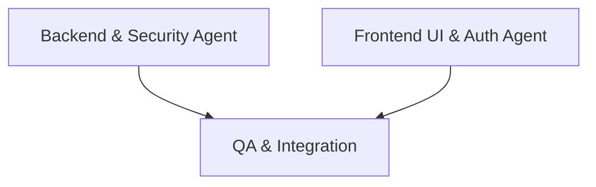

# מסמך אפיון ודרישות שדרוג מוצר (PRD) — הד | Echo (Multi-Tenant & Security Upgrade)

**תשתית לריבוי משתמשים והפרדה מוחלטת (B2C)**
גרסה: 2.1.0 (שדרוג אבטחה) | תאריך: ספטמבר 2026 | סטטוס: מוכן לפיתוח מבוזר (Multi-Agent)

---

## 1. מבט על וחזון המוצר (Overview & Product Vision)

### 1.1 תקציר שדרוג המערכת
שדרוג מערכת Echo (הד) לתמיכה מלאה ונוקשה בריבוי משתמשים פרטיים (B2C Multi-Tenancy). 
המטרה המרכזית: **הפרדה מוחלטת בין המשתמשים, כך שמשתמש אינו יכול לראות מידע של משתמש אחר, גם לא בטעות.**
בנוסף, השדרוג דורש שהרשמות הנתונים לא יהיו פתוחות ללא הזדהות מראש — האפליקציה תדרוש הרשמה מלאה כתנאי לשימוש, עם טיפול ייעודי (Migration) לשימור נתונים של משתמשי אמת קיימים.

### 1.2 בעיה ופתרון
הבעיה: ללא מנגנון אבטחה וזהות נוקשה, נתוני המשתמשים חשופים, והאפליקציה לא יכולה להבטיח את פרטיות הדילמות האינטימיות של המשתמש.
הפתרון: מעבר להזדהות Social (Apple/Google) מהירה, סגירת מסד הנתונים מול Firebase Security Rules כך שייקרא/ייכתב רק למזהה החוקי, והמרת משתמשים קיימים לזהות החדשה ללא איבוד נתונים.

---

## 2. המלצת טכנולוגיות (Tech Stack)

| שכבה | טכנולוגיה | רציונל והתאמה |
| :--- | :--- | :--- |
| **Frontend Mobile** | **React Native (Expo)** | שימוש בספריות OAuth קיימות כמו `expo-auth-session` או ספריות Native של Google/Apple Sign-In. |
| **ניהול זהויות (Auth)** | **Firebase Authentication** | תמיכה מובנית ב-Google, Apple Sign-in ואינטגרציה מושלמת עם Firestore. |
| **מסד נתונים (Rules)**| **Firestore Security Rules** | שפת חוקים לאכיפת אבטחה ברמת הרשומה (Row-Level Security). |
| **Backend** | **Firebase Cloud Functions v2** | כל הפונקציות הקיימות יעברו להשתמש ב-`request.auth.uid` במקום לסמוך על קלט חיצוני. |

---

## 3. משתמשים והרשאות (User Roles & Permissions)

- **משתמש רשום (Registered User)**: משתמש שעבר התחברות בהצלחה דרך Google או Apple. המערכת מייצרת לו מזהה ייחודי קבוע (UID). המשתמש רשאי לקרוא, לכתוב, למחוק ולעדכן אך ורק מסמכים שבהם השדה `user_id` זהה ל-UID שלו.
- **משתמש לא מחובר (Unauthenticated)**: משתמש שלא עבר הזדהות לא יוכל לעבור את מסך הפתיחה. אין לו שום הרשאות קריאה או כתיבה במסד הנתונים.

---

## 4. ארכיטקטורת ממשק (UI/UX & Wireframe Architecture)



1. **מסך התחברות (Login Screen)**: מסך הפתיחה לאפליקציה למשתמשים חדשים או מנותקים. כולל עיצוב שמדבר בשפת ה"הד", ושני כפתורי התחברות גדולים - "התחבר עם Apple" ו-"התחבר עם Google".
2. **מסך/מודל הגירת נתונים (Migration State)**: מצב שקוף או מסך מעבר למשתמשי אמת קיימים. לאחר ההתחברות הראשונה שלהם (Sign Up), האפליקציה תזהה לפי ה-Device ID או ה-Local Storage שלהם שיש להם דילמות קיימות ששמורות כרגע מקומית או תחת מזהה אנונימי ישן, ותבצע עדכון של כל הדילמות שלהם בענן ל-UID החדש.
3. **App Navigator**: Router שחוסם גישה למסכים אחרים כל עוד המשתמש אינו מאומת.

---

## 5. מודל נתונים (Data Model / DB Schema)

השינויים במודל בהתאם לעקרונות OKF, עם דגש על Access Patterns לאבטחה.

```yaml
Entity: UserAuth
Concept ID: concept:user_auth
Metadata:
  type: user
  title: Authenticated User
  description: משתמש מערכת מאומת
  resource: /api/v1/users/{id}
  tags: [auth, identity, b2c]
Schema Fields:
  - id: String (Primary Key, Firebase Auth UID)
  - email: String
  - auth_provider: Enum [google, apple]
  - created_at: Timestamp
Relationships:
  - has_many: DecisionCase (via user_id)
Access Patterns & RLS Policies:
  - RLS: משתמש יכול לקרוא ולעדכן רק את פרופיל המשתמש של עצמו `request.auth.uid == id`

---

Entity: DecisionCase
Concept ID: concept:decision_case
Metadata:
  type: core_record
  title: דילמת החלטה
  description: הרשומה המרכזית של החלטת המשתמש. שדרוג האבטחה כאן קריטי.
  resource: /api/v1/decisions/{id}
Schema Fields:
  - id: String (PK, UUID)
  - user_id: String (FK, Indexed)
  - raw_capture_text: String
Relationships:
  - belongs_to: UserAuth (via user_id)
Access Patterns & RLS Policies:
  - Read/Write RLS: מורשה לקריאה/כתיבה אך ורק אם מזהה המשתמש המאומת שווה לבעל הרשומה. 
    ( Firestore Rule: `allow read, write: if request.auth != null && request.auth.uid == resource.data.user_id` )
  - Create RLS: מורשה ליצירה רק אם המזהה שהמשתמש מנסה לשמור כ-`user_id` שווה ל-`request.auth.uid`.
```



---

## 6. פיצ'רים מרכזיים וזרימת משתמש (Core Features & User Flows)

1. **Gatekeeping**: הפעלת האפליקציה בודקת ב-Context את מצב ה-Auth. אם המשתמש לא מחובר, האפליקציה "מציירת" אך ורק את רכיב ההתחברות.
2. **התחברות ללא סיסמאות (Social Only)**: המשתמש בוחר ספק זהות. מקבל חווית Native.
3. **הגירת משתמשי אמת (Data Migration)**: 
   - עבור משתמשים שהשתמשו בגרסה הקודמת ללא התחברות (או התחברות אנונימית), האפליקציה שומרת את ה-UID הישן.
   - מיד לאחר שדרוג הזהות (Link Account) או כניסה ראשונית של זהות Google/Apple, רץ סקריפט מבוסס Cloud Function שמאתר את כל ה-`DecisionCase` וה-`OutcomeLoop` של ה-ID הישן, ומחליף להם את ה-`user_id` ל-UID המאומת החדש, כדי שהנתונים לא יימחקו וימשיכו איתו.
4. **אכיפה קשיחה בבקשות (Backend Overriding)**: כל פעולות התקשורת ב-App צריכות לכלול את ה-Auth Header, והפונקציות בענן מתעלמות מערך ה-`user_id` שנשלח ב-Body של הבקשה (כדי למנוע זיוף), ובמקום זאת קוראות את הזהות באופן ודאי מתוך `request.auth.uid`.

---

## 7. ממשקים ואינטגרציות (APIs & External Integrations)

- **Firebase SDK Frontend**: שימוש ב-`signInWithCredential` עבור Google ו-Apple.
- **פונקציה ייעודית `migrateLegacyData` (Callable)**: מקבלת `old_device_or_anon_id`, מוודאת שהמשתמש הקורא הוא בעל `Auth Token` תקין, ומעדכנת אצווה (Batch) של מסמכים ב-Firestore למזהה החדש.
- **שדרוג פונקציות קיימות**: פונקציות כגון `createDecisionCase` או `updateMirror` חייבות לבדוק `if (!request.auth) throw new functions.https.HttpsError('unauthenticated')`.

---

## 8. מקרי קצה וטיפול בשגיאות (Edge Cases & Error Handling)

- **שגיאת חיבור Social (Network/Cancel)**: המשתמש סוגר את תפריט ה-Apple Sign-In. המערכת נשארת במסך Login ולא מתקדמת, תוך הצגת הודעת שגיאה קלה ("ההתחברות בוטלה").
- **הגירה כפולה**: פונקציית ההגירה חייבת להיות אידמפוטנטית. ניסיון הגירה חוזר לא יעשה נזק, או יחזיר 200 OK אם כבר בוצע.
- **Session Expiry**: אם הטוקן פג תוקף, פונקציות ה-Backend ידחו פעולות, וה-Frontend יעשה Sign-Out יזום ויחזיר למסך Login.

---

## 9. תוכנית ביצוע לריבוי סוכנים (Multi-Agent Execution & Orchestration Plan)

העבודה מופרדת לשני סוכנים מקבילים, כך שלא יווצרו קונפליקטים (Git Conflicts) או דריסות בתיקיות ה-Monorepo.

### Sub-Agent Role: Backend & Security Agent
- **Owned Paths**: `firebase/firestore.rules`, `firebase/functions/*`, `packages/shared/types` (במידה ויש הגדרת נתונים משותפת).
- **Provides**: חוקי פיירוול (Firestore Rules) אטומים. פונקציית API `migrateLegacyData`. שדרוג כל ה-Cloud Functions הקיימות לאכיפת Authentication.
- **Consumes**: n/a (הוא הספק של האבטחה).
- **Definition of Done**: טסטים או הרצות באמולטור מוכיחות שאי אפשר לקרוא מסמך של מישהו אחר, ופונקציית הגירה מחליפה UIDs בהצלחה.
- **Sequencing & Dependencies**: סוכן זה נדרש לבצע את העבודה במקביל או לפני ה-Frontend כדי לספק את התשתית.

### Sub-Agent Role: Frontend UI & Auth Agent
- **Owned Paths**: `apps/expo/src/screens/LoginScreen.tsx`, `apps/expo/src/hooks/useAuth.ts`, `apps/expo/app.config.js` / `package.json` (להוספת ספריות).
- **Provides**: ממשק התחברות Google/Apple. חסימת ניווט לא-מורשה. מנגנון הרצת ההגירה (Migration) בסיום ההתחברות למשתמשי עבר.
- **Consumes**: אינטגרציה עם Firebase Client SDK, הפעלת קריאה ל-Cloud Function של ה-Backend Agent לשם הגירה.
- **Definition of Done**: המשתמש רואה מסך Login, מצליח להתחבר, ורק אז עובר למסך הראשי של האפליקציה. משתמש ישן רואה את נתוניו מיד לאחר ההתחברות הראשונה.
- **Sequencing & Dependencies**: יכול להתחיל מיד בבניית ה-UI. חיבור לפונקציית ההגירה דורש סיום של ה-Backend Agent.


