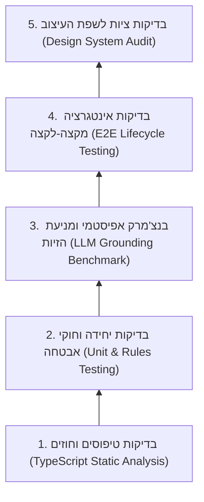

# אסטרטגיית איכות, בדיקות ובנצ'מרק AI (QA & Testing Strategy) — הד | Echo
**גרסה:** 1.0.0 | **תאריך:** ספטמבר 2026 | **סיווג:** מתודולוגיית בדיקות ואבטחת איכות (QA & Evaluation)

---

## 1. מבוא ומטרות האיכות (Quality Objectives)

מערכת **"הד" (Echo)** משלבת קוד תוכנה קלאסי (Client/Server/Database) יחד עם **מנוע קוגניטיבי מבוסס מודל שפה (LLM)**. בדיקות תוכנה סטנדרטיות (Unit / E2E) אינן מספיקות למערכת כזו; נדרשת מתודולוגיית איכות מקיפה הכוללת גם **בנצ'מרק אפיסטמי ומניעת הזיות (Grounding & Anti-Hallucination Evaluation)**.

### יעדי האיכות המרכזיים:
1. **שלמות טיפוסים מוחלטת (100% Type Safety):** אפס שגיאות קימפול בין כל חבילות ה-Monorepo.
2. **אבטחה הרמטית (Zero Data Leakage):** הוכחה אמפירית שחוקי ה-Firestore מונעים כל גישה צולבת בין משתמשים.
3. **דיוק אפיסטמי גבוה (Epistemic Grounding):** פלט ה-AI מבוסס ב-100% על דברי המשתמש ללא המצאת שמות, חברות או נתונים שלא הוזכרו.
4. **ציות מלא לשפת העיצוב (Design Compliance):** בדיקת עמידה ב-3 צבעי הליבה ובפונטים המאושרים בלבד.

---

## 2. פירמידת הבדיקות (The Testing Pyramid)



---

## 3. פירוט שכבות הבדיקה וכלי העבודה

### שכבה 1: אימות טיפוסים וחוזים משותפים (`@echo/shared`)
* **כלי:** TypeScript Compiler (`tsc --noEmit`).
* **מטרה:** אימות שכל ה-Interfaces ב-[packages/shared/src/types/](file:///c:/Users/guyku/costs/ECHO/packages/shared/src/types/) מסונכרנים עם ה-Client וה-Backend.
* **פקודת הרצה:**
  ```bash
  npm run build --workspace=@echo/shared
  ```

---

### שכבה 2: בדיקות יחידה לחוקי אבטחה (Firestore Security Rules)
* **כלי:** `@firebase/rules-unit-testing` + Jest.
* **תרחישי בדיקה קריטיים:**
  1. משתמש מאומת $U_1$ מצליח לקרוא ולכתוב למסלול `/users/U1/decisions/*`.
  2. משתמש מאומת $U_2$ מקבל **Permission Denied** כשהוא מנסה לקרוא או לכתוב למסלול של $U_1$.
  3. משתמש אנונימי (לא מחובר) נחסם מכל גישה למסד הנתונים.
* **מיקום קובץ הבדיקות:** `packages/backend/tests/security/rules.test.ts`.

---

### שכבה 3: בנצ'מרק אפיסטמי ומניעת הזיות (LLM Grounding Benchmark)
כדי לוודא שמנוע ה-Gemini אינו מייצר "הזיות" ואינו ממציא פרטים חיצוניים:
* **מאגר ה-Gold Standard:** שימוש ב-38 מקרי הבוחן האמיתיים מתוך [DECISION_CYCLES.json](file:///c:/Users/guyku/costs/ECHO/DECISION_CYCLES.json) וב-38 קבצי ה-ADR ב-[docs/adr/](file:///c:/Users/guyku/costs/ECHO/docs/adr/).
* **מדדי הערכה (Evaluation Metrics):**
  1. **Strict Entity Grounding:** אימות שכל ישות (אדם, חברה, סכום) שחולצה ב-`keyEntities` או ב-`facts` מופיעה מפורשות בטקסט הקלט הגולמי.
  2. **Single Illumination Discipline:** אימות שהמודל מייצר **בדיוק שאלה אחת חדה** הממוקדת בחומר הגלם הנוכחי, ללא קלישאות גנריות.
  3. **Tension & Hinge Validity:** אימות שהמתח המרכזי מציג קונפליקט אמיתי בין שתי מטרות ולא רק ניסוח מחדש של הדילמה.
* **פקודת הרצת הסימולציות:**
  ```bash
  npm run test:simulations --workspace=@echo/backend
  ```

---

### שכבה 4: בדיקות אינטגרציה מקצה-לקצה (E2E Life Cycle)
* **כלי:** סוויטת E2E ייעודית ב-[packages/e2e-tests/](file:///c:/Users/guyku/costs/ECHO/packages/e2e-tests/).
* **זרימת הבדיקה המלאה (`decision-lifecycle.e2e.ts`):**
  1. קלט דילמה חדשה (טקסט/קול) $\rightarrow$
  2. חילוץ אפיסטמי והקפאת המקרה המקורי (`frozenAt`) $\rightarrow$
  3. שיקוף המראה ועריכת ממד ע"י המשתמש $\rightarrow$
  4. מענה לשאלת ההארה וקבלת חיווי התחדדות (Before/After) $\rightarrow$
  5. חתימת המקרה ושמירתו ביומן $\rightarrow$
  6. פתיחת מודאל תוצאה, הזנת מה קרה בפועל ובדיקת סגירת המעגל.

---

### שכבה 5: ביקורת ציות לשפת העיצוב (Design System Audit)
* **כלי:** Linter מותאם ובדיקות AST על קבצי `apps/mobile/src`.
* **כללי אימות אוטומטיים:**
  1. **איסור חריגת צבעים:** חיפוש צבעים שאינם ברשימת ה-3 המאושרים מ-[DESIGN_SYSTEM.md](file:///c:/Users/guyku/costs/ECHO/DESIGN_SYSTEM.md):
     - רקעים: `#07080B` בלבד (ושקיפויות לבן עדינות).
     - טקסטים: `#E6E8EE` בלבד (ושקיפויות מוגדרות).
     - הדגשות ואורביטר: `#D4AF37` בלבד.
  2. **איסור חריגת פונטים:** איסור על `Noto Serif`, `Roboto` או `Inter`. וידוא שימוש בלעדי ב-`Frank Ruhl Libre` וב-`Assistant`.
  3. **עיגול פינות:** וידוא שכל הכרטיסים והכפתורים משתמשים ב-`rounded-xl` ומעלה.

---

## 4. מטריצת הרצת בדיקות לפני גרסה (Release Checklist)

| שלב בדיקה | פקודה לביצוע | תוצאה מצופה | חובה לפני פריסה? |
| :--- | :--- | :--- | :---: |
| **Shared Typecheck** | `npm run build --workspace=@echo/shared` | `0 errors`, קבצי `dist` נוצרו | **כן 🔴** |
| **Frontend Build** | `npm run build --workspace=@echo/mobile` | יצירת `dist/index.html` ללא שגיאות | **כן 🔴** |
| **Backend Build** | `npm run build --workspace=@echo/backend` | קימפול מלא של כל ה-Functions | **כן 🔴** |
| **Security Rules Test** | `npm run test:security --workspace=@echo/backend` | 100% מעבר של בדיקות בידוד | **כן 🔴** |
| **Simulations Suite** | `npm run test:simulations` | 4 מקרי הסימולציה מחלצים JSON תקין | **כן 🔴** |
| **E2E Integration** | `npm run test:e2e` | כל זרימות המשתמש עוברות בהצלחה | **כן 🔴** |
