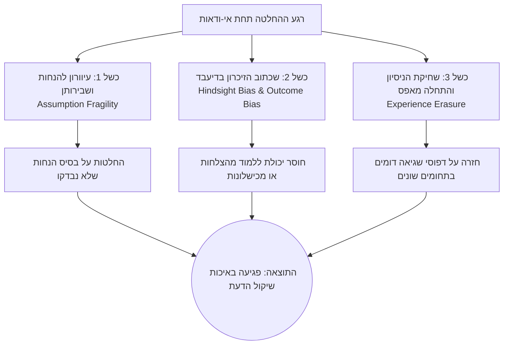
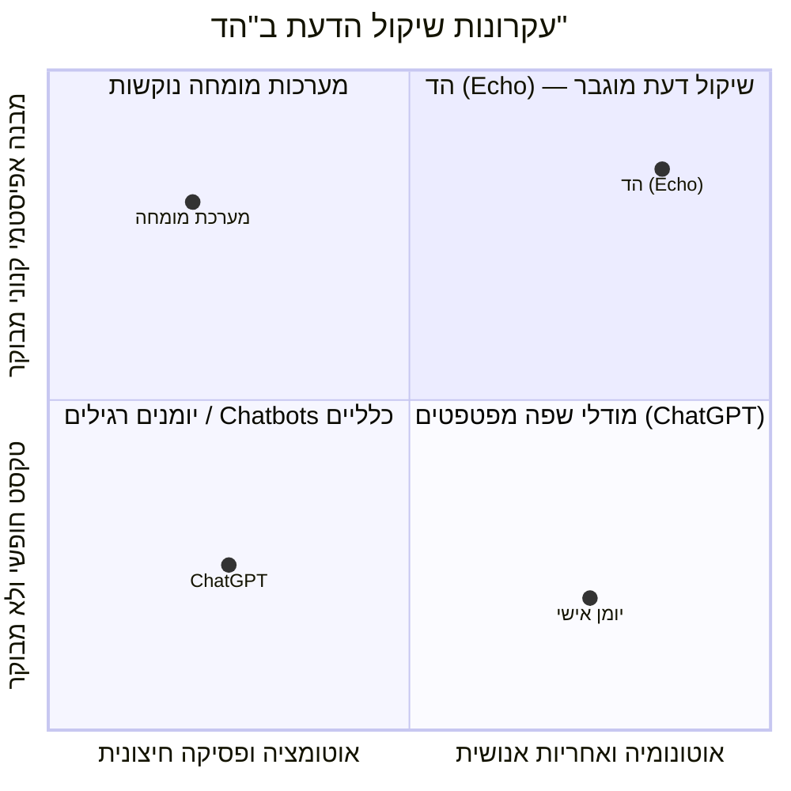

# מסמך חזון מערכת — הד | Echo
**תשתית לזיכרון הלומד של שיקול הדעת האנושי**
גרסה: 1.0.0 | תאריך: ספטמבר 2026 | סיווג: מסמך יסוד ואסטרטגיה

---

## 1. הצהרת החזון (Vision Statement)

> **"הד (Echo) היא תשתית לזיכרון הלומד של שיקול הדעת האנושי: מערכת המלווה את האדם ברגעי הכרעה קריטיים תחת אי-ודאות, מקפיאה את מצב החשיבה המקורי לפני שנודעת התוצאה, מפרקת את המלל הגולמי לסכמה אפיסטמית צלולה, מציבה שאלת הארה יחידה לחשיפת נקודות עיוורון, ומחזירה לאורך זמן את הניסיון המצטבר של המשתמש דרך שליפת אנלוגיות מבניות מהחלטות עבר."**

שיקול דעת אינו עוד סוג של נתונים, ואינו תוצר לוואי של משימות יומיומיות. הוא המשאב היקר, הנדיר והמשפיע ביותר של מנהיגים, יזמים ומשקיעים. "הד" אינה עוד מחברת הערות, יומן אישי או כלי ניהול משימות; "הד" היא **נכס קוגניטיבי מצטבר (Longitudinal Cognitive Asset)** ההופך את רצף ההחלטות הבודדות לרשת לומדת המחדדת ומכיילת את שיקול הדעת לאורך שנים.

---

## 2. שורש הבעיה והכשל האפיסטמי

בעולם העסקי והניהולי המודרני, מקבלי החלטות מוצפים במידע ובמודלי בינה מלאכותית המסוגלים לייצר הררי טקסט, אך הם מתמודדים עם שלושה כשלים פסיכולוגיים ואפיסטמיים יסודיים:



### 2.1 הטיית בדיעבד ובלבול בין איכות לתוצאה (Hindsight Bias & "Resulting")
כאשר תוצאה של החלטה נודעת (לטוב או לרע), המוח האנושי משכתב באופן בלתי רצוני את מה שהוא ידע, שיער וחשב לפני המעשה:
- **אם ההחלטה הצליחה:** האדם משוכנע שהוא "ידע זאת כל הזמן" ומייחס לעצמו ראיית נולד מדויקת, גם אם ההצלחה נבעה ממזל עיוור או נסיבות חיצוניות.
- **אם ההחלטה נכשלה:** האדם נוטה להאשים גורמים חיצוניים, או לחלופין לטעון ש"הכתובת הייתה על הקיר" ולבקר את עצמו על דברים שלא ניתן היה לדעת מראש.

כשל זה, המכונה בספרות המקצועית **"Resulting"** (שפיטת איכות ההחלטה אך ורק על פי איכות התוצאה), מונע למידה אמיתית ומקבע ביטחון יתר שווא.

### 2.2 שבירות הנחות סמויות (Assumption Fragility)
בכל החלטה משמעותית מתקיימות עשרות הנחות סמויות — על קצב השוק, התנהגות לקוחות, לוחות זמנים ויכולות צוות. רוב ההחלטות אינן נכשלות בגלל העובדות הידועות, אלא בגלל **הנחות ציר בלתי מאומתות** שנלקחו כמובנות מאליהן מבלי שנוסח ניסוי מקדים לבדיקתן.

### 2.3 שחיקת הניסיון (Experience Erasure)
מנהל או משקיע בעל 15 שנות ניסיון קיבל מאות החלטות מורכבות. עם זאת, כאשר ניצבת בפניו דילמה חדשה, הוא מתחיל כמעט מאפס. הניסיון שלו מאוחסן בזיכרון עמום ולא מובנה, המוטה ע"י המקרה האחרון שהתרחש (Recency Bias), במקום לעמוד לרשותו כמאגר מובנה של אנלוגיות מבניות.

---

## 3. פילוסופיית המוצר ועקרונות הברזל

מערכת "הד" בנויה על ארבעה עקרונות יסוד בלתי מתפשרים:



### עיקרון 1: האדם נשאר בעל ההכרעה הבלעדי (Human in Command)
- המערכת **אינה מייעצת "מה לעשות"**, אינה ממליצה על פעולה ואינה מתיימרת להחליף את האינטואיציה, הערכים והאחריות של המשתמש.
- ה-AI פועל כ**מראה רפלקטיבית (Reflective Mirror)**: משקף לאדם את חשיבתו שלו, מחדד את ההפרדה בין עובדות להשערות, ומציף שאלות נוקבות.

### עיקרון 2: הקפאה קנונית הרמטית (Canonical State Freeze)
- רגע ההחלטה חייב להיאטם בזמן לפני שמתרחש אירוע חיצוני כלשהו.
- המלל הגולמי והאודיו המקורי ננעלים עם חותמת זמן מדויקת (`frozenAt`). שום עדכון עתידי או עיבוד AI לעולם לא ישכתב את העבר.

### עיקרון 3: שאלה אחת ולא שיחה (The Single Illumination Rule)
- מנהלים אינם זקוקים לעוד צ'אטבוט פטפטן הדורש עשרות שאלות ותשובות ומבזבז אנרגיה ניהולית.
- המערכת מזהה את נקודת החיכוך המרכזית (Tension Point) ומציבה **שאלת הארה יחידה ומדויקת**. שאלה זו מאלצת חשיבה עמוקה, בדיקת הנחה שבירה, או ניסוח ניסוי זול ומיידי.

### עיקרון 4: ענווה אפיסטמית (Epistemic Humility)
- כל תובנה, דפוס או אנלוגיה שהמערכת מפיקה מנוסחים בענווה אפיסטמית:
  - שום תובנה אינה מוגדרת כ"חוק מוחלט".
  - כל השערת דפוס מציינת את גודל המדגם ($N$) שתומך בה, את המקרים הסותרים אותה, ואת תנאי הגבול שבהם היא תקפה.

---

## 4. קהלי היעד ופרופילי שימוש (User Personas)

| פרופיל משתמש | אתגר קוגניטיבי מרכזי | הערך הייחודי מ"הד" |
| :--- | :--- | :--- |
| **יזמים ומנכ"לי סטארטאפ** | קבלת החלטות מהירות בהיעדר נתונים שלמים, לחץ זמנים, שריפת משאבים (Runway). | הפרדת עובדות מהנחות, ניסוח ניסוי זול לפני התחייבות כבדה, תיעוד שלבי חיים (Eras). |
| **משקיעי הון סיכון (VCs / Angels)** | הטיית הצלחה בדיעבד, קושי בבידוד איכות התזה הניהולית מתנאי השוק. | שמירת תזת ההשקעה המקורית בקיפאון מוחלט, בחינת קריטריוני הצלחה לאורך שנים וכיול הסתברותי. |
| **מנהלים בכירים ומובילי מוצר** | החלטות מורכבות עם תלויות רבות בין צוותים (Principal-Agent Tension), אי-הפיכות של מהלכים. | חשיפת שבירות של הנחות שחזרו על עצמן, שליפת מקרים דומים מבנית מתקופות ניהול קודמות. |

---

## 5. תרחיש סימולציה לדוגמה: "פרויקט אטלס"

כדי להמחיש את החזון בפעולה, נבחן תרחיש אמת של מנכ"ל העומד בפני דילמה אסטרטגית:

```
[לכידה גולמית בקול - 10:14:00]
"אנחנו חייבים להחליט היום אם להשקיע 500,000 דולר ושלושה חודשי פיתוח 
בפרויקט אטלס עבור לקוחות אנטרפרייז. הפידבקים מעולים, כולם אומרים שזה מה שחסר להם, 
והמתחרים שלנו עדיין לא שם. אם נחכה – נאבד את ההובלה."
```

### תגובת "הד":
1. **הקפאה הרמטית:** המלל וההקלטה ננעלים מיידית בסטטוס `frozenAt: 10:14:02`.
2. **חילוץ אפיסטמי:**
   - **מטרה:** שימור יתרון תחרותי וכניסה לשוק האנטרפרייז.
   - **עובדות מוצקות:** לקוחות הביעו עניין חיובי מילולי; המתחרים טרם השיקו פיצ'ר מקביל.
   - **הנחות סמויות:** (1) הפידבק החיובי יתורגם לנכונות לשלם בפועל; (2) הפיתוח יסתיים תוך 3 חודשים ללא חריגה; (3) חלון ההזדמנויות ייסגר תוך פחות מרבעון.
   - **הפשטה מבנית (Signature):** שיפוע התחייבות גבוה (0.85), יחס עלות מידע זול (0.75 - ניתן לבדוק ביקוש לפני פיתוח).
3. **שאלת הארה יחידה:**
   > *"האם כדי לוודא נכונות לשלם נדרשים 3 חודשי פיתוח מלאים, או שקיים ניסוי מוקדם של שבועיים (כגון מכתב כוונות חתום או Pre-order) שיבדוק את ההנחה תמורת 2% מהעלות?"*
4. **שליפת אנלוגיה מהעבר:**
   > *"נמצאה אנלוגיה מבנית להחלטה 'השקת מודול BI' מנובמבר 2024: גם שם זוהתה התלהבות לקוחות מילולית אך ללא התחייבות מראש; בפועל רק 1 מתוך 8 לקוחות רכש לאחר ההשקה."*

---

## 6. מדדי הצלחה ארוכי טווח (North Star Metrics)

הצלחת המערכת אינה נמדדת ב"זמן שהייה באפליקציה" (Time in App) או בכמות לחיצות — מטרתנו היא לצמצם את זמן המסך ולמקסם את איכות המחשבה:

1. **Brier Score Calibration (דיוק כיול הסתברותי):** שיפור הדרגתי במתאם שבין רמת הביטחון שהמשתמש מצהיר עליה לבין שיעור ההתממשות האמפירי במציאות.
2. **Assumption Fragility Rate (שיעור שבירות הנחות):** ירידה עקבית לאורך זמן באחוז ההנחות הסמויות שנשברות במפגש עם המציאות, כתוצאה מניסוח ניסויי בירור מקדימים.
3. **Retrieval Actionability (שימושיות אנלוגיות עבר):** אחוז המקרים שבהם שליפת אנלוגיה מבנית שינתה את ניסוח החלופה או הובילה לפעולת בירור זולה בטרם התחייבות.
4. **Longitudinal Asset Retention (נכס ניסיון מצטבר):** שיעור המשתמשים שחוזרים לעיין בחוזי הערכה קודמים ומעדכנים תוצאות לאחר חודשים ושנים.

---

## 7. סיכום: העתיד של שיקול הדעת

בעולם שבו מודלי בינה מלאכותית מספקים תשובות מהירות לכל שאלה טכנית, הערך של האדם אינו ביכולת לחשב מהר יותר, אלא ב**שיקול הדעת, בערכים, ובאחריות על הבחירה**. 

"הד" נבנית כדי להבטיח שהנכס היקר ביותר של האדם — ניסיונו המצטבר וכושר השיפוט שלו — לעולם לא יאבד, לא ישוכתב בדיעבד, ולא יתחיל מאפס.
