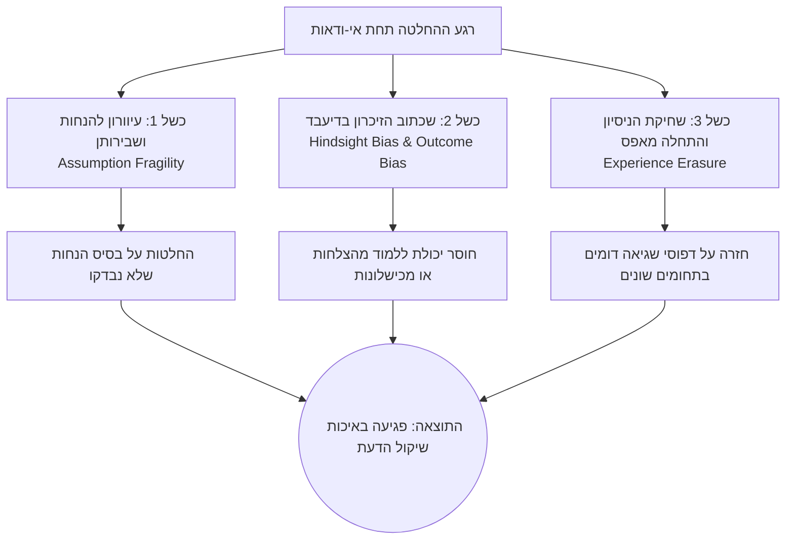
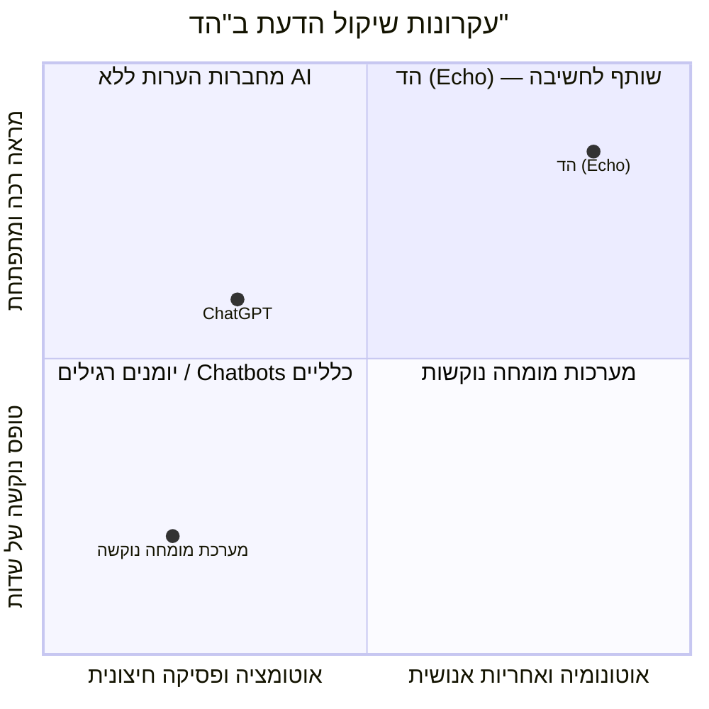

# מסמך חזון מערכת — הד | Echo
**תשתית לזיכרון הלומד של שיקול הדעת האנושי**
גרסה: 2.0.0 | תאריך: ספטמבר 2026 | סיווג: מסמך יסוד ואסטרטגיה

---

## 1. הצהרת החזון (Vision Statement)

> **"הד (Echo) היא שותף לחשיבה (Thinking Partner) המלווה את האדם ברגעי הכרעה תחת אי-ודאות. המערכת משמשת כמראה מתפתחת המציגה את מצב החשיבה, מתאימה את רמת החיכוך לדילמה, מציעה התערבות ממוקדת רק כשצריך, וחושפת בפני האדם את השינוי וההתחדדות במחשבתו שלו באופן מיידי. לאורך זמן, המערכת מחזירה לו את ניסיונו המצטבר בעדינות, תוך השארת השליטה והאחריות הבלעדית בידיו."**

שיקול דעת אינו עוד סוג של נתונים. הוא המשאב היקר, הנדיר והמשפיע ביותר של מנהיגים, יזמים ומשקיעים. "הד" אינה פלטפורמה אובססיבית לתיעוד או כלי "פוסק"; "הד" היא **מראה אנושית ואמפתית** העוזרת לאדם לבצע עוד מהלך חשיבה אחד שהיה חסר לו, מבלי להפוך כל החלטה לתחקיר מעייף.

---

## 2. שורש הבעיה והכשל האפיסטמי

בעולם העסקי והניהולי, מקבלי החלטות מתמודדים עם מספר כשלים יסודיים:



### 2.1 הטיית בדיעבד ובלבול בין איכות לתוצאה (Hindsight Bias & "Resulting")
כאשר תוצאה של החלטה נודעת, המוח האנושי משכתב את מה שהוא ידע קודם לכן. עם זאת, התוצאה אינה חזות הכל: החלטה טובה יכולה להיכשל, והנחה שנשברה יכולה ללמד שיעור חשוב. 

### 2.2 שבירות הנחות סמויות (Assumption Fragility)
בכל החלטה משמעותית מתקיימות הנחות סמויות. רוב ההחלטות אינן נכשלות בגלל העובדות הידועות, אלא בגלל הנחות שלא עורערו.

### 2.3 שחיקת הניסיון (Experience Erasure)
מנהל צובר ניסיון שמאוחסן בזיכרון עמום. כשיש דילמה חדשה, הוא נשען על המקרה האחרון שהתרחש (Recency Bias). המערכת מאפשרת לשלוף אנלוגיות, אך בצורה עדינה ושואלת, ולא כקביעה עובדתית מוחלטת ("האם זה רלוונטי גם כאן?").

---

## 3. פילוסופיית המוצר ועקרונות הברזל

מערכת "הד" בנויה על ארבעה עקרונות יסוד בלתי מתפשרים:



### עיקרון 1: להתחיל מהדילמה של האדם, לא מהמערכת (Human in Command)
- המערכת משקפת למשתמש את הדילמה ומאפשרת לו לתקן אותה בקלות. היא מבדילה בבירור בין מה שהמשתמש אמר לבין מה שהיא הסיקה ("הבנתי שחשוב לך...").

### עיקרון 2: להתאים את החיכוך (Adaptive Friction)
- לא כל החלטה דורשת מסע פסיכולוגי. המערכת מציעה 3 רמות: *מראה מהירה*, *בירור ממוקד* ו*בחינה מעמיקה*. המשתמש יכול בכל עת ללחוץ על **"מספיק לי לעכשיו"** ולשמור.

### עיקרון 3: התערבות ממוקדת - ולפעמים גם אפס (Contextual Intervention)
- המערכת אינה מכריחה מענה על שאלה. אם הדילמה ברורה, היא יכולה לציין זאת. אם יש פער, היא תבחר את ההתערבות האחת שעשויה להשפיע ביותר (למשל סתירה בין מטרות, או הנחה ללא ביסוס). 

### עיקרון 4: ענווה אפיסטמית ולהראות ערך מיידי
- המערכת נמנעת מציונים על "איכות החלטה". במקום זאת, היא מציגה תיאור אובייקטיבי ומראה *מיד* את **ההתחדדות בחשיבה** (למשל: "קודם חשבת X, כעת התחדד Y").

---

## 4. קהלי היעד ופרופילי שימוש (User Personas)

| פרופיל משתמש | אתגר קוגניטיבי מרכזי | הערך הייחודי מ"הד" |
| :--- | :--- | :--- |
| **יזמים ומנכ"לי סטארטאפ** | קבלת החלטות מהירות בהיעדר נתונים שלמים. | קבלת בהירות מיידית, ניסוח ניסוי מוקדם, תיעוד התחדדות ללא בזבוז זמן יקר. |
| **משקיעי הון סיכון (VCs / Angels)** | הטיית הצלחה בדיעבד. | שמירת תזת ההשקעה כבסיס גמיש ללמידה. הפרדה בין מזל לאיכות התזה ללא מתן "ציונים" מערכתיים. |
| **מנהלים בכירים ומובילי מוצר** | החלטות עם אי-הפיכות גבוהה ותלות פנימית. | חשיפת פערי מידע לפני יציאה לפועל. שליפת מקרים דומים בעדינות המאפשרת לאדם לפרש בעצמו. |

---

## 5. סימולציה של חוויית המראה המתפתחת

```
[לכידה חופשית]
"אני שוקל לקחת את התפקיד באטלס. השכר טוב יותר, אבל אני חושש שלא יהיה 
לי זמן לילדים. אולי אני סתם מפחד משינוי."
```

### תגובת "הד" המיידית:
1. **שיקוף קצר לעריכה:**
   > **אתה שוקל:** מעבר לתפקיד חדש באטלס.
   > **אתה רוצה להשיג:** התקדמות והכנסה גבוהה יותר.
   > **אתה רוצה לשמור:** זמן ונוכחות בבית עם הילדים.
   > **עדיין לא ברור:** מה יהיו שעות העבודה בפועל.
   > *(למטה: "זה משקף אותך?" מתאפשרת עריכה מיידית).*

2. **בחירת התערבות אחת רלוונטית:**
   > "ציינת שאתה רוצה לשמור זמן בבית, אבל חושש. איזה נתון על שעות העבודה באטלס יוכל להכריע עבורך את הדילמה?"

3. **חיווי ההתחדדות המיידי:** (אחרי תשובת המשתמש)
   > **קודם:** "חששת שהתפקיד יפגע בזמן עם הילדים."
   > **כעת התחדד:** "החשש ממוקד ביום ספציפי בשבוע, וניתן לתאם זאת מראש."
   > **הצעד שבחרת:** "לברר מול המנהל גמישות של יום אחד בשבוע מהבית."

---

## 6. מדדי הצלחה (North Star Metrics)

הצלחת המערכת נמדדת בבהירות שהיא מייצרת ולא בכפיית נוקשות אפיסטמית:

1. **Immediate Insight Delivery (יצירת התחדדות מיידית):** אחוז הדילמות שבהן המערכת הצליחה להראות למשתמש "שינוי בחשיבה" ברור בין תחילת הסשן לסופו.
2. **Contextual Engagement Rate (מעורבות מותאמת):** שיעור המקרים שבהם המשתמש משתמש ב-3 רמות החיכוך (ולא תמיד בוחר ב"אפס" או ב"מקסימום"), מעיד על כך שהמערכת נותנת לו שליטה להחליט מתי להעמיק.
3. **Continuous Loop Return (סגירת מעגלי למידה):** אחוז המקרים שבהם משתמשים חוזרים לעדכן מה קרה לגבי ההנחות שלהם כחלק מהתפתחות אישית, ולא רק מגיבים להתראות "הצליח/נכשל" נוקשות. 

---

## 7. סיכום: שותף לחשיבה

הערך המרכזי של "הד" אינו בכמות התובנות שהמערכת מפיקה עבור האדם, אלא בכך שהיא מאפשרת לאדם **לראות את החשיבה של עצמו, לזהות מה עשוי לשנות אותה, ולבחור אם להעמיק**. המערכת לא נותנת ציונים ולא כופה תהליכים ארוכים, אלא מלווה כשותף שקט ואובייקטיבי.
