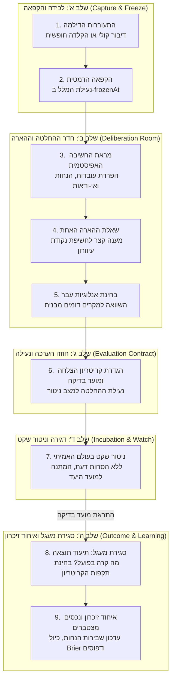
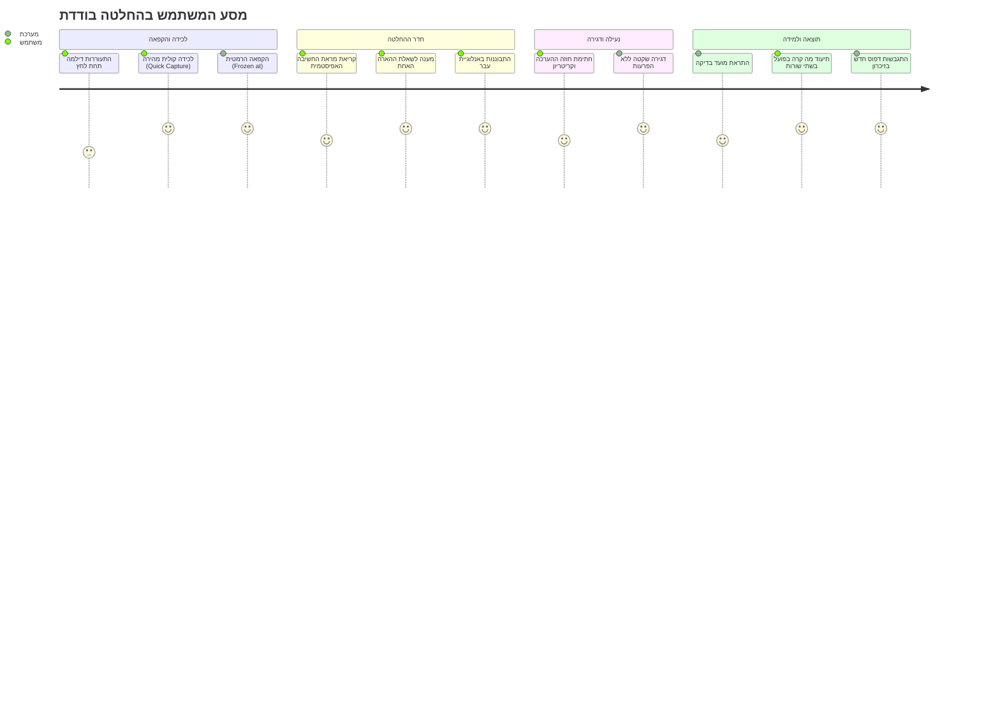

# מסמך זרימת עבודה ומסע משתמש — הד | Echo
**מחזור חיי ההחלטה, שלבי האינטראקציה, ריטואלים קוגניטיביים ומסך זרימת עבודה**
גרסה: 1.0.0 | תאריך: ספטמבר 2026 | סיווג: מדריך תהליך וחוויית שימוש

---

## 1. מבט-על על מחזור חיי ההחלטה (End-to-End Decision Lifecycle)

זרימת השימוש ב"הד" נבנתה במיוחד כדי להפחית עומס קוגניטיבי, למנוע פינג-פונג מייגע מול מודלי AI, ולהבטיח שכל החלטה מקבלת ליווי רפלקטיבי מדויק ומתועדת כנכס לומד לאורך זמן.

---

## 2. פירוט צעד-אחר-צעד של זרימת המשתמש (Step-by-Step User Journey)

### שלב 1: התעוררות הדילמה והלכידה המהירה (Impromptu Dilemma Capture)
- **הסיטואציה:** המשתמש (יזם, מנכ"ל, משקיע) נתקל בצומת החלטה משמעותית המלווה בחוסר ודאות ובלחץ.
- **הפעולה במערכת:**
  - פתיחת האפליקציה למסך **Quick Capture**.
  - לחיצה על כפתור המיקרופון במרכז הילת ההד (`Echo Orb`).
  - דיבור חופשי וטבעי (30 שניות עד 2 דקות) המתאר את הדילמה, החלופות וההתלבטות — או הקלדה תמציתית.
- **החוויה:** אין שום שדות למילוי, אין תפריטים מורכבים. הממשק נקי ומזמין פריקה מחשבתית מיידית.

### שלב 2: רגע הנעילה וההקפאה ההרמטית (The Hermetic Freeze Moment)
- **הפעולה במערכת:** לחיצה על "הקפא והאר" (Freeze & Echo).
- **התרחשות טכנולוגית:**
  - המלל המקורי נשלח לשרת, נוצר מסמך `DecisionCase`, ונרשמת חותמת הזמן המדויקת `frozenAt`.
  - המצב המקורי ננעל לקריאה בלבד (`locked: true`).
- **המשמעות הפסיכולוגית:** המשתמש יודע שמה שהוא ידע, חשב והרגיש ברגע זה נשמר לעד, ללא סכנת שכתוב בדיעבד (Hindsight Bias).

### שלב 3: כניסה לחדר ההחלטה ומראת החשיבה (Decision Room & Epistemic Mirror)
- **החוויה הוויזואלית:** מעבר חלק באנימציית Skia אל מסך חדר ההחלטה (`DecisionRoomScreen`).
- **תצוגת המראה:**
  - **בראש המסך:** כרטיס הקפאה סגור עם חיווי נעילה עדין (`🔒 Frozen @ 10:14:02`).
  - **במרכז המסך:** כרטיסי הסכמה האפיסטמית:
    - **מטרה (Goal):** כרטיס סגול המגדיר בחדות מה מנסים להשיג.
    - **עובדות מוצקות (Observations):** רשימת פריטים ירוקה עם עובדות מאומתות בלבד.
    - **הנחות סמויות (Assumptions):** רשימת פריטים מודגשת בענבר זוהר (`[הנחה טעונת אימות]`).
    - **פערי מידע (Unknowns):** הדגשת אי-הוודאות המרכזית.
- **הערך המיידי:** המשתמש מביט ב"מראה" ורואה את חשיבתו שלו בצורה צלולה ומאורגנת, המפרידה מיד בין מה שידוע למה שרק הונח.

### שלב 4: רגע ההארה (The Single Illumination Moment)
- **המוקד המרכזי:** כרטיס זוהר ובולט במרכז המסך המציג **שאלת הארה יחידה**.
- **אופי השאלה:** שאלה רפלקטיבית חדה וממוקדת (למשל: *"האם כדי לוודא ביקוש נדרשים 3 חודשי פיתוח, או שקיים ניסוי מקדים של שבועיים ב-2% מהעלות?"*).
- **פעולת המשתמש:**
  - מענה קצר וממוקד בתיבת הטקסט (או בחירה מתוך חלופה מעודכנת).
  - מענה זה מגדיר במקרים רבים "פעולת בירור זולה" (Cheap Information Action).
- **כלל הברזל:** אין צ'אט אינסופי. מענה אחד ממצה את שלב ההארה.

### שלב 5: בחינת אנלוגיות עבר נשלפות (Cross-Era Analogy Examination)
- **תנאי להופעה:** מופיע רק אם נמצא מקרה עבר בעל דמיון מבני משוקלל גבוה ($\ge 0.78$). אם אין מקרה מתאים — הקרוסלה מוסתרת לחלוטין.
- **התצוגה:** כרטיס המציג מקרה עבר, שנת ההתרחשות, הדילמה המבנית הזהה, ומה היה הניסוי שנבחר אז.
- **הערך:** שליפת ניסיון העבר ברגע הנכון, מבלי שהמשתמש צריך לזכור לחפש אותו.

### שלב 6: חתימת חוזה ההערכה ונעילת המעקב (Evaluation Contract Sealing)
- **המעבר למסך חוזה:** לחיצה על "הגדר חוזה ומעקב".
- **הגדרות החוזה:**
  - בחירת החלופה הנבחרת (Option).
  - ניסוח **קריטריון הצלחה מוגדר מראש וחד-משמעי** (למשל: "חתימה על LOI אחד תוך 30 יום").
  - הגדרת תאריך יעד לבדיקה (`reviewDate`).
- **סיום שלב ההכרעה:** לחיצה על "שמור לזיכרון שיקול הדעת". המקרה עובר לסטטוס `monitoring`.

### שלב 7: דגירה וניטור שקט בעולם האמיתי (Silent Incubation)
- **העיקרון:** האפליקציה אינה מטרידה את המשתמש. אין נוטיפיקציות ספאם יומיומיות.
- ההחלטה מבשילה בעולם האמיתי בזמן שהמשתמש מוציא אותה לפועל.
- מערכת הענן (Cloud Scheduler) ממתינה בדממה עד להגעת תאריך היעד שנקבע בחוזה.

### שלב 8: סגירת המעגל ברגע האמת (Closing the Loop / Outcome Reflection)
- **הטריגר:** בבוקר תאריך היעד, נשלחת התראת Push שקטה: *"הגיע מועד הבדיקה להחלטה: פרויקט אטלס"*.
- **המודאל הנפתח (`OutcomeModal`):**
  - מוצג מה שהמשתמש הניח, ציפה והגדיר כקריטריון ביום ההחלטה.
  - תיבת קלט תמציתית של שתי שורות בלבד: **"מה נצפה בפועל?"**
  - בחירת תוצאת הקריטריון: הצליח / נכשל / חלקי / לא ניתן למדידה.
  - שאלה רפלקטיבית קצרה: *"האם הקריטריון שהוגדר אז היה אכן מדד נכון?"*
- **השלמת המעגל:** לחיצה על "סגור מעגל ותעד תוצאה".

### שלב 9: הטמעת הניסיון בזיכרון הנצבר (Pattern Crystallization)
- **ברקע:** מנוע האיחוד האפיסטמי (`runConsolidationJob`) מתעורר:
  - מעדכן את שבירות ההנחות ב-`AssumptionRegistry`.
  - מעדכן את ציון הכיול ההסתברותי ב-`CalibrationTracker`.
  - מוסיף את המקרה למאגר הראיות של השערות דפוס (`PatternHypothesis`).
- הניסיון מוקלט והופך לחלק מהאינטליגנציה שתוזן להחלטות הבאות.

---

## 3. מסך זרימת עבודה ומסע החלטה באפליקציה (In-App Workflow Screen)

כדי לאפשר למשתמש שקיפות מלאה לגבי מיקום ההחלטה במחזור החיים שלה, פותח **מסך זרימת עבודה ומסע החלטה (Decision Journey Screen)**.

### מאפייני מסך זרימת העבודה (UI Specs):
1. **ציר זמן ויזואלי חי (Vertical Stepper):**
   - כל שלב מסומן באייקון ובסטטוס צבעוני (ירוק: הושלם, זוהר/אינדיגו: שלב נוכחי, עמום: שלב עתידי).
2. **כרטיס הקפאה (Snapshot Card):** מציג את השעה והתאריך המדויקים של נעילת המחשבה המקורית.
3. **שעון דגירה (Incubation Countdown):** בהחלטות הנמצאות בשלב ניטור (`monitoring`), מוצג מונה ימים שקט המראה מתי תאריך הבדיקה הבא.
4. **תגית קשרים ודפוסים (Pattern Link Tag):** קישור ויזואלי המציג לאילו דפוסי עבר או השערות המקרה הנוכחי מתחבר.

---

## 4. ריטואלים קוגניטיביים של המשתמש (User Cognitive Rituals)

מערכת "הד" אינה מיועדת לצריכת תוכן פסיבית, אלא לעיגון הרגלי חשיבה (Thinking Habits) בריאים:

| סוג ריטואל | תדירות / טריגר | מה עושים בפועל? | משך זמן |
| :--- | :--- | :--- | :--- |
| **לכידת בזק (Flash Capture)** | בעת דילמה מיידית | פותחים את המיקרופון, מקליטים את ההתלבטות וההנחות, ונועלים בחדר ההחלטה. | 2–3 דקות |
| **סגירת מעגל (Loop Closure)** | בהגעת תאריך יעד | קוראים את הציפייה המקורית, כותבים שתי שורות על המציאות ובוחנים את הקריטריון. | 90 שניות |
| **סקירה חודשית שקטה** | סוף חודש קלנדרי | מעבר על מקרים בסטטוס ניטור, בחינת שבירות הנחות חוזרות ב-Assumption Registry. | 5–10 דקות |
| **כיול תקופת חיים (Era Transition)** | מעבר שלב חברה (גיוס, פיטורים, מיזוג) | סגירת ה-Operating Context הנוכחי, סיכום ביצועי שיקול הדעת בתקופה ופתיחת Era חדש. | 15 דקות |
